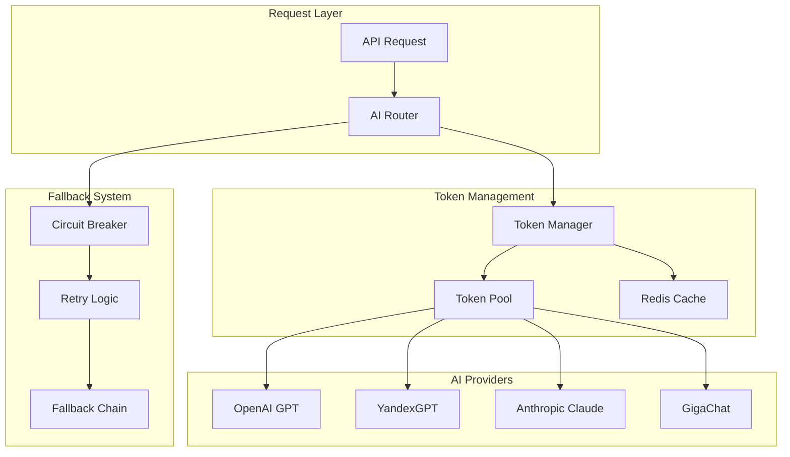

# AI Routing & Token Management

**Last Updated:** 2025-08-23

Comprehensive guide to AI provider routing, token management, and intelligent load balancing in ChatAI platform.

## Architecture Overview

ChatAI uses a sophisticated multi-provider AI routing system with intelligent token pooling and automatic failover capabilities.



## Supported AI Providers

### 1. OpenAI (Primary Provider)

**Models Supported:**
- `gpt-4o` - Most capable model, highest cost (~$0.015/1K tokens)
- `gpt-4o-mini` - Optimized for speed and cost (~$0.0015/1K tokens)
- `gpt-4` - Previous generation, reliable (~$0.03/1K tokens)

**Use Cases:**
- Complex reasoning and analysis
- Code generation and review
- Creative writing and content generation
- Document summarization and Q&A

### 2. YandexGPT (Regional Provider)

**Models Supported:**
- `yandexgpt` - Russian-optimized model
- `yandexgpt-lite` - Faster, lightweight version

**Use Cases:**
- Russian language processing
- Local data compliance
- Reduced latency for Russian users

### 3. Anthropic Claude (Backup Provider)

**Models Supported:**
- `claude-3-5-sonnet` - Best reasoning capabilities
- `claude-3-haiku` - Fast and economical

**Use Cases:**
- Safety-critical applications
- Long-context processing
- Complex reasoning tasks

### 4. GigaChat (Compliance Provider)

**Models Supported:**
- `gigachat` - Russian compliance-friendly model

**Use Cases:**
- Government and enterprise applications
- Data localization requirements
- Russian regulatory compliance

## AI Token Pool Management

### Token Selection Algorithm

**1. Filtering Phase:**
```python
def filter_available_tokens(model: str):
    # Filter by model support
    tokens = tokens.filter(model_access.contains(model))
    
    # Filter by active status
    tokens = tokens.filter(is_active == True)
    
    # Filter by daily limits
    tokens = tokens.filter(current_daily_usage < daily_limit)
    
    # Filter by monthly limits
    tokens = tokens.filter(current_monthly_usage < monthly_limit)
    
    # Filter by error count (< 5 consecutive errors)
    tokens = tokens.filter(error_count < 5)
    
    return tokens
```

**2. Ranking Phase:**
```python
def rank_tokens(tokens: List[AITokenPool]):
    return sorted(tokens, key=lambda t: (
        t.priority,                    # Higher priority first
        -t.current_daily_usage,        # Lower usage first
        -t.current_monthly_usage,      # Lower monthly usage first
        -t.error_count,               # Fewer errors first
        t.last_used                   # Least recently used first
    ), reverse=True)
```

**3. Caching Strategy:**
```python
# Cache best token for 60 seconds to reduce DB load
cache_key = f"best_token:{model}:{hash(constraints)}"
cached_token = redis.get(cache_key)
if cached_token and validate_token(cached_token):
    return cached_token
```

## AI Request Routing Matrix

### Model Selection by Use Case

| Use Case | Primary Model | Fallback Model | Reasoning |
|----------|---------------|----------------|-----------|
| **Q&A Short** | `gpt-4o-mini` | `gpt-4o` | Speed + cost optimization |
| **RAG (Documents)** | `gpt-4o` | `gpt-4` | Better context understanding |
| **Long-form Content** | `gpt-4o` | `claude-3-5-sonnet` | Creative capabilities |
| **Code Generation** | `gpt-4o` | `gpt-4` | Technical accuracy |
| **Russian Language** | `yandexgpt` | `gpt-4o-mini` | Language optimization |
| **Enterprise/Compliance** | `gigachat` | `yandexgpt` | Regulatory requirements |

### Intelligent Fallback Chain

**1. Primary → Secondary → Tertiary:**
```python
FALLBACK_CHAINS = {
    "gpt-4o": ["gpt-4", "gpt-4o-mini", "claude-3-5-sonnet"],
    "gpt-4": ["gpt-4o-mini", "claude-3-haiku"],
    "yandexgpt": ["gpt-4o-mini", "gpt-4o"],
    "claude-3-5-sonnet": ["gpt-4o", "gpt-4"],
    "gigachat": ["yandexgpt", "gpt-4o-mini"]
}
```

**2. Circuit Breaker Implementation:**
```python
class CircuitBreaker:
    def __init__(self, failure_threshold=3, reset_timeout=60):
        self.failure_threshold = failure_threshold
        self.reset_timeout = reset_timeout
        self.state = "CLOSED"  # CLOSED, OPEN, HALF_OPEN
        self.failure_count = 0
        self.opened_at = None
    
    def allow_request(self) -> bool:
        if self.state == "CLOSED":
            return True
        
        if self.state == "OPEN":
            if time_since_opened() > self.reset_timeout:
                self.state = "HALF_OPEN"
                return True
            return False
        
        if self.state == "HALF_OPEN":
            return True  # Allow one test request
```

## Token Usage Limits & Quotas

### Per-Token Limits

**Daily Limits:**
- Production tokens: 10,000 requests/day
- Development tokens: 1,000 requests/day
- Test tokens: 100 requests/day

**Monthly Limits:**
- Production tokens: 300,000 requests/month
- Development tokens: 30,000 requests/month
- Test tokens: 3,000 requests/month

### Per-User Quotas

**Free Tier:**
- 100 AI messages/day
- 10 document uploads/day
- Standard response time

**Pro Tier:**
- 1,000 AI messages/day
- 100 document uploads/day
- Priority routing

**Premium Tier:**
- 10,000 AI messages/day
- Unlimited document uploads
- Highest priority routing
- Advanced models access

### Rate Limiting

**Global Rate Limits:**
```python
RATE_LIMITS = {
    "openai": {
        "requests_per_minute": 3500,
        "tokens_per_minute": 150000,
        "requests_per_day": 10000
    },
    "yandex": {
        "requests_per_minute": 100,
        "requests_per_day": 1000
    },
    "claude": {
        "requests_per_minute": 1000,
        "tokens_per_minute": 40000
    }
}
```

## Configuration Management

### Environment Variables

```bash
# AI Provider Configuration
OPENAI_API_KEY=sk-...
OPENAI_BASE_URL=https://api.openai.com/v1
OPENAI_TIMEOUT=60

YANDEX_API_KEY=...
YANDEX_FOLDER_ID=...

ANTHROPIC_API_KEY=sk-ant-...

# Token Pool Settings
AI_TOKEN_POOL_ENABLED=true
AI_TOKEN_POOL_SIZE=10
AI_TOKEN_POOL_TTL=3600

# Fallback Configuration
AI_FALLBACK_ENABLED=true
AI_CIRCUIT_BREAKER_THRESHOLD=3
AI_CIRCUIT_BREAKER_TIMEOUT=60

# Caching
AI_RESPONSE_CACHE_TTL=300
AI_EMBEDDING_CACHE_TTL=3600
```

## Database Schema

### AITokenPool Table

```sql
CREATE TABLE ai_token_pool (
    id SERIAL PRIMARY KEY,
    name VARCHAR NOT NULL,
    token VARCHAR UNIQUE NOT NULL,
    model_access VARCHAR DEFAULT 'gpt-4o,gpt-4o-mini',
    daily_limit INTEGER DEFAULT 10000,
    monthly_limit INTEGER DEFAULT 300000,
    current_daily_usage INTEGER DEFAULT 0,
    current_monthly_usage INTEGER DEFAULT 0,
    priority INTEGER DEFAULT 1,
    is_active BOOLEAN DEFAULT TRUE,
    error_count INTEGER DEFAULT 0,
    last_reset_daily TIMESTAMP DEFAULT NOW(),
    last_reset_monthly TIMESTAMP DEFAULT NOW(),
    last_used TIMESTAMP DEFAULT NOW(),
    last_error TIMESTAMP NULL,
    notes TEXT NULL,
    created_at TIMESTAMP DEFAULT NOW()
);
```

### AITokenUsage Table

```sql
CREATE TABLE ai_token_usage (
    id SERIAL PRIMARY KEY,
    token_id INTEGER REFERENCES ai_token_pool(id),
    user_id INTEGER REFERENCES users(id),
    assistant_id INTEGER REFERENCES assistants(id),
    model_used VARCHAR NOT NULL,
    prompt_tokens INTEGER DEFAULT 0,
    completion_tokens INTEGER DEFAULT 0,
    total_tokens INTEGER DEFAULT 0,
    request_type VARCHAR DEFAULT 'chat',
    response_time FLOAT DEFAULT 0.0,
    success BOOLEAN DEFAULT TRUE,
    error_message TEXT NULL,
    created_at TIMESTAMP DEFAULT NOW()
);
```

## API Endpoints

### Admin Token Management

```bash
# List all tokens
GET /api/admin/ai-tokens

# Add new token
POST /api/admin/ai-tokens
{
  "name": "Production Token 1",
  "token": "sk-...",
  "model_access": "gpt-4o,gpt-4o-mini",
  "daily_limit": 10000,
  "monthly_limit": 300000,
  "priority": 1
}

# Update token
PUT /api/admin/ai-tokens/{token_id}
{
  "daily_limit": 15000,
  "is_active": true
}

# Get token usage statistics
GET /api/admin/ai-tokens/{token_id}/usage
```

## Monitoring & Analytics

### Token Performance Metrics

```python
def calculate_token_metrics(token_id: int, period: str) -> dict:
    return {
        "total_requests": count_requests(token_id, period),
        "successful_requests": count_successful_requests(token_id, period),
        "failed_requests": count_failed_requests(token_id, period),
        "average_response_time": avg_response_time(token_id, period),
        "total_tokens_consumed": sum_tokens_consumed(token_id, period),
        "error_rate": calculate_error_rate(token_id, period),
        "uptime_percentage": calculate_uptime(token_id, period),
        "cost_efficiency": calculate_cost_per_token(token_id, period)
    }
```

### Usage Analytics Queries

**Provider Performance Comparison:**
```sql
SELECT 
    model_used,
    COUNT(*) as total_requests,
    AVG(response_time) as avg_response_time,
    SUM(CASE WHEN success = true THEN 1 ELSE 0 END) / COUNT(*) as success_rate,
    AVG(total_tokens) as avg_tokens_per_request
FROM ai_token_usage
WHERE created_at >= NOW() - INTERVAL '7 days'
GROUP BY model_used
ORDER BY success_rate DESC;
```

**Token Usage Distribution:**
```sql
SELECT 
    atp.name,
    COUNT(atu.id) as usage_count,
    SUM(atu.total_tokens) as total_tokens,
    AVG(atu.response_time) as avg_response_time,
    atp.current_daily_usage,
    atp.daily_limit
FROM ai_token_pool atp
LEFT JOIN ai_token_usage atu ON atp.id = atu.token_id
WHERE atp.is_active = true
  AND atu.created_at >= NOW() - INTERVAL '24 hours'
GROUP BY atp.id, atp.name
ORDER BY usage_count DESC;
```

This AI routing system provides enterprise-grade reliability, performance optimization, and comprehensive monitoring for the ChatAI platform.