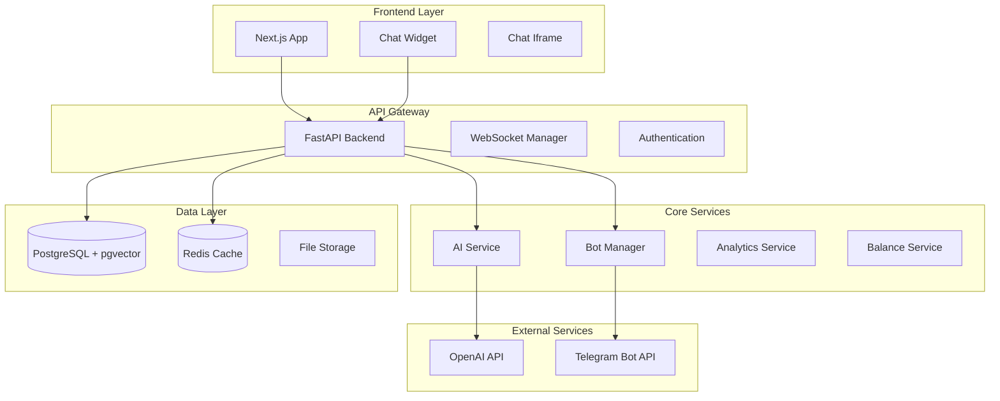
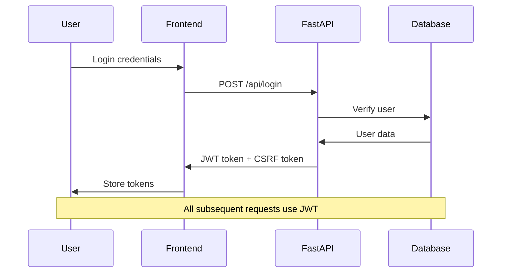
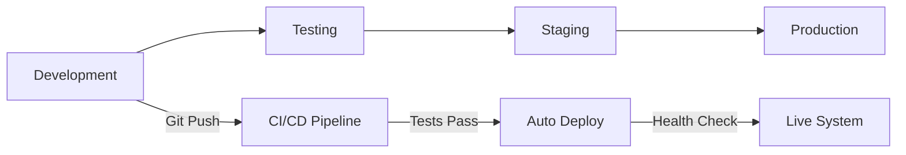

# 🏗️ ChatAI Architecture Documentation

**Complete architectural design and technology documentation for ChatAI platform**

This section provides comprehensive documentation of the system architecture, technology choices, and design decisions that power the ChatAI platform.

---

## 📋 **Architecture Overview**

### **Quick Navigation:**
- 🎯 **[System Overview](overview.md)** - High-level architecture and component interactions
- 🔧 **[Technology Stack](technology-stack.md)** - Complete list of technologies and versions
- 📊 **[Service Catalog](service-catalog.md)** - Service boundaries and dependencies
- 📈 **[Reorganization Report](reorganization-report.md)** - Architecture evolution history

---

## 🎯 **High-Level Architecture**

### **System Components:**



### **Key Architectural Principles:**

#### **🎯 Design Philosophy:**
- **API-First Design** - All functionality exposed via REST API
- **Microservices-Ready** - Modular architecture for future scaling
- **Real-time Capable** - WebSocket support for live updates
- **Multi-tenant** - Isolated user data and configurations

#### **🔒 Security-First:**
- **JWT Authentication** - Stateless token-based auth
- **CSRF Protection** - Cross-site request forgery prevention  
- **Rate Limiting** - API abuse prevention
- **Input Validation** - Comprehensive data sanitization

#### **📈 Scalability:**
- **Horizontal Scaling** - Load balancer ready
- **Database Optimization** - Indexed queries, connection pooling
- **Caching Strategy** - Redis for performance
- **Async Processing** - Non-blocking I/O operations

---

## 🔧 **Technology Choices**

### **Backend Stack:**
| Technology | Version | Purpose | Why Chosen |
|------------|---------|---------|------------|
| **Python** | 3.9+ | Backend language | AI ecosystem, rapid development |
| **FastAPI** | 0.111.0 | Web framework | Performance, auto-documentation |
| **PostgreSQL** | 14+ | Primary database | ACID compliance, pgvector support |
| **Redis** | 6+ | Caching/sessions | Performance, real-time features |
| **Alembic** | 1.13.2 | Database migrations | Version control for schema |

### **Frontend Stack:**
| Technology | Version | Purpose | Why Chosen |
|------------|---------|---------|------------|
| **Next.js** | 13.5.11 | React framework | SSR, performance, developer experience |
| **React** | 18.2.0 | UI library | Component reusability, ecosystem |
| **TypeScript** | 5.8.3 | Type safety | Error prevention, maintainability |
| **Tailwind CSS** | 3.4.17 | Styling | Utility-first, consistency |

### **Infrastructure:**
| Component | Technology | Purpose |
|-----------|------------|---------|
| **Process Management** | PM2, SystemD | Service orchestration |
| **Reverse Proxy** | Nginx | Load balancing, SSL termination |
| **Monitoring** | Prometheus, Grafana | Metrics and alerting |
| **Logging** | JSON structured logs | Debugging and analysis |

**Complete technology details:** [technology-stack.md](technology-stack.md)

---

## 📊 **Service Architecture**

### **Service Boundaries:**

#### **🔌 API Services (FastAPI):**
```python
# Modular API structure
/api/auth          # Authentication & authorization
/api/users         # User management  
/api/assistants    # AI assistant management
/api/dialogs       # Conversation management
/api/documents     # Knowledge base management
/api/bots          # Telegram bot management
/api/balance       # Billing and payments
/api/admin         # Administrative functions
```

#### **🤖 Worker Services (Node.js):**
```javascript
// Bot management system
workers/master/scalable_bot_manager.js    // Orchestrates bot workers
workers/telegram/bot_worker.js             // Individual Telegram bot instance
worker/webhook_handler.js          // Processes Telegram webhooks
```

#### **🎨 Frontend Services (Next.js):**
```typescript
// Frontend application structure
pages/             // Route components
components/        // Reusable UI components  
hooks/            // Custom React hooks
utils/            // Utility functions
styles/           // Global styles and themes
```

### **Data Flow Patterns:**

#### **User Message Flow:**
```
User Input → Frontend → FastAPI → AI Service → OpenAI API → Response → WebSocket → Frontend
```

#### **Bot Message Flow:**
```
Telegram → Webhook → Bot Worker → FastAPI → AI Service → Response → Bot Worker → Telegram
```

#### **Admin Analytics Flow:**
```
Admin Panel → FastAPI → Analytics Service → Database Queries → Aggregated Data → Frontend Charts
```

**Complete service details:** [service-catalog.md](service-catalog.md)

---

## 🔄 **Data Architecture**

### **Database Design:**

#### **Core Entities:**
```sql
-- Primary data model
Users (123)           -- User accounts and authentication
Assistants (456)      -- AI assistant configurations  
Dialogs (789)         -- Conversation containers
Messages (1000+)      -- Individual chat messages
Documents (100+)      -- Knowledge base files
```

#### **Supporting Entities:**
```sql
-- Operational data
UserBalances          -- Billing and payment tracking
BalanceTransactions   -- Financial transaction history
AITokenUsage         -- AI API usage analytics
BotInstances         -- Telegram bot configurations
```

### **Database Optimization:**

#### **Performance Indexes:**
```sql
-- Critical performance indexes
CREATE INDEX idx_messages_dialog_created ON messages(dialog_id, created_at);
CREATE INDEX idx_dialogs_user_status ON dialogs(user_id, status);
CREATE INDEX idx_ai_usage_date ON ai_token_usage(created_at);
CREATE INDEX idx_balance_transactions_user ON balance_transactions(user_id, created_at);
```

#### **Vector Search (pgvector):**
```sql
-- Semantic search capability
CREATE INDEX ON document_embeddings USING ivfflat (embedding vector_cosine_ops);
```

**Complete database docs:** [../db/schema.md](../db/schema.md)

---

## 🔒 **Security Architecture**

### **Authentication Flow:**


### **Security Layers:**

#### **🔐 Authentication & Authorization:**
- **JWT Tokens** - Stateless authentication
- **Role-Based Access** - User, admin, operator roles
- **Token Expiration** - Configurable timeout periods
- **Refresh Tokens** - Seamless token renewal

#### **🛡️ Protection Mechanisms:**
- **CSRF Protection** - Double-submit cookie pattern
- **Rate Limiting** - Per-user and per-endpoint limits
- **Input Validation** - Pydantic schema validation
- **SQL Injection Prevention** - ORM parameterized queries

#### **🔍 Monitoring & Auditing:**
- **Audit Logs** - All admin actions logged
- **Security Events** - Failed login attempts tracked
- **Rate Limit Monitoring** - Abuse detection
- **Performance Monitoring** - Response time tracking

**Complete security docs:** [../security/authentication.md](../security/authentication.md)

---

## 📈 **Performance Architecture**

### **Performance Targets:**

| Metric | Target | Current | Status |
|--------|--------|---------|--------|
| **API Response Time** | < 200ms (95th percentile) | ~150ms | ✅ |
| **Page Load Time** | < 2 seconds | ~1.5s | ✅ |
| **Database Queries** | < 50ms (95th percentile) | ~30ms | ✅ |
| **Concurrent Users** | 1000+ | Tested to 500+ | ✅ |
| **Bot Throughput** | 30 msg/sec per bot | 25-30 msg/sec | ✅ |

### **Optimization Strategies:**

#### **🚀 Backend Optimizations:**
```python
# Database optimization
- Connection pooling (20-100 connections)
- Query optimization with indexes
- Lazy loading for relationships
- Database query caching
```

#### **⚡ Frontend Optimizations:**
```typescript
// Performance optimizations
- Code splitting with dynamic imports
- Image optimization with Next.js Image
- Bundle analysis and tree shaking  
- Client-side caching with SWR
```

#### **💾 Caching Strategy:**
```redis
# Multi-level caching
L1: Application memory (hot data)
L2: Redis cache (shared data)
L3: Database query cache
L4: CDN (static assets)
```

**Performance details:** [../perf/findings.md](../perf/findings.md)

---

## 🔄 **Deployment Architecture**

### **Production Environment:**

#### **🖥️ Server Configuration:**
```yaml
# Production server setup
Server: Ubuntu 20.04 LTS
CPU: 4+ cores
RAM: 8GB+ 
Storage: 100GB+ SSD
Network: 1Gbps connection
```

#### **🐳 Process Management:**
```bash
# Service orchestration
Backend: Python + Uvicorn + SystemD
Frontend: Node.js + PM2 cluster mode
Database: PostgreSQL + auto-vacuum
Cache: Redis + persistence
Proxy: Nginx + SSL termination
```

### **Deployment Pipeline:**



**Deployment details:** [../deployment/текущее-состояние.md](../deployment/текущее-состояние.md)

---

## 🔍 **Monitoring & Observability**

### **Monitoring Stack:**

#### **📊 Metrics Collection:**
```yaml
Prometheus: System and application metrics
Grafana: Dashboards and visualization
AlertManager: Alert routing and notifications
Custom Metrics: Business logic monitoring
```

#### **📝 Logging Strategy:**
```json
{
  "timestamp": "2025-01-23T10:30:00Z",
  "level": "INFO",
  "service": "fastapi",
  "endpoint": "/api/assistants",
  "user_id": 123,
  "response_time": 150,
  "status_code": 200
}
```

#### **🚨 Alerting Rules:**
- **Error Rate** > 1% for 5 minutes
- **Response Time** > 500ms for 95th percentile
- **Memory Usage** > 80% for 10 minutes
- **Database Connections** > 80% of pool

**Complete monitoring:** [../observability/logging.md](../observability/logging.md)

---

## 🚀 **Future Architecture**

### **Planned Improvements:**

#### **📈 Scalability Enhancements:**
- **Microservices Migration** - Service decomposition
- **Event-Driven Architecture** - Async message processing
- **Database Sharding** - Horizontal data partitioning
- **CDN Integration** - Global content distribution

#### **🔒 Security Enhancements:**
- **Zero-Trust Architecture** - Service-to-service encryption
- **Advanced Threat Detection** - ML-based anomaly detection  
- **Compliance Framework** - SOC2/GDPR compliance
- **Secret Management** - Vault-based secret storage

#### **🤖 AI/ML Improvements:**
- **Model Serving Infrastructure** - Local model deployment
- **Vector Database** - Dedicated vector search
- **ML Pipeline** - Training and deployment automation
- **A/B Testing Framework** - Model performance comparison

**Future roadmap:** [reorganization-report.md](reorganization-report.md)

---

## 📚 **Related Documentation**

### **Technical Deep Dives:**
- **[API Reference](../api/README.md)** - Complete API documentation
- **[Database Schema](../db/schema.md)** - Data model details
- **[Security Model](../security/authentication.md)** - Security implementation
- **[Performance Analysis](../perf/findings.md)** - Performance optimization

### **Operational Guides:**
- **[Runbooks](../runbooks/README.md)** - Operational procedures
- **[Deployment Guide](../deployment/текущее-состояние.md)** - Production setup
- **[Monitoring Setup](../observability/logging.md)** - Observability configuration

### **Development Guides:**
- **[Backend Structure](../backend/structure-guide.md)** - Backend development
- **[Frontend Structure](../frontend/structure-guide.md)** - Frontend development
- **[Getting Started](../QUICKSTART.md)** - Development setup

---

**📅 Last Updated:** 2025-01-23  
**🏗️ Architecture Version:** 2.0  
**📊 Components:** 15+ services documented  
**🔄 Evolution:** Continuously updated with system changes


