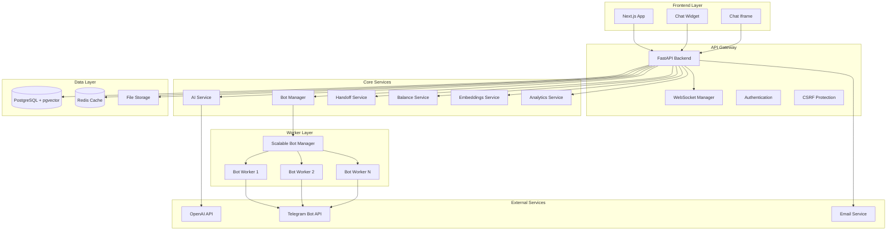
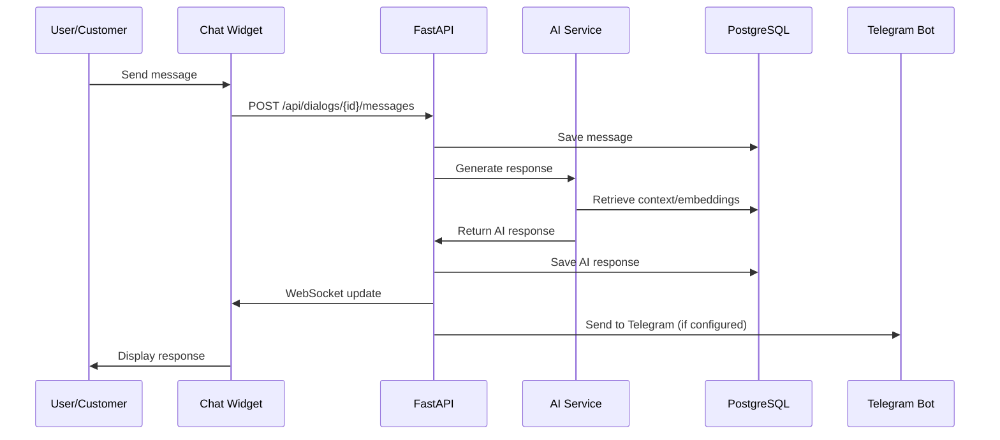
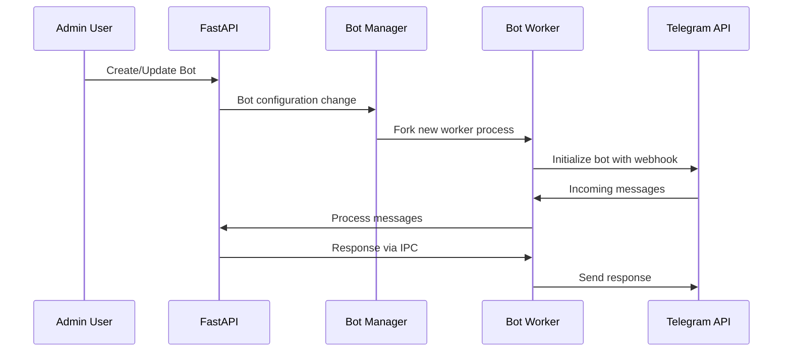

# ReplyX - Architecture Overview

**Last Updated:** 2025-09-13 (comprehensive analysis of MVP 13 structure)

ReplyX is a comprehensive full-stack AI assistant platform designed for enterprises to deploy intelligent chatbots and manage customer interactions through multiple channels. The platform provides scalable multi-tenant architecture supporting 1000+ concurrent users with advanced AI integration, real-time communications, and sophisticated security measures.

## Repository Structure (September 2025)

The project follows a refined clean separation of concerns based on the actual current structure:

```
/
├── backend/                    # Python FastAPI application
│   ├── api/                    # 20 API modules (auth, assistants, dialogs, etc.)
│   ├── ai/                     # AI providers and token management
│   ├── core/                   # App config, auth, security headers, CSRF
│   ├── database/              # Models, schemas, CRUD, connection
│   ├── services/              # Business logic services
│   ├── cache/                 # Redis cache management
│   ├── monitoring/            # Audit logging, DB size monitoring
│   ├── validators/            # Input validation and rate limiting
│   ├── integrations/          # Email and external services
│   ├── utils/                 # Utilities and bot cleanup
│   ├── security/              # Security monitoring (fail2ban)
│   ├── templates/             # Email templates
│   └── alembic/              # Database migrations
├── workers/                    # Node.js Telegram bot workers (13 workers)
│   ├── package.json           # Worker dependencies
│   └── scripts/               # Worker management scripts
├── frontend/                   # Next.js 13 React application
│   ├── pages/                 # 39 pages including admin panel
│   ├── components/            # React components (admin, ui, dialogs, etc.)
│   ├── hooks/                 # 19 custom React hooks
│   ├── styles/                # CSS modules and design tokens
│   └── contexts/              # React contexts
├── tests/                      # Testing infrastructure
│   └── backend/integration/   # Backend integration tests
├── scripts/                    # Build and deployment automation
│   ├── backend/               # Backend-specific scripts
│   └── reorganization/        # Project reorganization tools
├── payments/                   # Payment processing system
├── docs/                       # Comprehensive documentation (35 sections)
│   ├── api/                   # API documentation
│   ├── architecture/          # System architecture
│   ├── db/                    # Database schema and migrations
│   ├── runbooks/              # Operational procedures
│   └── ...                    # Additional documentation sections
└── .github/                   # CI/CD workflows
```

## Technology Stack

### Backend (Python/FastAPI)
- **FastAPI 0.104+** - Modern, high-performance web framework with lifespan events and async support
- **PostgreSQL 14+** with **pgvector** extension for vector embeddings and semantic search
- **Redis** for caching, session management, and pub/sub messaging
- **SQLAlchemy 2.0** with Alembic for database management (40+ production-ready migrations)
- **OpenAI API integration** with intelligent token pooling, rate limiting, and proxy management
- **Prometheus** for comprehensive metrics collection and monitoring
- **Server-Sent Events (SSE)** for real-time communications (migrated from WebSocket)
- **CSRF Protection** and security headers middleware with dynamic CORS
- **Authentication** via JWT tokens with role-based access control and file-based secrets
- **Dynamic middleware** for CORS, CSP (Content Security Policy), and security headers

### Frontend (Next.js/React)
- **Next.js 13.5.11** with TypeScript support (39 pages including admin panel)
- **React 18.2.0** with modern hooks architecture (19 custom hooks)
- **Tailwind CSS 3.4.17** for responsive styling with design tokens
- **Mantine UI components** (@mantine/core, @mantine/hooks)
- **Framer Motion 12.23** for smooth animations and transitions
- **Axios** for API communications with error handling
- **React Icons** for comprehensive icon library
- **React Color** for color picker components

### Worker Processes (Node.js)
- **Node.js 18+** workers with Telegram Bot API integration (13+ active workers)
- **Scalable multi-bot management** system supporting 1000+ concurrent bots
- **Advanced rate limiting** with Telegram API compliance (30 msg/sec per bot)
- **Process isolation** for reliability and fault tolerance with automatic restart
- **IPC communication** between master and worker processes
- **Real-time monitoring** with Prometheus metrics and health checks
- **Redis-based** state management and pub/sub communication
- **Express.js** HTTP server for health checks and metrics endpoints

### Infrastructure & DevOps
- **Alembic** database migrations with production-safe CONCURRENT indexes
- **Fail2ban** security monitoring and intrusion prevention
- **PostgreSQL** with 30+ performance indexes optimized for production workloads
- **Redis Cluster** support for caching, sessions, and real-time features
- **Comprehensive monitoring** with database size tracking, growth rate analysis, and alert systems
- **Audit logging** for security and compliance tracking
- **Docker containerization** with production-ready Dockerfiles
- **Environment-based configuration** with secure secret management
- **Health check endpoints** for load balancer integration
- **Prometheus metrics** with custom collectors for business metrics

## System Architecture

### High-Level Components



### Service Boundaries

#### Backend Services (FastAPI)
- **API Routes**: 24 modular API endpoints with comprehensive functionality
  - **Authentication & Authorization** (`api/auth.py`) - JWT tokens, CSRF protection, email confirmation
  - **User Management** (`api/users.py`) - Profile management, onboarding, password reset
  - **Assistant Management** (`api/assistants.py`) - AI assistant configuration, deployment, and training
  - **Document Processing** (`api/documents.py`) - Upload, indexing, knowledge base with vector embeddings
  - **Dialog Management** (`api/dialogs.py`) - Conversation handling, message routing, and context management
  - **Balance & Billing** (`api/balance.py`) - Payment processing, transaction history, service quotas
  - **Analytics & Monitoring** (`api/start_analytics.py`) - Usage statistics, conversion tracking
  - **Admin Functions** (`api/admin.py`) - User management, system settings, AI token pool administration
  - **Handoff Management** (`api/handoff.py`) - Human operator takeover, presence tracking, SLA management
  - **Bot Instance Management** (`api/bots.py`) - Telegram bot lifecycle, hot reloading, configuration
  - **Support System** (`api/support.py`) - Ticketing system, email integration, help center
  - **SSE Management** (`api/sse.py`) - Server-Sent Events for real-time communications
  - **Database Administration** (`api/database_admin.py`) - Direct database operations and maintenance
  - **QA Knowledge** (`api/qa_knowledge.py`) - Knowledge base CRUD with semantic search
  - **Site Integration** (`api/site.py`) - Website widget, iframe chat, domain validation
  - **Email Services** (`api/email.py`) - SMTP integration, template management, bulk operations
  - **System Health** (`api/system.py`) - Health checks, metrics, system status monitoring
  - **Token Management** (`api/tokens.py`) - API token validation and management
  - **YooKassa Payments** (`api/yookassa_payments.py`) - Russian payment gateway integration
  - **Proxy Monitoring** (`api/proxy_monitoring.py`) - AI proxy health and performance tracking
  - **Debug SSE** (`api/debug_sse.py`) - Development tools for SSE debugging

#### Core Business Services
- **AI Services** (`ai/`):
  - **AI Providers** (`ai_providers.py`) - Multi-provider AI integration (OpenAI, fallback providers)
  - **AI Token Manager** (`ai_token_manager.py`) - Token pooling, rotation, and usage tracking
  - **Professional Prompts** (`professional_prompts.py`) - Industry-specific prompt templates
  - **Proxy Manager** (`proxy_manager.py`) - AI request routing and failover
  - **Training System** (`training_system.py`) - Assistant learning and improvement
- **Business Services** (`services/`):
  - **Embeddings Service** (`embeddings_service.py`) - Vector search, document indexing, semantic similarity
  - **Balance Service** (`balance_service.py`) - Payment processing, quota management, service pricing
  - **Handoff Service** (`handoff_service.py`) - Human operator handoff with intelligent detection
  - **Bot Manager** (`bot_manager.py`) - Multi-tenant bot orchestration and lifecycle management
  - **Analytics Service** (`analytics_service.py`) - User behavior tracking and business metrics
  - **SSE Manager** (`sse_manager.py`) - Server-Sent Events for real-time updates
  - **Document Service** (`document_service.py`) - File processing and knowledge base management
  - **Trial Service** (`trial_service.py`) - Free trial management and quota enforcement
  - **LLM Client** (`llm_client.py`) - Language model abstraction layer
  - **Operator Presence** (`operator_presence.py`) - Real-time operator availability tracking

#### Worker System (/workers/)
- **Master Process**: Scalable bot manager supporting 1000+ concurrent bots
- **Worker Processes**: 13 isolated Telegram bot instances with process isolation
- **Advanced Rate Limiting**: Telegram API compliance with 30 msg/sec per bot
- **Process Monitoring**: Health checks, auto-restart, and performance tracking
- **IPC Communication**: Inter-process communication for coordination
- **Documentation**: See [workers runbook](../runbooks/workers.md)

#### Data Services
- **PostgreSQL Database** (`database/`):
  - **Models** (`models.py`) - SQLAlchemy ORM models with 40+ tables
  - **Schemas** (`schemas.py`) - Pydantic data validation schemas
  - **CRUD Operations** (`crud.py`) - Database operations and query optimization
  - **Connection Management** (`connection.py`) - Connection pooling and environment detection
  - **Utilities** (`utils/`) - Backup, monitoring, transaction management
- **pgvector Extension**: Vector embeddings for semantic search with IVFFLAT indexes
- **Redis Cache** (`cache/`):
  - **Redis Cache** (`redis_cache.py`) - Session caching, rate limiting, temporary data
  - **Pub/Sub messaging** - Event distribution for real-time features
- **File Storage**: Document and media management in /uploads directory with validation
- **Migration System**: 40+ Alembic migrations with production-safe CONCURRENT indexing

## Key Features Implementation

### Multi-Tenant Architecture
- **User Isolation**: Each user has isolated assistants, knowledge base, and dialogs
- **Resource Quotas**: Per-user balance system with service pricing
- **Scalable Bots**: Independent Telegram bot workers per user/assistant

### AI Integration
- **Token Pooling**: Intelligent distribution across multiple OpenAI keys
- **Model Support**: GPT-4, GPT-4o, GPT-4o-mini with automatic fallbacks
- **Context Management**: Document-aware responses with embeddings
- **Professional Prompts**: Industry-specific prompt templates

### Real-Time Features
- **WebSocket Support**: Live dialog updates
- **Operator Handoff**: Real-time human takeover
- **System Monitoring**: Live metrics and alerts
- **Chat Widgets**: Embeddable customer support

### Security & Compliance
- **Multi-layered Security Architecture** (`core/security/`):\n  - **CSRF Protection** (`csrf_protection.py`) - Configurable CSRF middleware with token validation\n  - **Dynamic CORS** (`dynamic_cors_middleware.py`) - Origin-based CORS policies for main app vs widgets\n  - **Security Headers** (`security_headers.py`) - HSTS, CSP, X-Frame-Options, referrer policy\n  - **Dynamic CSP** (`dynamic_csp_middleware.py`) - Content Security Policy for iframe embedding\n- **Authentication & Authorization** (`core/auth.py`):\n  - **JWT Tokens** - Secure token generation with configurable expiration\n  - **Role-based Access Control** - Admin, user, operator role separation\n  - **Site Authentication** (`site_auth.py`) - Widget and iframe authentication\n- **Secret Management** (`core/secrets.py`):\n  - **File-based Secrets** - Production-safe secret loading from files\n  - **Environment Detection** - Automatic dev/prod configuration switching\n- **Rate Limiting** (`validators/`):\n  - **API Rate Limiting** - Per-endpoint and per-user limits\n  - **Telegram Rate Limiting** - Compliant with Telegram Bot API limits\n- **Security Monitoring** (`security/`):\n  - **Fail2ban Integration** - Automatic intrusion prevention\n  - **Audit Logging** (`monitoring/audit_logger.py`) - Comprehensive action tracking\n  - **Security Alerts** - Real-time security event notifications

## Data Flow Patterns

### User Interaction Flow


### Bot Management Flow


## Performance & Scalability

### Current Capacity
- **Concurrent Users**: 1000+ supported
- **Bot Instances**: Up to 1000 Telegram bots
- **Message Throughput**: 30 messages/second per bot
- **Database**: Optimized with performance indexes
- **Memory Usage**: ~150MB per bot worker

### Monitoring & Observability
- **Prometheus Metrics Collection** (`monitoring/`):\n  - **HTTP Metrics** - Request latency, count, status codes by endpoint\n  - **Database Metrics** - Connection pool usage, query performance, size tracking\n  - **Redis Metrics** - Availability, connection count, cache hit rates\n  - **SSE Metrics** - Active connections, message queue status\n  - **Business Metrics** - User registrations, message counts, payment events\n  - **Telegram Metrics** - Bot-specific rate limiting, message throughput\n  - **AI Metrics** - Token usage, model performance, proxy health\n- **Health Check System** (`/health` endpoint):\n  - **Database Health** - Connection and query validation\n  - **Redis Health** - Cache availability and performance\n  - **AI Token Manager** - Provider availability and quota status\n  - **Disk Space** - Storage usage monitoring with thresholds\n  - **Memory Usage** - System resource monitoring\n  - **Database Pool** - Connection pool health and usage\n- **Specialized Monitoring**:\n  - **Database Size Monitor** (`monitoring/db_size_monitor.py`) - Growth rate analysis and alerts\n  - **Rate Limit Monitoring** (`/metrics/telegram-rate-limit`) - Detailed Telegram API statistics\n  - **Proxy Monitoring** (`api/proxy_monitoring.py`) - AI provider health and failover\n  - **Audit Logging** (`monitoring/audit_logger.py`) - Security and compliance tracking\n- **Real-time Dashboards**:\n  - **System Status** - Live health and performance metrics\n  - **Business Analytics** - User engagement and revenue metrics\n  - **Alert Management** - Automated notifications and escalation

## Deployment Architecture

### Process Structure (Post-Reorganization)
```
├── FastAPI Backend (backend/main.py)
├── Scalable Bot Manager (workers/master/scalable_bot_manager.js) ← moved to root
├── Bot Workers (workers/telegram/bot_worker.js) × N instances ← moved to root  
├── Next.js Frontend (frontend/)
├── PostgreSQL Database
├── Redis Cache
├── File Storage (/uploads)
└── Tests (tests/) ← centralized testing
```

## Real-time Communications Architecture

### Server-Sent Events (SSE) System
- **SSE Manager** (`services/sse_manager.py`):\n  - **Connection Management** - Per-dialog client tracking and cleanup\n  - **Event Broadcasting** - Efficient message distribution to subscribed clients\n  - **Heartbeat System** - Connection health monitoring and auto-cleanup\n  - **Error Recovery** - Automatic reconnection and state synchronization\n- **SSE Service** (`services/sse_service.py`):\n  - **Event Filtering** - User-specific and dialog-specific event routing\n  - **Message Queuing** - Reliable delivery with retry mechanisms\n  - **Client Authentication** - JWT-based client validation\n- **Migration from WebSocket** - Improved reliability and simplified deployment\n- **Browser Compatibility** - Universal SSE support with polyfills\n- **Load Balancer Friendly** - HTTP-based, no sticky sessions required\n\n### Event-Driven Architecture\n- **Redis Pub/Sub** (`services/events_pubsub.py`):\n  - **Inter-service Communication** - Decoupled service messaging\n  - **Real-time Notifications** - User activity, system events, operator presence\n  - **Event Routing** - Topic-based message distribution\n- **WebSocket Bridge** (Legacy, being phased out):\n  - **Gateway Compatibility** - Support for existing WebSocket clients\n  - **Progressive Migration** - Gradual transition to SSE\n\n## External Integrations & APIs\n\n### AI Provider Integration\n- **OpenAI Integration** (`ai/ai_providers.py`):\n  - **Multi-model Support** - GPT-4, GPT-4o, GPT-4o-mini with automatic fallbacks\n  - **Token Management** (`ai/ai_token_manager.py`) - Intelligent token pooling and rotation\n  - **Proxy Management** (`ai/proxy_manager.py`) - Health monitoring and failover\n  - **Request Optimization** - Batching, caching, and retry logic\n- **Embedding Services** (`services/embeddings_service.py`):\n  - **Vector Generation** - Document and query embedding with OpenAI\n  - **Semantic Search** - pgvector-powered similarity matching\n  - **Knowledge Base Integration** - Context-aware AI responses\n\n### Telegram Bot API\n- **Scalable Bot Management** (`workers/`):\n  - **Multi-tenant Architecture** - Isolated bot instances per user/assistant\n  - **Advanced Rate Limiting** - Telegram API compliance (30 msg/sec per bot)\n  - **Process Isolation** - Independent worker processes for reliability\n  - **Health Monitoring** - Automatic restart and performance tracking\n- **Message Delivery** - Guaranteed delivery with retry mechanisms\n- **Webhook Management** - Dynamic webhook configuration and validation\n\n### Payment Gateways\n- **YooKassa Integration** (`api/yookassa_payments.py`):\n  - **Russian Market** - Local payment methods and compliance\n  - **Webhook Processing** - Real-time payment status updates\n  - **Refund Management** - Automated refund processing\n- **Balance System** (`services/balance_service.py`):\n  - **Service Pricing** - Flexible pricing model for different services\n  - **Usage Tracking** - Real-time quota monitoring and enforcement\n  - **Transaction History** - Detailed payment and usage logs\n\n### Email Services\n- **SMTP Integration** (`integrations/email_service.py`):\n  - **Template System** - HTML/text email templates with variables\n  - **Bulk Operations** - Efficient mass email processing\n  - **Delivery Tracking** - Status monitoring and bounce handling\n- **Notification System** - User onboarding, system alerts, operator handoff\n\n## Workers & Background Tasks Architecture\n\n### Node.js Worker System (`workers/`)\n- **Scalable Bot Manager** (`master/scalable_bot_manager.js`):\n  - **Process Orchestration** - Master process managing 1000+ worker bots\n  - **Load Balancing** - Intelligent work distribution across workers\n  - **Health Monitoring** - Process health checks and automatic restart\n  - **Resource Management** - Memory and CPU usage optimization\n- **Bot Worker Processes** (`telegram/bot_worker.js`):\n  - **Telegram Bot Integration** - node-telegram-bot-api wrapper\n  - **Rate Limiting** - per-bot Telegram API compliance\n  - **Message Processing** - Async message handling with queuing\n  - **Error Handling** - Graceful error recovery and logging\n- **Inter-Process Communication**:\n  - **Master ↔ Worker IPC** - Command distribution and status reporting\n  - **Redis Coordination** - State sharing and event synchronization\n  - **HTTP Health Endpoints** - External monitoring integration\n\n### Background Task Processing\n- **Document Processing** - Async file upload and indexing\n- **Embedding Generation** - Batch vector computation\n- **Analytics Aggregation** - Periodic metrics calculation\n- **Cleanup Tasks** - Automated data retention and cleanup\n- **Email Queue Processing** - Reliable email delivery\n\n### Communication Patterns\n- **HTTP/HTTPS**: Frontend ↔ Backend API (REST + form data)\n- **Server-Sent Events**: Real-time updates Frontend ↔ Backend\n- **IPC**: Master ↔ Worker processes (Node.js)\n- **Database Connections**: Connection pooling with SQLAlchemy\n- **Redis**: Caching, sessions, pub/sub messaging\n- **External APIs**: OpenAI, Telegram Bot API, Email services, Payment gateways

## Configuration Management

### Environment-based Configuration (`core/app_config.py`)
- **Automatic Environment Detection** - Development vs Production based on .env file presence
- **Secret Management** (`core/secrets.py`):\n  - **File-based Secrets** - Production-safe secret loading from mounted files\n  - **Environment Variables** - Fallback to environment variables for development\n  - **Validation** - Comprehensive secret validation on startup\n- **Database Configuration**:\n  - **Development** - localhost PostgreSQL with user credentials\n  - **Production** - Remote PostgreSQL with file-based authentication\n  - **Connection Pooling** - Optimized connection management\n- **Service Configuration**:\n  - **AI Settings** - Token pool size, model selection, rate limits\n  - **Trial Settings** - Free trial duration and message limits\n  - **Handoff Settings** - SLA thresholds, operator capacity, keywords\n  - **CORS Settings** - Domain-specific policies for security\n\n### Feature Flags & Toggles\n- **CSRF Protection** - Configurable per environment\n- **Handoff System** - Enable/disable human operator integration\n- **WS Bridge** - Legacy WebSocket support toggle\n- **Debug Features** - Development-only endpoints and logging\n\n## Data Architecture & Schema

### Database Schema Overview\n```sql\n-- Core entities\nusers (id, email, password_hash, role, trial_expires_at)\nassistants (id, user_id, name, config, bot_config)\ndialogs (id, user_id, assistant_id, channel_type, status)\nmessages (id, dialog_id, content, role, metadata)\n\n-- Knowledge & Documents\ndocuments (id, user_id, filename, content_type, vector_id)\nembeddings (id, document_id, content, vector, metadata)\nqa_pairs (id, user_id, question, answer, similarity_threshold)\n\n-- Business Logic\nuser_balances (id, user_id, balance, currency)\ntransactions (id, user_id, amount, service_type, status)\nservice_prices (id, service_name, price_per_unit)\n\n-- Telegram Integration\nbots (id, assistant_id, token, webhook_url, status)\nbot_chats (id, bot_id, chat_id, user_info)\n\n-- Operator System\noperator_presence (user_id, status, last_heartbeat, max_chats)\nhandoff_requests (id, dialog_id, status, created_at, assigned_to)\n\n-- System & Analytics\naudit_logs (id, user_id, action, resource_type, details)\nanalytics_events (id, user_id, event_type, properties, timestamp)\n```\n\n### Vector Search with pgvector\n- **Embedding Storage** - High-dimensional vectors for semantic search\n- **IVFFLAT Indexes** - Optimized vector similarity search\n- **Similarity Thresholds** - Configurable matching sensitivity\n- **Context Retrieval** - RAG (Retrieval-Augmented Generation) integration\n\n## Deployment Patterns\n\n### Production Architecture\n```mermaid\ngraph TB\n    subgraph \"Load Balancer Layer\"\n        LB[\"Nginx Load Balancer\"]\n        SSL[\"SSL Termination\"]\n    end\n    \n    subgraph \"Application Layer\"\n        API1[\"FastAPI Instance 1\"]\n        API2[\"FastAPI Instance 2\"]\n        API3[\"FastAPI Instance N\"]\n    end\n    \n    subgraph \"Worker Layer\"\n        Master[\"Bot Manager\"]\n        Worker1[\"Bot Worker 1-100\"]\n        Worker2[\"Bot Worker 101-200\"]\n        WorkerN[\"Bot Worker N\"]\n    end\n    \n    subgraph \"Data Layer\"\n        PG_Primary[(\"PostgreSQL Primary\")]\n        PG_Replica[(\"PostgreSQL Replica\")]\n        Redis_Primary[(\"Redis Primary\")]\n        Redis_Replica[(\"Redis Replica\")]\n    end\n    \n    subgraph \"External Services\"\n        OpenAI[\"OpenAI API\"]\n        Telegram[\"Telegram Bot API\"]\n        Email[\"SMTP Service\"]\n        Payment[\"YooKassa\"]\n    end\n    \n    LB --> API1\n    LB --> API2\n    LB --> API3\n    \n    API1 --> PG_Primary\n    API2 --> PG_Replica\n    API3 --> PG_Primary\n    \n    API1 --> Redis_Primary\n    API2 --> Redis_Primary\n    API3 --> Redis_Primary\n    \n    Master --> Worker1\n    Master --> Worker2\n    Master --> WorkerN\n    \n    API1 --> OpenAI\n    API2 --> Email\n    API3 --> Payment\n    \n    Worker1 --> Telegram\n    Worker2 --> Telegram\n    WorkerN --> Telegram\n```\n\n### Container Orchestration\n- **Docker Containers** - Standardized deployment packages\n- **Health Check Endpoints** - Load balancer integration\n- **Graceful Shutdown** - Proper cleanup and connection draining\n- **Resource Limits** - Memory and CPU constraints\n\n### Scaling Strategies\n- **Horizontal Scaling** - Multiple FastAPI instances behind load balancer\n- **Database Read Replicas** - Query distribution for read-heavy workloads\n- **Redis Clustering** - Cache and session data distribution\n- **Worker Process Scaling** - Dynamic bot worker allocation\n- **CDN Integration** - Static asset optimization\n\n## Performance & Optimization\n\n### Current Performance Metrics\n- **Response Times** - Average API response < 200ms\n- **Throughput** - 1000+ concurrent users supported\n- **Database Performance** - Optimized with 30+ indexes\n- **Memory Usage** - ~512MB per FastAPI instance\n- **Bot Capacity** - 1000 concurrent Telegram bots\n- **Message Processing** - 30,000 messages/second aggregate capacity\n\n### Optimization Techniques\n- **Database Optimization**:\n  - **Connection Pooling** - Efficient database connection reuse\n  - **Query Optimization** - Analyzed query plans and index usage\n  - **CONCURRENT Indexing** - Production-safe index creation\n- **Caching Strategy**:\n  - **Redis Caching** - Frequently accessed data caching\n  - **Application-level Caching** - In-memory result caching\n  - **CDN Caching** - Static asset edge caching\n- **AI Integration Optimization**:\n  - **Token Pooling** - Efficient API key utilization\n  - **Request Batching** - Reduced API call overhead\n  - **Proxy Failover** - High availability for AI services\n\n### Monitoring & Alerting\n- **Prometheus Metrics** - System and business metric collection\n- **Health Check Dashboards** - Real-time system status\n- **Performance Alerting** - Automated issue detection\n- **Capacity Planning** - Proactive scaling decisions\n\n---\n\n## Quick Reference\n\n### Key Technologies\n- **Backend**: FastAPI (Python 3.9+), SQLAlchemy, Alembic\n- **Frontend**: Next.js 13, React 18, TypeScript, Tailwind CSS\n- **Database**: PostgreSQL 14+ with pgvector extension\n- **Cache**: Redis 6+ with clustering support\n- **Workers**: Node.js 18+, Express.js, Telegram Bot API\n- **Monitoring**: Prometheus, custom health checks\n- **Security**: CSRF, CORS, JWT, file-based secrets\n- **AI Integration**: OpenAI GPT models, embeddings, proxy management\n\n### Architecture Patterns\n- **Multi-tenant SaaS** - Isolated user environments\n- **Event-driven Architecture** - Decoupled services via pub/sub\n- **Microservices** - Modular, independent service components\n- **RESTful APIs** - Standard HTTP-based service interfaces\n- **Real-time Updates** - Server-Sent Events for live data\n- **Horizontal Scaling** - Load-balanced application instances\n\n### Documentation References\n- **API Documentation**: [docs/api/](../api/)\n- **Database Schema**: [docs/db/](../db/)\n- **Deployment Guide**: [docs/deployment/](../deployment/)\n- **Runbooks**: [docs/runbooks/](../runbooks/)\n- **Security Guide**: [docs/security/](../security/)\n\n*For detailed implementation guides and operational procedures, refer to the specific documentation sections linked above.*
