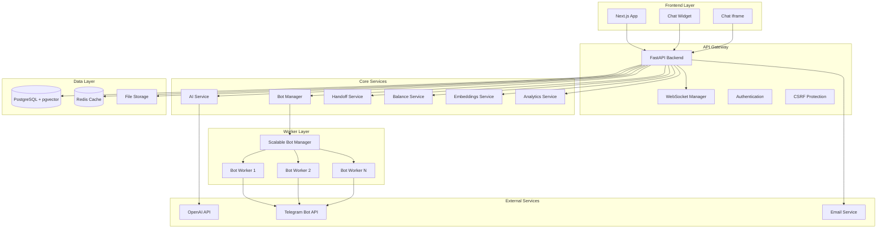
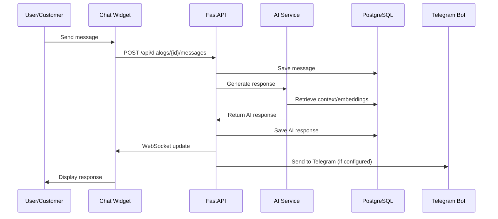
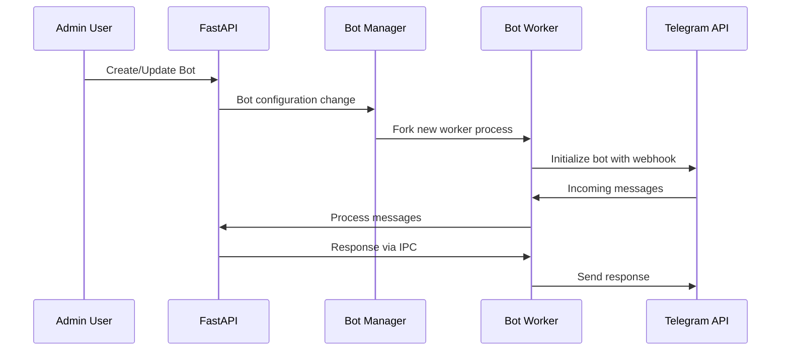

# ReplyX - Architecture Overview

**Last Updated:** 2025-09-04 (aligned with current MVP 13 structure)

ReplyX is a comprehensive full-stack AI assistant platform designed for enterprises to deploy intelligent chatbots and manage customer interactions through multiple channels.

## Repository Structure (September 2025)

The project follows a refined clean separation of concerns based on the actual current structure:

```
/
├── backend/                    # Python FastAPI application
│   ├── api/                    # 20 API modules (auth, assistants, dialogs, etc.)
│   ├── ai/                     # AI providers and token management
│   ├── core/                   # App config, auth, security headers, CSRF
│   ├── database/              # Models, schemas, CRUD, connection
│   ├── services/              # Business logic services
│   ├── cache/                 # Redis cache management
│   ├── monitoring/            # Audit logging, DB size monitoring
│   ├── validators/            # Input validation and rate limiting
│   ├── integrations/          # Email and external services
│   ├── utils/                 # Utilities and bot cleanup
│   ├── security/              # Security monitoring (fail2ban)
│   ├── templates/             # Email templates
│   └── alembic/              # Database migrations
├── workers/                    # Node.js Telegram bot workers (13 workers)
│   ├── package.json           # Worker dependencies
│   └── scripts/               # Worker management scripts
├── frontend/                   # Next.js 13 React application
│   ├── pages/                 # 39 pages including admin panel
│   ├── components/            # React components (admin, ui, dialogs, etc.)
│   ├── hooks/                 # 19 custom React hooks
│   ├── styles/                # CSS modules and design tokens
│   └── contexts/              # React contexts
├── tests/                      # Testing infrastructure
│   └── backend/integration/   # Backend integration tests
├── scripts/                    # Build and deployment automation
│   ├── backend/               # Backend-specific scripts
│   └── reorganization/        # Project reorganization tools
├── payments/                   # Payment processing system
├── docs/                       # Comprehensive documentation (35 sections)
│   ├── api/                   # API documentation
│   ├── architecture/          # System architecture
│   ├── db/                    # Database schema and migrations
│   ├── runbooks/              # Operational procedures
│   └── ...                    # Additional documentation sections
└── .github/                   # CI/CD workflows
```

## Technology Stack

### Backend (Python/FastAPI)
- **FastAPI** - Modern, high-performance web framework with async support
- **PostgreSQL** with **pgvector** extension for vector embeddings and semantic search
- **Redis** for caching and session management
- **SQLAlchemy** with Alembic for database management (40+ production-ready migrations)
- **OpenAI API integration** with intelligent token pooling and rate limiting
- **Prometheus** for comprehensive metrics collection and monitoring
- **WebSocket** support for real-time communications
- **CSRF Protection** and security headers middleware
- **Authentication** via JWT tokens with role-based access control

### Frontend (Next.js/React)
- **Next.js 13.5.11** with TypeScript support (39 pages including admin panel)
- **React 18.2.0** with modern hooks architecture (19 custom hooks)
- **Tailwind CSS 3.4.17** for responsive styling with design tokens
- **Mantine UI components** (@mantine/core, @mantine/hooks)
- **Framer Motion 12.23** for smooth animations and transitions
- **Axios** for API communications with error handling
- **React Icons** for comprehensive icon library
- **React Color** for color picker components

### Worker Processes (Node.js)
- **Node.js workers** with Telegram Bot API integration (13 active workers)
- **Scalable multi-bot management** system supporting 1000+ concurrent bots
- **Advanced rate limiting** with Telegram API compliance (30 msg/sec per bot)
- **Process isolation** for reliability and fault tolerance
- **IPC communication** between master and worker processes
- **Real-time monitoring** and health checks

### Infrastructure & DevOps
- **Alembic** database migrations with production-safe CONCURRENT indexes
- **Fail2ban** security monitoring and intrusion prevention
- **PostgreSQL** with 30+ performance indexes optimized for production workloads
- **Redis** for caching, sessions, and real-time features
- **Comprehensive monitoring** with database size tracking and alert systems
- **Audit logging** for security and compliance tracking

## System Architecture

### High-Level Components



### Service Boundaries

#### Backend Services (FastAPI)
- **API Routes**: 20 modular API endpoints with comprehensive functionality
  - **Authentication & Authorization** - JWT tokens, CSRF protection, OAuth
  - **User Management** - Profile, onboarding, password reset, email confirmation  
  - **Assistant Management** - AI assistant configuration and deployment
  - **Document Processing** - Upload, indexing, knowledge base management
  - **Dialog Management** - Conversation handling and message routing
  - **Balance & Billing** - Payment processing, transaction history, quotas
  - **Analytics & Monitoring** - Usage statistics, performance metrics
  - **Admin Functions** - User management, system settings, AI token pool
  - **Handoff Management** - Human operator takeover and presence tracking
  - **Bot Instance Management** - Telegram bot lifecycle and configuration
  - **Support System** - Ticketing, email integration, help center
  - **WebSocket Management** - Real-time communications and live updates
  - **Database Administration** - Direct database operations and maintenance
  - **QA Knowledge** - Knowledge base CRUD operations
  - **Start Analytics** - Landing page and conversion tracking
  - **Tinkoff Payments** - Payment gateway integration
  - **Site Integration** - Website widget and iframe chat functionality
  - **Email Services** - SMTP integration and template management
  - **System Health** - Health checks, metrics, and status monitoring
  - **Token Management** - AI API key rotation and usage tracking

#### Core Business Services
- **AI Service**: OpenAI integration with token pooling and model routing
- **Embeddings Service**: Vector search and document indexing
- **Balance Service**: Payment processing and quota management
- **Handoff Service**: Human operator handoff with state machine
- **Bot Manager**: Multi-tenant bot orchestration
- **Analytics Service**: User behavior and system metrics

#### Worker System (/workers/)
- **Master Process**: Scalable bot manager supporting 1000+ concurrent bots
- **Worker Processes**: 13 isolated Telegram bot instances with process isolation
- **Advanced Rate Limiting**: Telegram API compliance with 30 msg/sec per bot
- **Process Monitoring**: Health checks, auto-restart, and performance tracking
- **IPC Communication**: Inter-process communication for coordination
- **Documentation**: See [workers runbook](../runbooks/workers.md)

#### Data Services
- **PostgreSQL**: Primary data store with 40+ tables and production-optimized schema
- **pgvector Extension**: Vector embeddings for semantic search with IVFFLAT indexes
- **Redis Cache**: Session caching, real-time data, and operator presence
- **File Storage**: Document and media management in /uploads directory
- **Migration System**: 40+ Alembic migrations with production-safe CONCURRENT indexing

## Key Features Implementation

### Multi-Tenant Architecture
- **User Isolation**: Each user has isolated assistants, knowledge base, and dialogs
- **Resource Quotas**: Per-user balance system with service pricing
- **Scalable Bots**: Independent Telegram bot workers per user/assistant

### AI Integration
- **Token Pooling**: Intelligent distribution across multiple OpenAI keys
- **Model Support**: GPT-4, GPT-4o, GPT-4o-mini with automatic fallbacks
- **Context Management**: Document-aware responses with embeddings
- **Professional Prompts**: Industry-specific prompt templates

### Real-Time Features
- **WebSocket Support**: Live dialog updates
- **Operator Handoff**: Real-time human takeover
- **System Monitoring**: Live metrics and alerts
- **Chat Widgets**: Embeddable customer support

### Security & Compliance
- **CSRF Protection**: Configurable CSRF middleware
- **Rate Limiting**: API and service-level limits
- **Fail2ban Integration**: Automatic security monitoring
- **Role-based Access**: Admin/user/operator roles
- **Audit Logging**: Comprehensive action tracking

## Data Flow Patterns

### User Interaction Flow


### Bot Management Flow


## Performance & Scalability

### Current Capacity
- **Concurrent Users**: 1000+ supported
- **Bot Instances**: Up to 1000 Telegram bots
- **Message Throughput**: 30 messages/second per bot
- **Database**: Optimized with performance indexes
- **Memory Usage**: ~150MB per bot worker

### Monitoring & Observability
- **Prometheus Metrics**: HTTP requests, database, Redis, WebSocket connections
- **Health Checks**: Database, Redis, AI token manager status
- **Rate Limit Metrics**: Detailed Telegram API usage statistics
- **Database Monitoring**: Size tracking and growth rate analysis
- **Audit Logging**: Security and user action tracking

## Deployment Architecture

### Process Structure (Post-Reorganization)
```
├── FastAPI Backend (backend/main.py)
├── Scalable Bot Manager (workers/master/scalable_bot_manager.js) ← moved to root
├── Bot Workers (workers/telegram/bot_worker.js) × N instances ← moved to root  
├── Next.js Frontend (frontend/)
├── PostgreSQL Database
├── Redis Cache
├── File Storage (/uploads)
└── Tests (tests/) ← centralized testing
```

### Communication Patterns
- **HTTP/HTTPS**: Frontend ↔ Backend API
- **WebSocket**: Real-time updates Frontend ↔ Backend
- **IPC**: Master ↔ Worker processes
- **Database Connections**: Connection pooling with SQLAlchemy
- **Redis**: Caching and session management
- **External APIs**: OpenAI, Telegram Bot API, Email services
