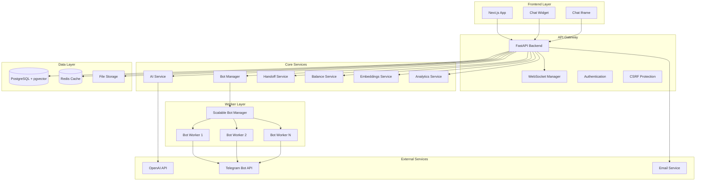
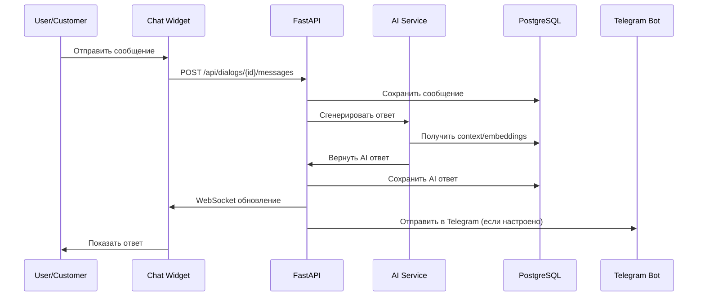
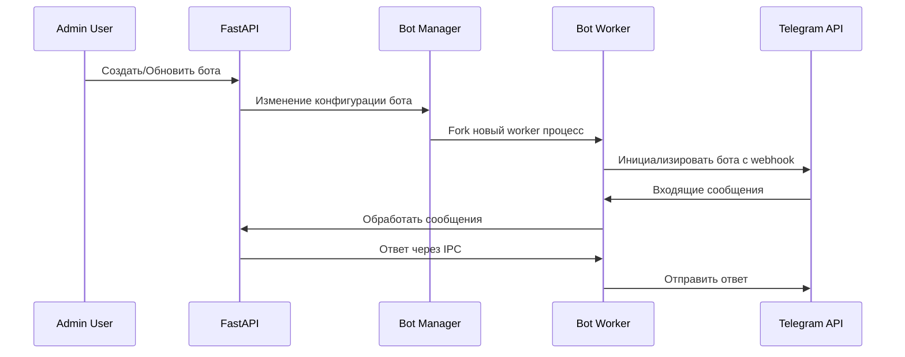
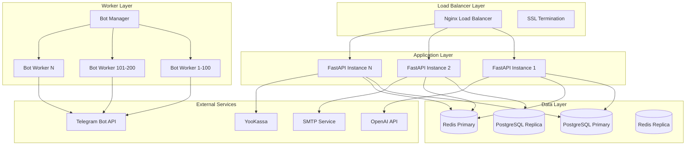

# ReplyX - Обзор архитектуры

**Последнее обновление:** 13 сентября 2025 г. (комплексный анализ структуры MVP 13)

ReplyX представляет собой комплексную full-stack платформу AI-ассистентов, предназначенную для предприятий, которые хотят развернуть интеллектуальные чат-боты и управлять клиентскими взаимодействиями через множественные каналы. Платформа обеспечивает масштабируемую мульти-тенантную архитектуру, поддерживающую 1000+ одновременных пользователей с продвинутой AI-интеграцией, коммуникациями в реальном времени и сложными мерами безопасности.

## Структура репозитория (сентябрь 2025)

Проект следует усовершенствованному четкому разделению ответственности на основе фактической текущей структуры:

```
/
├── backend/                    # Приложение Python FastAPI
│   ├── api/                    # 20 API модулей (auth, assistants, dialogs, etc.)
│   ├── ai/                     # AI провайдеры и управление токенами
│   ├── core/                   # Конфигурация приложения, авторизация, security headers, CSRF
│   ├── database/              # Модели, схемы, CRUD, подключения
│   ├── services/              # Сервисы бизнес-логики
│   ├── cache/                 # Управление кэшем Redis
│   ├── monitoring/            # Аудит логов, мониторинг размера БД
│   ├── validators/            # Валидация входных данных и rate limiting
│   ├── integrations/          # Email и внешние сервисы
│   ├── utils/                 # Утилиты и очистка ботов
│   ├── security/              # Мониторинг безопасности (fail2ban)
│   ├── templates/             # Шаблоны email
│   └── alembic/              # Миграции базы данных
├── workers/                    # Node.js Telegram bot workers (13 воркеров)
│   ├── package.json           # Зависимости воркеров
│   └── scripts/               # Скрипты управления воркерами
├── frontend/                   # Next.js 13 React приложение
│   ├── pages/                 # 39 страниц включая админ панель
│   ├── components/            # React компоненты (admin, ui, dialogs, etc.)
│   ├── hooks/                 # 19 кастомных React хуков
│   ├── styles/                # CSS модули и design токены
│   └── contexts/              # React контексты
├── tests/                      # Инфраструктура тестирования
│   └── backend/integration/   # Интеграционные тесты backend
├── scripts/                    # Автоматизация сборки и деплоя
│   ├── backend/               # Backend-специфичные скрипты
│   └── reorganization/        # Инструменты реорганизации проекта
├── payments/                   # Система обработки платежей
├── docs/                       # Комплексная документация (35 разделов)
│   ├── api/                   # API документация
│   ├── architecture/          # Системная архитектура
│   ├── db/                    # Схема БД и миграции
│   ├── runbooks/              # Операционные процедуры
│   └── ...                    # Дополнительные разделы документации
└── .github/                   # CI/CD workflows
```

## Технологический стек (Technology Stack)

### Backend (Python/FastAPI)
- **FastAPI 0.104+** - Современный, высокопроизводительный web framework с lifespan events и async поддержкой
- **PostgreSQL 14+** с расширением **pgvector** для векторных embeddings и семантического поиска
- **Redis** для кэширования, управления сессиями и pub/sub сообщений
- **SQLAlchemy 2.0** с Alembic для управления базой данных (40+ production-ready миграций)
- **Интеграция OpenAI API** с интеллектуальным token pooling, rate limiting и proxy управлением
- **Prometheus** для комплексного сбора метрик и мониторинга
- **Server-Sent Events (SSE)** для коммуникаций в реальном времени (миграция с WebSocket)
- **CSRF Protection** и security headers middleware с динамическим CORS
- **Аутентификация** через JWT токены с role-based access control и file-based секретами
- **Динамический middleware** для CORS, CSP (Content Security Policy) и security headers

### Frontend (Next.js/React)
- **Next.js 13.5.11** с поддержкой TypeScript (39 страниц включая админ панель)
- **React 18.2.0** с современной hooks архитектурой (19 кастомных хуков)
- **Tailwind CSS 3.4.17** для отзывчивой стилизации с design токенами
- **Mantine UI компоненты** (@mantine/core, @mantine/hooks)
- **Framer Motion 12.23** для плавных анимаций и переходов
- **Axios** для API коммуникаций с обработкой ошибок
- **React Icons** для комплексной библиотеки иконок
- **React Color** для компонентов выбора цвета

### Worker процессы (Node.js)
- **Node.js 18+** воркеры с интеграцией Telegram Bot API (13+ активных воркеров)
- **Масштабируемая система управления мульти-ботами**, поддерживающая 1000+ одновременных ботов
- **Продвинутый rate limiting** с соответствием Telegram API (30 сообщений/сек на бота)
- **Изоляция процессов** для надежности и fault tolerance с автоматическим перезапуском
- **IPC коммуникация** между master и worker процессами
- **Мониторинг в реальном времени** с Prometheus метриками и health checks
- **Redis-основанное** управление состоянием и pub/sub коммуникации
- **Express.js** HTTP сервер для health checks и metrics endpoints

### Инфраструктура и DevOps
- **Alembic** миграции базы данных с production-safe CONCURRENT индексами
- **Fail2ban** мониторинг безопасности и предотвращение вторжений
- **PostgreSQL** с 30+ производительными индексами, оптимизированными для production нагрузок
- **Redis Cluster** поддержка для кэширования, сессий и real-time функций
- **Комплексный мониторинг** с отслеживанием размера базы данных, анализом скорости роста и системами оповещений
- **Audit logging** для безопасности и отслеживания соответствия требованиям
- **Docker контейнеризация** с production-ready Dockerfile'ами
- **Environment-based конфигурация** с безопасным управлением секретами
- **Health check endpoints** для интеграции с load balancer
- **Prometheus метрики** с кастомными коллекторами для бизнес метрик

## Системная архитектура

### Высокоуровневые компоненты



### Границы сервисов (Service Boundaries)

#### Backend сервисы (FastAPI)
- **API Routes**: 24 модульных API endpoints с комплексной функциональностью
  - **Аутентификация и авторизация** (`api/auth.py`) - JWT токены, CSRF защита, email подтверждение
  - **Управление пользователями** (`api/users.py`) - Управление профилем, onboarding, сброс пароля
  - **Управление ассистентами** (`api/assistants.py`) - Конфигурация AI ассистентов, деплой и обучение
  - **Обработка документов** (`api/documents.py`) - Загрузка, индексирование, knowledge base с векторными embeddings
  - **Управление диалогами** (`api/dialogs.py`) - Обработка разговоров, маршрутизация сообщений и управление контекстом
  - **Баланс и биллинг** (`api/balance.py`) - Обработка платежей, история транзакций, квоты сервисов
  - **Аналитика и мониторинг** (`api/start_analytics.py`) - Статистика использования, отслеживание конверсии
  - **Админ функции** (`api/admin.py`) - Управление пользователями, системные настройки, администрирование AI token pool
  - **Управление Handoff** (`api/handoff.py`) - Передача человеку-оператору, отслеживание присутствия, SLA управление
  - **Управление экземплярами ботов** (`api/bots.py`) - Жизненный цикл Telegram ботов, hot reloading, конфигурация
  - **Система поддержки** (`api/support.py`) - Система тикетов, интеграция email, help center
  - **SSE управление** (`api/sse.py`) - Server-Sent Events для коммуникаций в реальном времени
  - **Администрирование БД** (`api/database_admin.py`) - Прямые операции с базой данных и обслуживание
  - **QA Knowledge** (`api/qa_knowledge.py`) - CRUD knowledge base с семантическим поиском
  - **Интеграция сайта** (`api/site.py`) - Website widget, iframe chat, валидация домена
  - **Email сервисы** (`api/email.py`) - SMTP интеграция, управление шаблонами, массовые операции
  - **Состояние системы** (`api/system.py`) - Health checks, метрики, мониторинг состояния системы
  - **Управление токенами** (`api/tokens.py`) - Валидация и управление API токенами
  - **YooKassa платежи** (`api/yookassa_payments.py`) - Интеграция российского платежного шлюза
  - **Мониторинг прокси** (`api/proxy_monitoring.py`) - Мониторинг здоровья и производительности AI прокси
  - **Debug SSE** (`api/debug_sse.py`) - Инструменты разработки для отладки SSE

#### Основные бизнес-сервисы
- **AI Сервисы** (`ai/`):
  - **AI Провайдеры** (`ai_providers.py`) - Мульти-провайдерная AI интеграция (OpenAI, fallback провайдеры)
  - **AI Token Manager** (`ai_token_manager.py`) - Token pooling, ротация и отслеживание использования
  - **Профессиональные промпты** (`professional_prompts.py`) - Отраслевые шаблоны промптов
  - **Proxy Manager** (`proxy_manager.py`) - Маршрутизация AI запросов и failover
  - **Система обучения** (`training_system.py`) - Обучение и улучшение ассистентов
- **Бизнес сервисы** (`services/`):
  - **Embeddings сервис** (`embeddings_service.py`) - Векторный поиск, индексирование документов, семантическое сходство
  - **Balance сервис** (`balance_service.py`) - Обработка платежей, управление квотами, ценообразование сервисов
  - **Handoff сервис** (`handoff_service.py`) - Передача человеку-оператору с интеллектуальным обнаружением
  - **Bot Manager** (`bot_manager.py`) - Мульти-тенантная оркестрация ботов и управление жизненным циклом
  - **Analytics сервис** (`analytics_service.py`) - Отслеживание поведения пользователей и бизнес метрик
  - **SSE Manager** (`sse_manager.py`) - Server-Sent Events для обновлений в реальном времени
  - **Document сервис** (`document_service.py`) - Обработка файлов и управление knowledge base
  - **Trial сервис** (`trial_service.py`) - Управление бесплатными пробными периодами и принуждение квот
  - **LLM Client** (`llm_client.py`) - Слой абстракции языковой модели
  - **Operator Presence** (`operator_presence.py`) - Отслеживание доступности оператора в реальном времени

#### Система воркеров (/workers/)
- **Master процесс**: Масштабируемый bot manager, поддерживающий 1000+ одновременных ботов
- **Worker процессы**: 13 изолированных экземпляров Telegram ботов с изоляцией процессов
- **Продвинутый Rate Limiting**: Соответствие Telegram API с 30 сообщений/сек на бота
- **Мониторинг процессов**: Health checks, авто-перезапуск и отслеживание производительности
- **IPC коммуникация**: Межпроцессная коммуникация для координации
- **Документация**: См. [workers runbook](../runbooks/workers.md)

#### Сервисы данных
- **База данных PostgreSQL** (`database/`):
  - **Модели** (`models.py`) - SQLAlchemy ORM модели с 40+ таблицами
  - **Схемы** (`schemas.py`) - Pydantic схемы валидации данных
  - **CRUD операции** (`crud.py`) - Операции с базой данных и оптимизация запросов
  - **Управление подключениями** (`connection.py`) - Connection pooling и определение окружения
  - **Утилиты** (`utils/`) - Резервное копирование, мониторинг, управление транзакциями
- **Расширение pgvector**: Векторные embeddings для семантического поиска с IVFFLAT индексами
- **Redis кэш** (`cache/`):
  - **Redis Cache** (`redis_cache.py`) - Кэширование сессий, rate limiting, временные данные
  - **Pub/Sub сообщения** - Распределение событий для real-time функций
- **Файловое хранилище**: Управление документами и медиа в директории /uploads с валидацией
- **Система миграций**: 40+ Alembic миграций с production-safe CONCURRENT индексированием

## Реализация ключевых функций

### Мульти-тенантная архитектура
- **Изоляция пользователей**: Каждый пользователь имеет изолированных ассистентов, knowledge base и диалоги
- **Квоты ресурсов**: Система баланса per-user с ценообразованием сервисов
- **Масштабируемые боты**: Независимые Telegram bot воркеры на пользователя/ассистента

### AI интеграция
- **Token Pooling**: Интеллектуальное распределение между несколькими OpenAI ключами
- **Поддержка моделей**: GPT-4, GPT-4o, GPT-4o-mini с автоматическими fallback
- **Управление контекстом**: Ответы с учетом документов через embeddings
- **Профессиональные промпты**: Отраслевые шаблоны промптов

### Функции реального времени (Real-Time)
- **WebSocket поддержка**: Обновления диалогов в живом времени
- **Operator Handoff**: Передача человеку в реальном времени
- **Мониторинг системы**: Живые метрики и оповещения
- **Chat виджеты**: Встраиваемая клиентская поддержка

### Безопасность и соответствие требованиям
- **Многослойная архитектура безопасности** (`core/security/`):
  - **CSRF Protection** (`csrf_protection.py`) - Настраиваемый CSRF middleware с валидацией токенов
  - **Динамический CORS** (`dynamic_cors_middleware.py`) - CORS политики на основе origin для основного приложения vs виджетов
  - **Security Headers** (`security_headers.py`) - HSTS, CSP, X-Frame-Options, referrer policy
  - **Динамический CSP** (`dynamic_csp_middleware.py`) - Content Security Policy для iframe встраивания
- **Аутентификация и авторизация** (`core/auth.py`):
  - **JWT токены** - Безопасная генерация токенов с настраиваемым истечением
  - **Role-based Access Control** - Разделение ролей админ, пользователь, оператор
  - **Site Authentication** (`site_auth.py`) - Аутентификация виджета и iframe
- **Управление секретами** (`core/secrets.py`):
  - **File-based секреты** - Production-safe загрузка секретов из файлов
  - **Определение окружения** - Автоматическое переключение dev/prod конфигурации
- **Rate Limiting** (`validators/`):
  - **API Rate Limiting** - Лимиты per-endpoint и per-user
  - **Telegram Rate Limiting** - Соответствие лимитам Telegram Bot API
- **Мониторинг безопасности** (`security/`):
  - **Интеграция Fail2ban** - Автоматическое предотвращение вторжений
  - **Audit Logging** (`monitoring/audit_logger.py`) - Комплексное отслеживание действий
  - **Security оповещения** - Уведомления о событиях безопасности в реальном времени

## Паттерны потока данных (Data Flow)

### Поток взаимодействия пользователя


### Поток управления ботами


## Производительность и масштабируемость

### Текущая пропускная способность
- **Одновременные пользователи**: Поддерживается 1000+
- **Экземпляры ботов**: До 1000 Telegram ботов
- **Пропускная способность сообщений**: 30 сообщений/секунду на бота
- **База данных**: Оптимизирована с производительными индексами
- **Использование памяти**: ~150MB на bot воркер

### Мониторинг и наблюдаемость (Observability)
- **Сбор Prometheus метрик** (`monitoring/`):
  - **HTTP метрики** - Задержка запросов, количество, статус коды по endpoint
  - **Метрики БД** - Использование connection pool, производительность запросов, отслеживание размера
  - **Redis метрики** - Доступность, количество подключений, cache hit rates
  - **SSE метрики** - Активные подключения, статус очереди сообщений
  - **Бизнес метрики** - Регистрация пользователей, количество сообщений, события платежей
  - **Telegram метрики** - Bot-специфичный rate limiting, пропускная способность сообщений
  - **AI метрики** - Использование токенов, производительность модели, здоровье прокси
- **Система Health Check** (endpoint `/health`):
  - **Здоровье БД** - Валидация подключения и запросов
  - **Здоровье Redis** - Доступность кэша и производительность
  - **AI Token Manager** - Доступность провайдера и статус квоты
  - **Дисковое пространство** - Мониторинг использования хранилища с пороговыми значениями
  - **Использование памяти** - Мониторинг системных ресурсов
  - **Database Pool** - Здоровье и использование connection pool
- **Специализированный мониторинг**:
  - **Database Size Monitor** (`monitoring/db_size_monitor.py`) - Анализ скорости роста и оповещения
  - **Rate Limit Monitoring** (`/metrics/telegram-rate-limit`) - Детальная статистика Telegram API
  - **Proxy Monitoring** (`api/proxy_monitoring.py`) - Здоровье AI провайдера и failover
  - **Audit Logging** (`monitoring/audit_logger.py`) - Отслеживание безопасности и соответствия требованиям
- **Dashboards в реальном времени**:
  - **Статус системы** - Живые метрики здоровья и производительности
  - **Бизнес аналитика** - Вовлеченность пользователей и метрики дохода
  - **Управление оповещениями** - Автоматизированные уведомления и эскалация

## Архитектура развертывания (Deployment)

### Структура процессов (после реорганизации)
```
├── FastAPI Backend (backend/main.py)
├── Scalable Bot Manager (workers/master/scalable_bot_manager.js) ← перенесен в root
├── Bot Workers (workers/telegram/bot_worker.js) × N экземпляров ← перенесен в root
├── Next.js Frontend (frontend/)
├── PostgreSQL Database
├── Redis Cache
├── File Storage (/uploads)
└── Tests (tests/) ← централизованное тестирование
```

## Архитектура коммуникаций в реальном времени

### Система Server-Sent Events (SSE)
- **SSE Manager** (`services/sse_manager.py`):
  - **Управление подключениями** - Отслеживание клиентов per-dialog и cleanup
  - **Event Broadcasting** - Эффективное распределение сообщений подписанным клиентам
  - **Система Heartbeat** - Мониторинг здоровья подключений и авто-cleanup
  - **Восстановление ошибок** - Автоматическое переподключение и синхронизация состояния
- **SSE Service** (`services/sse_service.py`):
  - **Фильтрация событий** - Маршрутизация событий пользователя и диалога
  - **Очередь сообщений** - Надежная доставка с механизмами повтора
  - **Аутентификация клиента** - JWT-основанная валидация клиента
- **Миграция с WebSocket** - Улучшенная надежность и упрощенное развертывание
- **Совместимость с браузерами** - Универсальная поддержка SSE с полифиллами
- **Load Balancer Friendly** - HTTP-основанное, без sticky sessions

### Event-driven архитектура
- **Redis Pub/Sub** (`services/events_pubsub.py`):
  - **Межсервисная коммуникация** - Разделенные сервисные сообщения
  - **Уведомления в реальном времени** - Активность пользователей, системные события, присутствие оператора
  - **Маршрутизация событий** - Распределение сообщений на основе тем
- **WebSocket Bridge** (Legacy, поэтапно выводится):
  - **Совместимость шлюза** - Поддержка существующих WebSocket клиентов
  - **Прогрессивная миграция** - Постепенный переход на SSE

## Внешние интеграции и API

### Интеграция AI провайдеров
- **Интеграция OpenAI** (`ai/ai_providers.py`):
  - **Поддержка мульти-моделей** - GPT-4, GPT-4o, GPT-4o-mini с автоматическими fallback
  - **Управление токенами** (`ai/ai_token_manager.py`) - Интеллектуальный token pooling и ротация
  - **Управление прокси** (`ai/proxy_manager.py`) - Мониторинг здоровья и failover
  - **Оптимизация запросов** - Пакетирование, кэширование и логика повторов
- **Embeddings сервисы** (`services/embeddings_service.py`):
  - **Генерация векторов** - Document и query embedding с OpenAI
  - **Семантический поиск** - pgvector-powered сопоставление сходства
  - **Интеграция Knowledge Base** - Context-aware AI ответы

### Telegram Bot API
- **Масштабируемое управление ботами** (`workers/`):
  - **Мульти-тенантная архитектура** - Изолированные экземпляры ботов на пользователя/ассистента
  - **Продвинутый Rate Limiting** - Соответствие Telegram API (30 сообщений/сек на бота)
  - **Изоляция процессов** - Независимые worker процессы для надежности
  - **Мониторинг здоровья** - Автоматический перезапуск и отслеживание производительности
- **Доставка сообщений** - Гарантированная доставка с механизмами повтора
- **Управление Webhook** - Динамическая конфигурация и валидация webhook

### Платежные шлюзы
- **Интеграция YooKassa** (`api/yookassa_payments.py`):
  - **Российский рынок** - Локальные методы платежа и соответствие требованиям
  - **Обработка Webhook** - Обновления статуса платежа в реальном времени
  - **Управление возвратами** - Автоматизированная обработка возвратов
- **Система баланса** (`services/balance_service.py`):
  - **Ценообразование сервисов** - Гибкая модель ценообразования для различных сервисов
  - **Отслеживание использования** - Мониторинг квот в реальном времени и принуждение
  - **История транзакций** - Детальные журналы платежей и использования

### Email сервисы
- **SMTP интеграция** (`integrations/email_service.py`):
  - **Система шаблонов** - HTML/текстовые email шаблоны с переменными
  - **Массовые операции** - Эффективная обработка массовых email
  - **Отслеживание доставки** - Мониторинг статуса и обработка отказов
- **Система уведомлений** - Onboarding пользователей, системные оповещения, operator handoff

## Архитектура воркеров и фоновых задач

### Система Node.js воркеров (`workers/`)
- **Scalable Bot Manager** (`master/scalable_bot_manager.js`):
  - **Оркестрация процессов** - Master процесс, управляющий 1000+ worker ботами
  - **Балансировка нагрузки** - Интеллектуальное распределение работы между воркерами
  - **Мониторинг здоровья** - Health checks процессов и автоматический перезапуск
  - **Управление ресурсами** - Оптимизация использования памяти и CPU
- **Bot Worker процессы** (`telegram/bot_worker.js`):
  - **Интеграция Telegram Bot** - node-telegram-bot-api wrapper
  - **Rate Limiting** - per-bot соответствие Telegram API
  - **Обработка сообщений** - Асинхронная обработка сообщений с очередями
  - **Обработка ошибок** - Graceful восстановление ошибок и логирование
- **Межпроцессная коммуникация**:
  - **Master ↔ Worker IPC** - Распределение команд и отчеты о статусе
  - **Redis координация** - Общение состояниями и синхронизация событий
  - **HTTP Health Endpoints** - Интеграция внешнего мониторинга

### Обработка фоновых задач
- **Обработка документов** - Асинхронная загрузка и индексирование файлов
- **Генерация Embedding** - Пакетное вычисление векторов
- **Агрегация аналитики** - Периодическое вычисление метрик
- **Задачи очистки** - Автоматизированное удержание данных и cleanup
- **Обработка очереди Email** - Надежная доставка email

### Паттерны коммуникации
- **HTTP/HTTPS**: Frontend ↔ Backend API (REST + form data)
- **Server-Sent Events**: Обновления в реальном времени Frontend ↔ Backend
- **IPC**: Master ↔ Worker процессы (Node.js)
- **Database подключения**: Connection pooling с SQLAlchemy
- **Redis**: Кэширование, сессии, pub/sub сообщения
- **Внешние API**: OpenAI, Telegram Bot API, Email сервисы, Платежные шлюзы

## Управление конфигурацией

### Environment-based конфигурация (`core/app_config.py`)
- **Автоматическое определение окружения** - Development vs Production на основе наличия .env файла
- **Управление секретами** (`core/secrets.py`):
  - **File-based секреты** - Production-safe загрузка секретов из монтированных файлов
  - **Environment переменные** - Fallback на environment переменные для разработки
  - **Валидация** - Комплексная валидация секретов при запуске
- **Конфигурация БД**:
  - **Development** - localhost PostgreSQL с пользовательскими учетными данными
  - **Production** - Удаленный PostgreSQL с file-based аутентификацией
  - **Connection Pooling** - Оптимизированное управление подключениями
- **Конфигурация сервисов**:
  - **AI настройки** - Размер token pool, выбор модели, rate limits
  - **Trial настройки** - Продолжительность бесплатного периода и лимиты сообщений
  - **Handoff настройки** - SLA пороговые значения, емкость оператора, ключевые слова
  - **CORS настройки** - Domain-specific политики для безопасности

### Feature флаги и переключатели
- **CSRF Protection** - Настраиваемая по окружению
- **Handoff система** - Включить/отключить интеграцию человека-оператора
- **WS Bridge** - Переключатель поддержки legacy WebSocket
- **Debug функции** - Development-only endpoints и логирование

## Архитектура данных и схема

### Обзор схемы БД
```sql
-- Основные сущности
users (id, email, password_hash, role, trial_expires_at)
assistants (id, user_id, name, config, bot_config)
dialogs (id, user_id, assistant_id, channel_type, status)
messages (id, dialog_id, content, role, metadata)

-- Знания и документы
documents (id, user_id, filename, content_type, vector_id)
embeddings (id, document_id, content, vector, metadata)
qa_pairs (id, user_id, question, answer, similarity_threshold)

-- Бизнес логика
user_balances (id, user_id, balance, currency)
transactions (id, user_id, amount, service_type, status)
service_prices (id, service_name, price_per_unit)

-- Интеграция Telegram
bots (id, assistant_id, token, webhook_url, status)
bot_chats (id, bot_id, chat_id, user_info)

-- Система операторов
operator_presence (user_id, status, last_heartbeat, max_chats)
handoff_requests (id, dialog_id, status, created_at, assigned_to)

-- Система и аналитика
audit_logs (id, user_id, action, resource_type, details)
analytics_events (id, user_id, event_type, properties, timestamp)
```

### Векторный поиск с pgvector
- **Хранение Embedding** - Высокоразмерные векторы для семантического поиска
- **IVFFLAT индексы** - Оптимизированный поиск подобия векторов
- **Пороговые значения подобия** - Настраиваемая чувствительность сопоставления
- **Извлечение контекста** - RAG (Retrieval-Augmented Generation) интеграция

## Паттерны развертывания

### Production архитектура


### Оркестрация контейнеров
- **Docker контейнеры** - Стандартизированные пакеты развертывания
- **Health Check Endpoints** - Интеграция load balancer
- **Graceful Shutdown** - Правильная очистка и дренирование подключений
- **Ограничения ресурсов** - Ограничения памяти и CPU

### Стратегии масштабирования
- **Горизонтальное масштабирование** - Множественные FastAPI экземпляры за load balancer
- **Database Read Replicas** - Распределение запросов для read-heavy нагрузок
- **Redis кластеризация** - Распределение данных кэша и сессий
- **Масштабирование Worker процессов** - Динамическое распределение bot воркеров
- **CDN интеграция** - Оптимизация статических ресурсов

## Производительность и оптимизация

### Текущие метрики производительности
- **Время ответа** - Среднее время ответа API < 200мс
- **Пропускная способность** - Поддерживается 1000+ одновременных пользователей
- **Производительность БД** - Оптимизировано с 30+ индексами
- **Использование памяти** - ~512MB на экземпляр FastAPI
- **Емкость ботов** - 1000 одновременных Telegram ботов
- **Обработка сообщений** - 30,000 сообщений/секунду общая пропускная способность

### Техники оптимизации
- **Оптимизация базы данных**:
  - **Connection Pooling** - Эффективное переиспользование подключений к БД
  - **Оптимизация запросов** - Анализированные планы запросов и использование индексов
  - **CONCURRENT индексирование** - Production-safe создание индексов
- **Стратегия кэширования**:
  - **Redis кэширование** - Кэширование часто используемых данных
  - **Application-level кэширование** - In-memory кэширование результатов
  - **CDN кэширование** - Edge кэширование статических ресурсов
- **Оптимизация AI интеграции**:
  - **Token Pooling** - Эффективное использование API ключей
  - **Request Batching** - Снижение накладных расходов на API вызовы
  - **Proxy Failover** - Высокая доступность для AI сервисов

### Мониторинг и оповещения
- **Prometheus метрики** - Сбор системных и бизнес метрик
- **Health Check Dashboards** - Статус системы в реальном времени
- **Performance оповещения** - Автоматизированное обнаружение проблем
- **Capacity Planning** - Проактивные решения масштабирования

---

## Краткий справочник

### Ключевые технологии
- **Backend**: FastAPI (Python 3.9+), SQLAlchemy, Alembic
- **Frontend**: Next.js 13, React 18, TypeScript, Tailwind CSS
- **Database**: PostgreSQL 14+ с расширением pgvector
- **Cache**: Redis 6+ с поддержкой кластеризации
- **Workers**: Node.js 18+, Express.js, Telegram Bot API
- **Monitoring**: Prometheus, кастомные health checks
- **Security**: CSRF, CORS, JWT, file-based секреты
- **AI Integration**: OpenAI GPT модели, embeddings, управление прокси

### Архитектурные паттерны
- **Multi-tenant SaaS** - Изолированные пользовательские окружения
- **Event-driven архитектура** - Разделенные сервисы через pub/sub
- **Микросервисы** - Модульные, независимые компоненты сервисов
- **RESTful API** - Стандартные HTTP-основанные интерфейсы сервисов
- **Real-time обновления** - Server-Sent Events для живых данных
- **Горизонтальное масштабирование** - Load-balanced экземпляры приложений

### Справки по документации
- **API документация**: [docs/api/](../api/)
- **Схема БД**: [docs/db/](../db/)
- **Руководство по развертыванию**: [docs/deployment/](../deployment/)
- **Runbooks**: [docs/runbooks/](../runbooks/)
- **Руководство по безопасности**: [docs/security/](../security/)

*Для детальных руководств по реализации и операционных процедур обращайтесь к конкретным разделам документации, ссылки на которые приведены выше.*