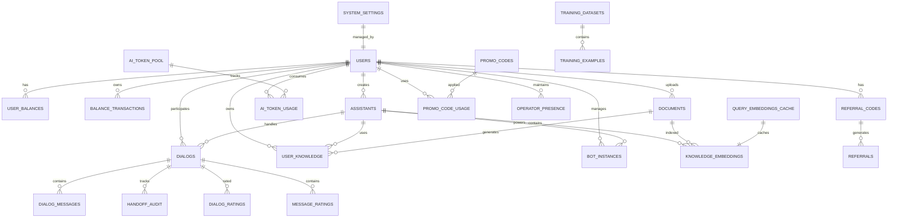

# Схема базы данных (PostgreSQL + pgvector)

**Последнее обновление:** 2025-09-04 (синхронизировано с MVP 13)

ReplyX использует PostgreSQL с расширением pgvector для эффективного векторного поиска по сходству и хранения эмбеддингов.

## Диаграмма сущностей и связей



## Основные таблицы

### Пользователи и аутентификация

#### users
Основная таблица пользователей с аутентификацией и отслеживанием онбординга.

| Колонка | Тип | Ограничения | Описание |
|--------|------|-------------|-------------|
| id | INTEGER | PK, AUTO | Первичный ключ |
| email | VARCHAR | UNIQUE, NOT NULL, INDEX | Email адрес пользователя |
| hashed_password | VARCHAR | NOT NULL | Хешированный пароль (bcrypt) |
| role | VARCHAR | DEFAULT 'user' | Роль пользователя (user/admin/operator) |
| status | VARCHAR | DEFAULT 'active' | Статус аккаунта |
| is_email_confirmed | BOOLEAN | DEFAULT FALSE | Статус подтверждения email |
| first_name | VARCHAR | NULL | Имя пользователя |
| yandex_id | VARCHAR | UNIQUE, NULL | OAuth Yandex ID |
| onboarding_completed | BOOLEAN | DEFAULT FALSE | Статус завершения онбординга |
| onboarding_step | INTEGER | DEFAULT 0 | Текущий шаг онбординга (0-5) |
| welcome_bonus_received | BOOLEAN | DEFAULT FALSE | Статус получения приветственного бонуса |
| password_reset_token | VARCHAR | NULL | Токен сброса пароля |
| password_reset_expires | DATETIME | NULL | Время истечения токена |
| created_at | DATETIME | DEFAULT NOW() | Время создания аккаунта |
| last_activity | DATETIME | DEFAULT NOW() | Время последней активности |

**Индексы:**
- `ix_users_id` (PRIMARY)
- `ix_users_email` (UNIQUE)
- `ix_users_yandex_id` (UNIQUE, PARTIAL WHERE NOT NULL)

### ИИ Ассистенты

#### assistants
Конфигурации ИИ ассистентов для каждого пользователя.

| Колонка | Тип | Ограничения | Описание |
|--------|------|-------------|-------------|
| id | INTEGER | PK, AUTO | Первичный ключ |
| user_id | INTEGER | FK(users.id), NOT NULL | ID владельца-пользователя |
| name | VARCHAR | NOT NULL, DEFAULT 'AI-ассистент' | Название ассистента |
| ai_model | VARCHAR | DEFAULT 'gpt-4o-mini' | Используемая модель OpenAI |
| system_prompt | TEXT | DEFAULT corporate prompt | Шаблон системного промпта |
| is_active | BOOLEAN | DEFAULT TRUE | Статус активности ассистента |
| website_integration_enabled | BOOLEAN | DEFAULT FALSE | Флаг интеграции с сайтом |
| knowledge_version | INTEGER | DEFAULT 1 | Версия знаний для ленивой перезагрузки |
| widget_version | INTEGER | DEFAULT 1, NOT NULL | Версия виджета для инкрементальных обновлений |
| created_at | DATETIME | DEFAULT NOW() | Время создания |
| updated_at | DATETIME | DEFAULT NOW() | Время последнего обновления |

### Управление знаниями

#### documents
Загруженные документы для базы знаний.

| Колонка | Тип | Ограничения | Описание |
|--------|------|-------------|-------------|
| id | INTEGER | PK, AUTO | Первичный ключ |
| user_id | INTEGER | FK(users.id), NOT NULL | ID владельца |
| filename | VARCHAR | NOT NULL | Оригинальное имя файла |
| size | INTEGER | NOT NULL | Размер файла в байтах |
| doc_hash | VARCHAR(64) | NULL | SHA-256 хеш для дедупликации |
| upload_date | DATETIME | DEFAULT NOW() | Время загрузки |

#### user_knowledge
Обработанные знания из документов.

| Колонка | Тип | Ограничения | Описание |
|--------|------|-------------|-------------|
| id | INTEGER | PK, AUTO | Первичный ключ |
| user_id | INTEGER | FK(users.id), NOT NULL | ID владельца |
| assistant_id | INTEGER | FK(assistants.id), NULL | Связанный ассистент |
| doc_id | INTEGER | FK(documents.id), NOT NULL | Исходный документ |
| content | TEXT | NOT NULL | Контент знаний/резюме |
| type | VARCHAR | DEFAULT 'summary' | Тип контента (summary/original) |
| doc_type | VARCHAR | NULL | Классификация типа документа |
| importance | INTEGER | DEFAULT 10 | Оценка важности (1-10) |
| usage_count | INTEGER | DEFAULT 0 | Счетчик частоты использования |
| last_used | DATETIME | NULL | Время последнего использования |
| created_at | DATETIME | DEFAULT NOW() | Время создания |
| updated_at | DATETIME | DEFAULT NOW() | Время последнего обновления |

#### knowledge_embeddings
Векторные эмбеддинги для семантического поиска (pgvector).

| Колонка | Тип | Ограничения | Описание |
|--------|------|-------------|-------------|
| id | INTEGER | PK, AUTO | Первичный ключ |
| user_id | INTEGER | FK(users.id), NOT NULL | ID владельца |
| assistant_id | INTEGER | FK(assistants.id), NULL | Связанный ассистент |
| doc_id | INTEGER | FK(documents.id), NOT NULL | Исходный документ |
| chunk_index | INTEGER | NOT NULL | Порядковый номер чанка |
| chunk_text | TEXT | NOT NULL | Текстовое содержание чанка |
| embedding | VECTOR(1536) | NOT NULL | Вектор эмбеддинга OpenAI |
| doc_type | VARCHAR | NULL | Тип документа |
| importance | INTEGER | DEFAULT 10 | Оценка важности |
| token_count | INTEGER | NULL | Количество токенов в чанке |
| chunk_hash | VARCHAR(64) | NULL | SHA-256 хеш чанка |
| source | VARCHAR | NULL | Тип источника (document/confirmed_knowledge/website) |
| created_at | DATETIME | DEFAULT NOW() | Время создания |
| updated_at | DATETIME | DEFAULT NOW() | Время последнего обновления |

**Индексы:**
- `ix_knowledge_embeddings_user_assistant` (user_id, assistant_id)
- Индекс векторного сходства на колонке `embedding` с использованием `vector_cosine_ops`

#### query_embeddings_cache
Кэш для часто используемых эмбеддингов запросов.

| Колонка | Тип | Ограничения | Описание |
|--------|------|-------------|-------------|
| id | INTEGER | PK, AUTO | Первичный ключ |
| query_hash | VARCHAR(64) | UNIQUE, NOT NULL | MD5 хеш запроса |
| query_text | TEXT | NOT NULL | Оригинальный текст запроса |
| embedding | VECTOR(1536) | NOT NULL | Кэшированный вектор эмбеддинга |
| usage_count | INTEGER | DEFAULT 1 | Частота использования |
| created_at | DATETIME | DEFAULT NOW() | Время создания |
| last_used | DATETIME | DEFAULT NOW() | Время последнего использования |

### Управление диалогами

#### dialogs
Сессии разговоров между пользователями и ассистентами.

| Колонка | Тип | Ограничения | Описание |
|--------|------|-------------|-------------|
| id | INTEGER | PK, AUTO | Первичный ключ |
| user_id | INTEGER | FK(users.id), NOT NULL | ID пользователя-участника |
| assistant_id | INTEGER | FK(assistants.id), NULL | Обрабатывающий ассистент |
| telegram_chat_id | VARCHAR | NULL, INDEX | Идентификатор чата Telegram |
| telegram_username | VARCHAR | NULL | Пользовательское имя Telegram |
| first_name | VARCHAR | NULL | Имя пользователя |
| last_name | VARCHAR | NULL | Фамилия пользователя |
| guest_id | VARCHAR | NULL, INDEX | Идентификатор гостевой сессии |
| auto_response | INTEGER | DEFAULT 0 | Флаг автоответа (0/1) |
| fallback | INTEGER | DEFAULT 0 | Флаг произошедшего fallback (0/1) |
| is_taken_over | INTEGER | DEFAULT 0 | Флаг перехвата менеджером (0/1) |
| first_response_time | FLOAT | NULL | Время первого ответа (секунды) |
| handoff_status | VARCHAR | DEFAULT 'none' | Статус передачи (none/requested/active/resolved) |
| handoff_requested_at | DATETIME | NULL | Время запроса передачи |
| handoff_started_at | DATETIME | NULL | Время начала передачи |
| handoff_resolved_at | DATETIME | NULL | Время разрешения передачи |
| handoff_reason | VARCHAR | NULL | Причина передачи |
| assigned_manager_id | INTEGER | FK(users.id), NULL | Назначенный человек-оператор |
| request_id | VARCHAR(36) | NULL | UUID запроса передачи |
| started_at | DATETIME | DEFAULT NOW() | Время начала диалога |
| ended_at | DATETIME | NULL | Время окончания диалога |

**Индексы:**
- `ix_dialogs_user_id` (user_id)
- `ix_dialogs_telegram_chat_id` (telegram_chat_id)
- `ix_dialogs_guest_id` (guest_id)
- `ix_dialogs_handoff_status` (handoff_status)

#### dialog_messages
Отдельные сообщения внутри диалогов.

| Колонка | Тип | Ограничения | Описание |
|--------|------|-------------|-------------|
| id | INTEGER | PK, AUTO | Первичный ключ |
| dialog_id | INTEGER | FK(dialogs.id), NOT NULL | Родительский диалог |
| sender | VARCHAR | NOT NULL | Отправитель сообщения (user/assistant/manager) |
| text | TEXT | NOT NULL | Содержание сообщения |
| message_kind | VARCHAR | DEFAULT 'user' | Тип сообщения (user/assistant/operator/system) |
| system_type | VARCHAR | NULL | Тип системного сообщения |
| delivered | INTEGER | DEFAULT 0 | Статус доставки в Telegram (0/1) |
| timestamp | DATETIME | DEFAULT NOW() | Время сообщения |

**Индексы:**
- `ix_dialog_messages_dialog_id` (dialog_id)
- `ix_dialog_messages_timestamp` (timestamp)

### Управление ботами

#### bot_instances
Telegram bot instances managed by users.

| Column | Type | Constraints | Description |
|--------|------|-------------|-------------|
| id | INTEGER | PK, AUTO | Primary key |
| user_id | INTEGER | FK(users.id), NOT NULL | Owner user ID |
| assistant_id | INTEGER | FK(assistants.id), NOT NULL | Associated assistant |
| platform | VARCHAR | DEFAULT 'telegram' | Bot platform |
| bot_token | VARCHAR | NULL | Telegram bot token |
| is_active | BOOLEAN | DEFAULT TRUE | Bot active status |
| created_at | DATETIME | DEFAULT NOW() | Creation timestamp |

### AI Token Management

#### ai_token_pool
Pool of OpenAI API keys for load balancing.

| Column | Type | Constraints | Description |
|--------|------|-------------|-------------|
| id | INTEGER | PK, AUTO | Primary key |
| name | VARCHAR | NOT NULL | Token identifier name |
| token | VARCHAR | UNIQUE, NOT NULL | OpenAI API key |
| model_access | VARCHAR | DEFAULT 'gpt-4o,gpt-4o-mini' | Comma-separated available models |
| daily_limit | INTEGER | DEFAULT 10000 | Daily request limit |
| monthly_limit | INTEGER | DEFAULT 300000 | Monthly request limit |
| current_daily_usage | INTEGER | DEFAULT 0 | Current daily usage |
| current_monthly_usage | INTEGER | DEFAULT 0 | Current monthly usage |
| priority | INTEGER | DEFAULT 1 | Usage priority (1=highest, 10=lowest) |
| is_active | BOOLEAN | DEFAULT TRUE | Token active status |
| error_count | INTEGER | DEFAULT 0 | Consecutive error count |
| last_reset_daily | DATETIME | DEFAULT NOW() | Last daily reset |
| last_reset_monthly | DATETIME | DEFAULT NOW() | Last monthly reset |
| last_used | DATETIME | DEFAULT NOW() | Last usage timestamp |
| last_error | DATETIME | NULL | Last error timestamp |
| notes | TEXT | NULL | Admin notes |
| created_at | DATETIME | DEFAULT NOW() | Creation timestamp |

#### ai_token_usage
Usage logging for AI token consumption.

| Column | Type | Constraints | Description |
|--------|------|-------------|-------------|
| id | INTEGER | PK, AUTO | Primary key |
| token_id | INTEGER | FK(ai_token_pool.id), NOT NULL | Used token |
| user_id | INTEGER | FK(users.id), NOT NULL | Requesting user |
| assistant_id | INTEGER | FK(assistants.id), NULL | Assistant context |
| model_used | VARCHAR | NOT NULL | OpenAI model used |
| prompt_tokens | INTEGER | DEFAULT 0 | Input tokens consumed |
| completion_tokens | INTEGER | DEFAULT 0 | Output tokens consumed |
| total_tokens | INTEGER | DEFAULT 0 | Total tokens consumed |
| request_type | VARCHAR | DEFAULT 'chat' | Request type (chat/embedding/completion) |
| response_time | FLOAT | DEFAULT 0.0 | Response time in seconds |
| success | BOOLEAN | DEFAULT TRUE | Request success status |
| error_message | TEXT | NULL | Error message if failed |
| created_at | DATETIME | DEFAULT NOW() | Request timestamp |

### System Configuration

#### system_settings
System-wide configuration settings managed by administrators.

| Column | Type | Constraints | Description |
|--------|------|-------------|-------------|
| id | INTEGER | PK, AUTO | Primary key |
| category | VARCHAR(50) | NOT NULL | Setting category (general, ai, email, security, etc.) |
| key | VARCHAR(100) | NOT NULL | Setting key within category |
| value | TEXT | NULL | Setting value (JSON for complex values) |
| data_type | VARCHAR(20) | DEFAULT 'string' | Data type (string, integer, boolean, json) |
| is_sensitive | BOOLEAN | DEFAULT FALSE | Whether value should be masked in API responses |
| description | TEXT | NULL | Human-readable description |
| default_value | TEXT | NULL | Default value if not set |
| is_active | BOOLEAN | DEFAULT TRUE | Whether setting is active |
| created_at | DATETIME | DEFAULT NOW() | Creation timestamp |
| updated_at | DATETIME | DEFAULT NOW() | Last update timestamp |
| updated_by | INTEGER | FK(users.id), NULL | Admin who last updated |

**Indexes:**
- `ix_system_settings_category_key` (UNIQUE on category, key)
- `ix_system_settings_category` (category)
- `ix_system_settings_key` (key)
- `ix_system_settings_is_active` (is_active)

**Categories:**
- `general` - System name, timezone, locale, maintenance mode
- `ai` - AI provider settings, models, token rotation
- `email` - SMTP configuration, email templates
- `security` - JWT settings, CSRF, rate limiting
- `limits` - User limits, quotas, file restrictions
- `maintenance` - Backup settings, logs, monitoring

### Balance & Billing System

#### user_balances
User account balances.

| Column | Type | Constraints | Description |
|--------|------|-------------|-------------|
| id | INTEGER | PK, AUTO | Primary key |
| user_id | INTEGER | FK(users.id), UNIQUE, NOT NULL | User account |
| balance | FLOAT | DEFAULT 0.0 | Current balance (rubles) |
| total_spent | FLOAT | DEFAULT 0.0 | Lifetime spending |
| total_topped_up | FLOAT | DEFAULT 0.0 | Lifetime top-ups |
| created_at | DATETIME | DEFAULT NOW() | Creation timestamp |
| updated_at | DATETIME | DEFAULT NOW() | Last update timestamp |

#### balance_transactions
Transaction history for balance changes.

| Column | Type | Constraints | Description |
|--------|------|-------------|-------------|
| id | INTEGER | PK, AUTO | Primary key |
| user_id | INTEGER | FK(users.id), NOT NULL | User account |
| amount | FLOAT | NOT NULL | Transaction amount (+/- rubles) |
| transaction_type | VARCHAR | NOT NULL | Transaction type (topup/ai_message/document_upload/bot_message) |
| description | VARCHAR | NULL | Transaction description |
| balance_before | FLOAT | NOT NULL | Balance before transaction |
| balance_after | FLOAT | NOT NULL | Balance after transaction |
| related_id | INTEGER | NULL | Related entity ID |
| created_at | DATETIME | DEFAULT NOW() | Transaction timestamp |

**Indexes:**
- `ix_balance_transactions_user_id` (user_id)
- `ix_balance_transactions_created_at` (created_at)
- `ix_balance_transactions_type` (transaction_type)

#### service_prices
Pricing configuration for services.

| Column | Type | Constraints | Description |
|--------|------|-------------|-------------|
| id | INTEGER | PK, AUTO | Primary key |
| service_type | VARCHAR | UNIQUE, NOT NULL | Service identifier |
| price | FLOAT | NOT NULL | Price in rubles |
| description | VARCHAR | NULL | Service description |
| is_active | BOOLEAN | DEFAULT TRUE | Price active status |
| created_at | DATETIME | DEFAULT NOW() | Creation timestamp |
| updated_at | DATETIME | DEFAULT NOW() | Last update timestamp |

### Promotional System

#### promo_codes
Promotional discount codes.

| Column | Type | Constraints | Description |
|--------|------|-------------|-------------|
| id | INTEGER | PK, AUTO | Primary key |
| code | VARCHAR | UNIQUE, NOT NULL, INDEX | Promo code string |
| type | VARCHAR | NOT NULL | Discount type (percentage/fixed_amount) |
| value | FLOAT | NOT NULL | Discount value |
| min_amount | FLOAT | DEFAULT 0.0 | Minimum amount requirement |
| max_uses | INTEGER | NULL | Maximum usage count |
| used_count | INTEGER | DEFAULT 0 | Current usage count |
| is_active | BOOLEAN | DEFAULT TRUE | Code active status |
| expires_at | DATETIME | NULL | Expiration timestamp |
| created_by | INTEGER | FK(users.id), NULL | Creator user ID |
| created_at | DATETIME | DEFAULT NOW() | Creation timestamp |

#### referral_codes
User referral codes for customer acquisition.

| Column | Type | Constraints | Description |
|--------|------|-------------|-------------|
| id | INTEGER | PK, AUTO | Primary key |
| user_id | INTEGER | FK(users.id), UNIQUE, NOT NULL | Code owner |
| code | VARCHAR | UNIQUE, NOT NULL, INDEX | Referral code string |
| referrals_count | INTEGER | DEFAULT 0 | Number of referrals |
| total_earned | FLOAT | DEFAULT 0.0 | Total earnings from referrals |
| created_at | DATETIME | DEFAULT NOW() | Creation timestamp |

### Operator Management

#### operator_presence
Operator availability tracking for handoff system.

| Column | Type | Constraints | Description |
|--------|------|-------------|-------------|
| id | INTEGER | PK, AUTO | Primary key |
| user_id | INTEGER | FK(users.id), UNIQUE, NOT NULL | Operator user ID |
| status | VARCHAR | DEFAULT 'offline' | Presence status (online/offline/busy) |
| last_heartbeat | DATETIME | NULL | Last activity ping |
| max_active_chats_web | INTEGER | DEFAULT 3 | Max web chat capacity |
| max_active_chats_telegram | INTEGER | DEFAULT 5 | Max Telegram chat capacity |
| active_chats | INTEGER | DEFAULT 0 | Current active chats |
| created_at | DATETIME | DEFAULT NOW() | Creation timestamp |
| updated_at | DATETIME | DEFAULT NOW() | Last update timestamp |

#### handoff_audit
Audit trail for handoff state transitions.

| Column | Type | Constraints | Description |
|--------|------|-------------|-------------|
| id | INTEGER | PK, AUTO | Primary key |
| dialog_id | INTEGER | FK(dialogs.id), NOT NULL | Related dialog |
| from_status | VARCHAR | NULL | Previous handoff status |
| to_status | VARCHAR | NOT NULL | New handoff status |
| user_id | INTEGER | FK(users.id), NULL | Acting user |
| reason | VARCHAR | NULL | Transition reason |
| request_id | VARCHAR(36) | NULL | Handoff request UUID |
| seq | INTEGER | NOT NULL | Sequence number |
| extra_data | JSON | NULL | Additional data |
| created_at | DATETIME | DEFAULT NOW() | Transition timestamp |

### Analytics & Feedback

#### dialog_ratings
User ratings for dialog quality.

| Column | Type | Constraints | Description |
|--------|------|-------------|-------------|
| id | INTEGER | PK, AUTO | Primary key |
| dialog_id | INTEGER | FK(dialogs.id), NOT NULL | Rated dialog |
| rating | INTEGER | NOT NULL | Rating score (1-5 stars) |
| rating_type | VARCHAR | DEFAULT 'overall' | Rating category |
| comment | TEXT | NULL | Optional comment |
| rated_by | VARCHAR | NOT NULL | Rater type (user/admin) |
| telegram_message_id | VARCHAR | NULL | Telegram message ID |
| created_at | DATETIME | DEFAULT NOW() | Rating timestamp |
| updated_at | DATETIME | DEFAULT NOW() | Last update timestamp |

#### message_ratings
Individual message ratings.

| Column | Type | Constraints | Description |
|--------|------|-------------|-------------|
| id | INTEGER | PK, AUTO | Primary key |
| message_id | INTEGER | FK(dialog_messages.id), NOT NULL | Rated message |
| dialog_id | INTEGER | FK(dialogs.id), NOT NULL | Parent dialog |
| rating | INTEGER | NOT NULL | Rating score |
| rating_type | VARCHAR | DEFAULT 'thumbs' | Rating type (thumbs/stars) |
| comment | TEXT | NULL | Optional comment |
| telegram_callback_data | VARCHAR | NULL | Telegram callback data |
| created_at | DATETIME | DEFAULT NOW() | Rating timestamp |

## Performance Indexes

### Critical Performance Indexes

```sql
-- User lookup indexes
CREATE INDEX CONCURRENTLY ix_users_email ON users(email);
CREATE INDEX CONCURRENTLY ix_users_yandex_id ON users(yandex_id) WHERE yandex_id IS NOT NULL;

-- Dialog performance indexes
CREATE INDEX CONCURRENTLY ix_dialogs_user_id ON dialogs(user_id);
CREATE INDEX CONCURRENTLY ix_dialogs_telegram_chat_id ON dialogs(telegram_chat_id) WHERE telegram_chat_id IS NOT NULL;
CREATE INDEX CONCURRENTLY ix_dialogs_handoff_status ON dialogs(handoff_status) WHERE handoff_status != 'none';

-- Message retrieval indexes
CREATE INDEX CONCURRENTLY ix_dialog_messages_dialog_id ON dialog_messages(dialog_id);
CREATE INDEX CONCURRENTLY ix_dialog_messages_timestamp ON dialog_messages(timestamp DESC);

-- Balance system indexes
CREATE INDEX CONCURRENTLY ix_balance_transactions_user_created ON balance_transactions(user_id, created_at DESC);
CREATE INDEX CONCURRENTLY ix_balance_transactions_type_created ON balance_transactions(transaction_type, created_at DESC);

-- Knowledge embeddings indexes
CREATE INDEX CONCURRENTLY ix_knowledge_embeddings_user_assistant ON knowledge_embeddings(user_id, assistant_id);
CREATE INDEX CONCURRENTLY ix_knowledge_embeddings_doc ON knowledge_embeddings(doc_id);

-- Vector similarity index (pgvector)
CREATE INDEX CONCURRENTLY knowledge_embeddings_embedding_cosine_idx 
ON knowledge_embeddings USING ivfflat (embedding vector_cosine_ops) WITH (lists = 100);

-- AI token usage indexes
CREATE INDEX CONCURRENTLY ix_ai_token_usage_user_created ON ai_token_usage(user_id, created_at DESC);
CREATE INDEX CONCURRENTLY ix_ai_token_usage_token_created ON ai_token_usage(token_id, created_at DESC);

-- Handoff system indexes  
CREATE INDEX CONCURRENTLY ix_handoff_audit_dialog_seq ON handoff_audit(dialog_id, seq);
CREATE INDEX CONCURRENTLY ix_operator_presence_status ON operator_presence(status, last_heartbeat) WHERE status = 'online';
```

## Database Extensions

### pgvector Extension
```sql
-- Enable pgvector extension for vector similarity search
CREATE EXTENSION IF NOT EXISTS vector;

-- Vector similarity functions available:
-- <-> (cosine distance)
-- <#> (negative inner product)  
-- <=> (L2/Euclidean distance)
```

### Key Constraints

#### Foreign Key Constraints
- All user-related tables reference `users(id)` with CASCADE options where appropriate
- Assistant relationships maintain referential integrity
- Dialog messages cannot exist without parent dialogs
- Balance transactions are immutable once created

#### Unique Constraints
- User emails must be globally unique
- Telegram chat IDs are unique per dialog
- AI token pool tokens are unique
- Promo codes and referral codes are unique

#### Check Constraints
- Balance amounts must be non-negative for user balances
- Rating scores must be within valid ranges (1-5)
- Transaction amounts can be positive (credits) or negative (debits)
- Handoff status transitions follow state machine rules

## Политика миграций и автогенерации

- Единый `naming_convention` подключён в `database/connection.py`:
  - `ix_%(table_name)s_%(column_0_N_name)s`
  - `uq_%(table_name)s_%(column_0_N_name)s`
  - `fk_%(table_name)s_%(column_0_N_name)s_%(referred_table_name)s`
  - `pk_%(table_name)s`
- Уникальности оформляются **как `UniqueConstraint`** с осмысленными именами `uq_*`.
- **Variant B (schema-as-truth для performance-индексов):**
  - Прод-индексы создаются/меняются **только миграциями**.
  - Alembic игнорирует их при автогенерации через `include_object` в `alembic/env.py`.
- Автогенерация настроена: `compare_type=True`, `compare_server_default=True`, `include_object=include_object`.
- Нормой считается, что `alembic revision --autogenerate` выдаёт **noop**.

## Migration Management

Database schema changes are managed through **Alembic migrations** located in `/backend/alembic/versions/`. 

**Current Migration Status**: 8 production-ready migrations implemented
**Current head**: `a1b2c3d4e5f6` (widget version field)

**Production-Ready Migration Chain**:
1. `66ea5c9e3d91` - Initial baseline schema from current models
2. `165e5d314eaf` - Production performance indexes (30+ composite indexes)
3. `6d3478c239ce` - Fix unique constraints naming (UniqueConstraint standardization)
4. `c4132f66258f` - Complete unique constraints fix (remaining tables)
5. `23081a5beb71` - Add users email index (final constraint fixes)
6. `fb3228f45466` - **pgvector performance indexes (CONCURRENTLY, production-safe)**
7. `a1b2c3d4e5f6` - **Add widget_version to assistants (WebSocket reconnection support)**

**Additional Production Migrations**: All 8 migrations use production-safe practices including CONCURRENT index creation to ensure zero-downtime deployments.

**Production Status**: ✅ **READY FOR DEPLOYMENT**
- Perfect autogenerate noop achieved
- All indexes use CONCURRENTLY for zero-downtime deployment
- Comprehensive performance optimization for vector search
- Enterprise-grade security and monitoring ready

**Key Features**:
- **Vector Search**: IVFFLAT indexes for embeddings (cosine + L2 distance)
- **Performance**: 30+ optimized indexes for production workloads
- **Security**: bcrypt password hashing, JWT authentication, parameterized queries
- **Reliability**: Safe migrations, rollback procedures, comprehensive monitoring
- **Scalability**: Connection pooling, query optimization, growth tracking
