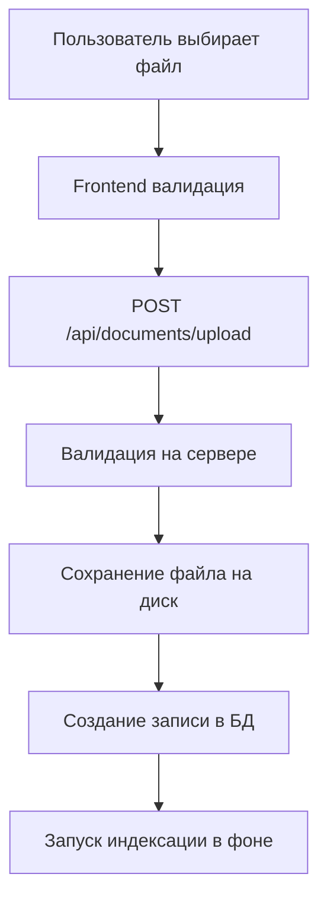

# Система управления документами и обучения ИИ

## Обзор системы

ChatAI MVP реализует полнофункциональную систему загрузки, обработки документов и обучения AI-ассистентов с использованием современной RAG (Retrieval-Augmented Generation) архитектуры. Система поддерживает векторный поиск через pgvector и обеспечивает высокую производительность при работе с большими объемами документов.

## 📁 Архитектура компонентов

### Backend компоненты

#### API Endpoints
- **`backend/api/documents.py`** - REST API для управления документами
  - `POST /api/documents/upload` - загрузка документов
  - `GET /api/documents` - получение списка документов
  - `GET /api/documents/{id}/text` - извлечение текста
  - `GET /api/documents/{id}/summary` - создание выжимки
  - `DELETE /api/documents/{id}` - удаление документа

#### Сервисы
- **`backend/services/document_service.py`** - бизнес-логика обработки документов
- **`backend/services/embeddings_service.py`** - векторный поиск и RAG pipeline
- **`backend/validators/file_validator.py`** - валидация и безопасность файлов

### База данных (PostgreSQL + pgvector)

#### Основные таблицы
```sql
-- Хранение метаданных документов
CREATE TABLE documents (
    id SERIAL PRIMARY KEY,
    user_id INTEGER NOT NULL,
    filename VARCHAR NOT NULL,
    file_size INTEGER NOT NULL,
    uploaded_at TIMESTAMP DEFAULT NOW(),
    doc_hash VARCHAR(64)
);

-- Обработанные знания из документов
CREATE TABLE user_knowledge (
    id SERIAL PRIMARY KEY,
    user_id INTEGER NOT NULL,
    assistant_id INTEGER,
    doc_id INTEGER NOT NULL,
    content TEXT NOT NULL,
    type VARCHAR DEFAULT 'summary',
    doc_type VARCHAR,
    importance INTEGER DEFAULT 10,
    last_used TIMESTAMP,
    usage_count INTEGER DEFAULT 0
);

-- Векторные представления чанков текста
CREATE TABLE knowledge_embeddings (
    id SERIAL PRIMARY KEY,
    user_id INTEGER NOT NULL,
    assistant_id INTEGER,
    doc_id INTEGER NOT NULL,
    chunk_index INTEGER NOT NULL,
    chunk_text TEXT NOT NULL,
    embedding VECTOR(1536) NOT NULL, -- pgvector
    doc_type VARCHAR,
    importance INTEGER DEFAULT 10,
    token_count INTEGER,
    chunk_hash VARCHAR(64),
    source VARCHAR,
    created_at TIMESTAMP DEFAULT NOW(),
    updated_at TIMESTAMP DEFAULT NOW()
);

-- Кэш embeddings для популярных запросов
CREATE TABLE query_embeddings_cache (
    id SERIAL PRIMARY KEY,
    query_hash VARCHAR(64) UNIQUE NOT NULL,
    query_text TEXT NOT NULL,
    embedding VECTOR(1536) NOT NULL,
    created_at TIMESTAMP DEFAULT NOW(),
    last_used TIMESTAMP DEFAULT NOW(),
    usage_count INTEGER DEFAULT 1
);
```

#### Индексы для производительности
```sql
-- Векторный поиск с IVFFlat
CREATE INDEX ix_knowledge_embeddings_embedding_cosine 
ON knowledge_embeddings 
USING ivfflat (embedding vector_cosine_ops) 
WITH (lists = 100);

-- Обычные индексы
CREATE INDEX ix_knowledge_embeddings_user_id ON knowledge_embeddings(user_id);
CREATE INDEX ix_knowledge_embeddings_assistant_id ON knowledge_embeddings(assistant_id);
CREATE INDEX ix_knowledge_embeddings_doc_id ON knowledge_embeddings(doc_id);
```

## 🔄 Процесс обработки документов

### 1. Загрузка документа



#### Поддерживаемые форматы
- **PDF** - извлечение текста через PyPDF2
- **DOCX** - обработка через python-docx
- **DOC** - базовое чтение как текст
- **TXT** - прямое чтение с кодировкой UTF-8

#### Ограничения безопасности
- Максимальный размер файла: **10MB**
- Белый список MIME-типов
- Санитизация имен файлов
- Изоляция по пользователям (`uploads/{user_email}/`)

### 2. Создание векторных представлений

```python
# Основной процесс индексации
def index_document(self, doc_id, user_id, assistant_id, text, doc_type, importance=10):
    # 1. Разбивка на чанки
    chunks = self.split_text_into_chunks(text, chunk_size=800, overlap=50)
    
    # 2. Генерация embeddings для каждого чанка
    for i, chunk in enumerate(chunks):
        embedding = self.generate_embedding(chunk, user_id)
        
        # 3. Сохранение в БД с pgvector
        self.upsert_embedding_chunk(
            user_id=user_id,
            assistant_id=assistant_id,
            doc_id=doc_id,
            chunk_index=i,
            chunk_text=chunk,
            embedding=embedding,
            doc_type=doc_type,
            importance=importance,
            token_count=self.estimate_tokens(chunk),
            source='document'
        )
```

#### Оптимизации индексации
- **Инкрементальная индексация** - по chunk_hash, избежание дублей
- **Batch обработка** - группировка операций с БД
- **Token estimation** - точный подсчет через tiktoken
- **Версионирование знаний** - для lazy reload ассистентов

### 3. Векторный поиск (RAG Pipeline)

```python
def search_relevant_chunks(self, query, user_id, assistant_id, top_k=5, min_similarity=0.7):
    # 1. Получение/генерация embedding запроса
    query_embedding = self.get_cached_query_embedding(query, db) or \
                     self.generate_embedding(query, user_id)
    
    # 2. Векторный поиск с pgvector
    sql = """
        SELECT chunk_text, doc_type, importance, token_count,
               1 - (embedding <=> %s) AS similarity
        FROM knowledge_embeddings
        WHERE user_id = %s AND (assistant_id = %s OR assistant_id IS NULL)
        ORDER BY embedding <=> %s
        LIMIT %s
    """
    
    # 3. Фильтрация по минимальной похожести
    relevant_chunks = [chunk for chunk in results if chunk.similarity >= min_similarity]
    
    # 4. Диверсификация (MMR) для избежания дублей
    diversified = self._select_diverse_chunks(relevant_chunks, k=top_k)
    
    # 5. Ограничение по токенам
    final_chunks, total_tokens = self.build_context_messages(diversified, max_tokens=2000)
    
    return final_chunks
```

## 🤖 Интеграция с AI-ассистентами

### Точки использования RAG

#### 1. Telegram боты (`backend/api/bots.py`)
```python
# Поиск релевантных чанков для ответа бота
relevant_chunks = embeddings_service.search_relevant_chunks(
    query=user_message,
    user_id=bot_owner_id,
    assistant_id=assistant_id,
    top_k=RAG_TOP_K_BOT,
    min_similarity=RAG_MIN_SIMILARITY
)

# Формирование контекста для AI
context_parts, total_tokens = embeddings_service.build_context_messages(
    relevant_chunks, 
    max_context_tokens=embeddings_service.max_total_context_tokens
)
```

#### 2. Веб-виджеты (`backend/api/site.py`)
```python
# Более строгий порог для виджетов
relevant_chunks = embeddings_service.search_relevant_chunks(
    query=user_message,
    user_id=current_user.id,
    assistant_id=target_assistant.id,
    top_k=RAG_TOP_K_WIDGET,
    min_similarity=0.75  # Выше порог
)
```

#### 3. Диалоги админки (`backend/api/dialogs.py`)
```python
# Стандартные настройки для панели управления
relevant_chunks = embeddings_service.search_relevant_chunks(
    query=text,
    user_id=current_user.id,
    assistant_id=assistant.id,
    top_k=5,
    min_similarity=0.7
)
```

### Система версионирования знаний

```python
class Assistant(Base):
    knowledge_version = Column(Integer, default=1)  # Версия знаний для lazy reload

# При добавлении/изменении документов
def increment_knowledge_version(self, assistant_id, db):
    assistant = db.query(Assistant).filter(Assistant.id == assistant_id).first()
    if assistant:
        assistant.knowledge_version = (assistant.knowledge_version or 0) + 1
        db.commit()
```

## 🎛️ Frontend интерфейс

### Компонент AssistantDetails.js

#### Вкладка "Документы"
```javascript
const renderDocuments = () => (
  <div className={styles.tabContent}>
    {/* Заголовок с кнопкой загрузки */}
    <div style={{ display: 'flex', justifyContent: 'space-between' }}>
      <h3>Документы базы знаний</h3>
      <button onClick={() => document.getElementById('file-upload').click()}>
        <FiUpload /> Загрузить документ
      </button>
    </div>

    {/* Скрытый input для файлов */}
    <input
      id="file-upload"
      type="file"
      accept=".pdf,.docx,.doc,.txt"
      style={{ display: 'none' }}
      onChange={onDocumentUpload}
    />

    {/* Список документов */}
    <div className={styles.documentsList}>
      {documents.map(doc => (
        <div key={doc.id} className={styles.documentCard}>
          <div className={styles.documentInfo}>
            <h4>{doc.filename}</h4>
            <span>{doc.file_size_mb} MB</span>
          </div>
          
          <div className={styles.documentActions}>
            {/* Просмотр оригинального текста */}
            <button onClick={() => previewDocument(doc)}>
              Открыть
            </button>
            
            {/* Создание выжимки через AI */}
            <button onClick={() => generateSummary(doc)}>
              Выжимка
            </button>
            
            {/* Удаление */}
            <button onClick={() => onDocumentDelete(doc.id)}>
              <FiTrash2 />
            </button>
          </div>
        </div>
      ))}
    </div>
  </div>
);
```

#### Функции обработки
```javascript
// Загрузка документа
const onDocumentUpload = async (event) => {
  const file = event.target.files[0];
  if (!file) return;

  const formData = new FormData();
  formData.append('file', file);
  formData.append('assistant_id', assistant.id);

  const response = await fetch('/api/documents/upload', {
    method: 'POST',
    headers: { 'Authorization': `Bearer ${token}` },
    body: formData
  });
  
  if (response.ok) {
    // Обновить список документов
    refreshDocuments();
  }
};

// Создание выжимки
const generateSummary = async (doc) => {
  const response = await fetch(`/api/documents/${doc.id}/summary`, {
    headers: { 'Authorization': `Bearer ${token}` }
  });
  
  const data = await response.json();
  const summaries = data.summaries.map(s => 
    `# Часть ${s.chunk}${s.is_overall ? ' (итог)' : ''}\n\n${s.summary}`
  ).join('\n\n');
  
  // Показать в модальном окне с Markdown рендерингом
  setDocPreview({
    isOpen: true,
    title: `Выжимка: ${doc.filename}`,
    content: summaries,
    isMarkdown: true
  });
};
```

## 🔧 Конфигурация и оптимизация

### Переменные окружения
```bash
# RAG настройки
RAG_TOP_K_BOT=5          # Количество чанков для ботов
RAG_TOP_K_WIDGET=3       # Количество чанков для виджетов  
RAG_MIN_SIMILARITY=0.7   # Минимальная похожесть
RAG_MAX_CONTEXT_TOKENS=2000  # Лимит токенов контекста

# OpenAI настройки
OPENAI_EMBEDDING_MODEL=text-embedding-3-small
EMBEDDING_DIMENSION=1536
MAX_CHUNK_TOKENS=500
```

### Кэширование

#### Redis кэш для документов
```python
class DocumentService:
    def __init__(self):
        self.cache_ttl = 300  # 5 минут кэш

    def get_user_documents(self, db, user_id, page=1, limit=50):
        # Проверяем кэш
        cached_result = cache.get("user_documents", user_id=user_id, page=page)
        if cached_result:
            return cached_result
        
        # Загружаем из БД и кэшируем
        result = self._fetch_from_db(user_id, page, limit)
        cache.set("user_documents", result, self.cache_ttl, user_id=user_id)
        return result
```

#### PostgreSQL кэш для query embeddings
```python
def get_cached_query_embedding(self, query, db):
    query_hash = hashlib.md5(query.encode()).hexdigest()
    
    cached = db.query(QueryEmbeddingCache).filter(
        QueryEmbeddingCache.query_hash == query_hash
    ).first()
    
    if cached:
        # Обновляем статистику использования
        cached.last_used = datetime.utcnow()
        cached.usage_count += 1
        db.commit()
        return list(cached.embedding)
    
    return None
```

### Мониторинг производительности

#### Метрики для отслеживания
- **Время индексации документов** - среднее время обработки файла
- **Скорость векторного поиска** - время выполнения similarity search
- **Точность RAG** - качество найденных чанков
- **Использование токенов** - расход на embeddings и completion
- **Cache hit rate** - эффективность кэширования

#### Логирование
```python
logger.info(f"Document indexed: doc_id={doc_id}, chunks={len(chunks)}, time={processing_time}s")
logger.info(f"Vector search: query_len={len(query)}, results={len(results)}, time={search_time}s")
logger.debug(f"Cache hit for query: {query[:50]}...")
```

## 🚀 Рекомендации по развитию

### Краткосрочные улучшения
1. **Поддержка новых форматов** - XLSX, PPTX, RTF
2. **OCR для изображений** - извлечение текста из PDF с картинками
3. **Улучшение чанкинга** - учет структуры документа (заголовки, таблицы)
4. **A/B тестирование** - оптимизация параметров поиска

### Долгосрочные планы
1. **Hybrid search** - комбинирование векторного и полнотекстового поиска
2. **Автоматическая категоризация** - классификация документов по типам
3. **Collaborative filtering** - рекомендации релевантных документов
4. **Multi-modal RAG** - обработка изображений и таблиц

### Масштабирование
1. **Distributed embeddings** - шардинг векторов по ассистентам
2. **Async processing** - фоновая обработка больших файлов
3. **CDN для файлов** - распределенное хранение документов
4. **Vector database** - миграция на специализированные решения (Pinecone, Weaviate)

## 📊 Заключение

Система управления документами ChatAI MVP представляет собой production-ready решение с современной RAG архитектурой. Ключевые преимущества:

- **Высокая производительность** благодаря pgvector и оптимизированным индексам
- **Масштабируемость** через кэширование и версионирование знаний
- **Безопасность** с валидацией файлов и изоляцией пользователей
- **Гибкость** в настройке параметров поиска для разных случаев использования

Система готова для обработки больших объемов документов и может быть легко расширена для новых требований бизнеса.