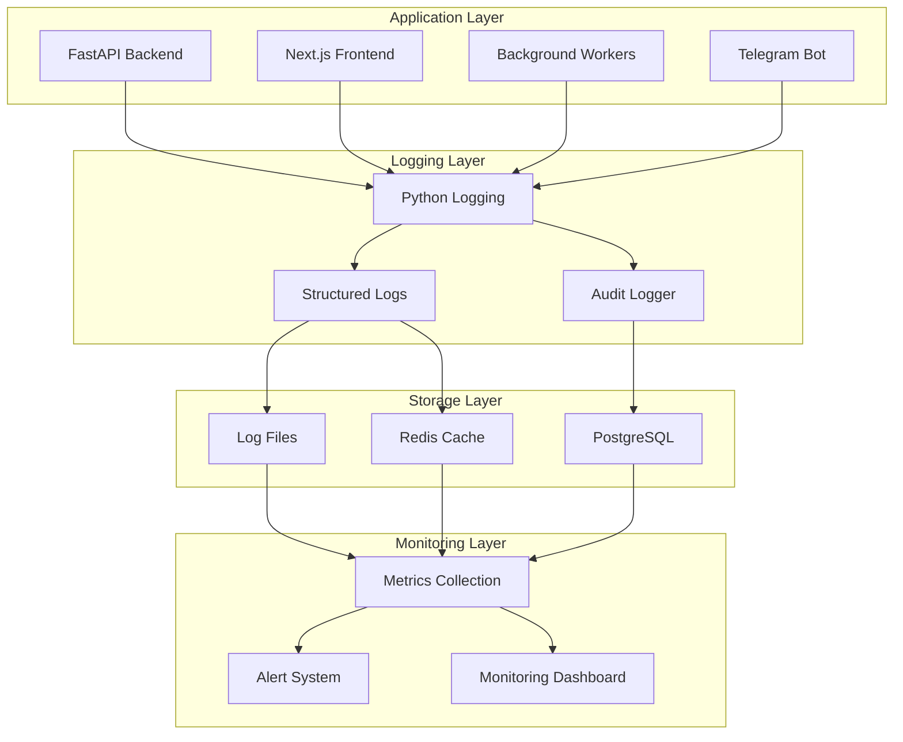

# Logging & Observability

**Last Updated:** 2025-08-23

Comprehensive guide to logging, monitoring, and observability in the ChatAI platform.

## Overview

ChatAI implements structured logging and comprehensive observability to ensure:
- Application performance monitoring
- Error tracking and debugging
- Security event monitoring
- Business metrics collection
- System health monitoring

## Logging Architecture



## Structured Logging

### Log Configuration

```python
import logging
import json
from datetime import datetime
from typing import Dict, Any, Optional

class StructuredFormatter(logging.Formatter):
    """JSON structured log formatter"""
    
    def format(self, record: logging.LogRecord) -> str:
        """Format log record as structured JSON"""
        
        # Base log data
        log_data = {
            "timestamp": datetime.utcnow().isoformat(),
            "level": record.levelname,
            "logger": record.name,
            "message": record.getMessage(),
            "module": record.module,
            "function": record.funcName,
            "line": record.lineno
        }
        
        # Add exception info if present
        if record.exc_info:
            log_data["exception"] = self.formatException(record.exc_info)
        
        # Add extra fields from log call
        if hasattr(record, 'extra_fields'):
            log_data.update(record.extra_fields)
        
        # Add request context if available
        if hasattr(record, 'request_id'):
            log_data["request_id"] = record.request_id
        
        if hasattr(record, 'user_id'):
            log_data["user_id"] = record.user_id
        
        if hasattr(record, 'session_id'):
            log_data["session_id"] = record.session_id
        
        return json.dumps(log_data, ensure_ascii=False)

def setup_logging():
    """Configure application logging"""
    
    # Create formatters
    structured_formatter = StructuredFormatter()
    simple_formatter = logging.Formatter(
        '%(asctime)s - %(name)s - %(levelname)s - %(message)s'
    )
    
    # Configure root logger
    root_logger = logging.getLogger()
    root_logger.setLevel(logging.INFO)
    
    # Console handler (simple format for development)
    console_handler = logging.StreamHandler()
    console_handler.setFormatter(simple_formatter)
    console_handler.setLevel(logging.INFO)
    root_logger.addHandler(console_handler)
    
    # File handler for application logs (structured format)
    app_handler = logging.FileHandler('logs/api.log')
    app_handler.setFormatter(structured_formatter)
    app_handler.setLevel(logging.INFO)
    root_logger.addHandler(app_handler)
    
    # Error file handler
    error_handler = logging.FileHandler('logs/error.log')
    error_handler.setFormatter(structured_formatter)
    error_handler.setLevel(logging.ERROR)
    root_logger.addHandler(error_handler)
    
    # Audit log handler
    audit_handler = logging.FileHandler('logs/audit.log')
    audit_handler.setFormatter(structured_formatter)
    audit_handler.setLevel(logging.INFO)
    
    # Create audit logger
    audit_logger = logging.getLogger('audit')
    audit_logger.addHandler(audit_handler)
    audit_logger.setLevel(logging.INFO)
    audit_logger.propagate = False
```

### Request Logging Middleware

```python
import time
import uuid
from contextvars import ContextVar
from fastapi import Request, Response
from starlette.middleware.base import BaseHTTPMiddleware

# Context variables for request tracking
request_id_var: ContextVar[str] = ContextVar('request_id')
user_id_var: ContextVar[Optional[int]] = ContextVar('user_id', default=None)

class RequestLoggingMiddleware(BaseHTTPMiddleware):
    """Log all HTTP requests with structured data"""
    
    async def dispatch(self, request: Request, call_next):
        # Generate unique request ID
        request_id = str(uuid.uuid4())
        request_id_var.set(request_id)
        
        # Start timing
        start_time = time.time()
        
        # Extract request information
        request_data = {
            "request_id": request_id,
            "method": request.method,
            "url": str(request.url),
            "path": request.url.path,
            "query_params": dict(request.query_params),
            "headers": dict(request.headers),
            "client_ip": request.client.host,
            "user_agent": request.headers.get("User-Agent", "")
        }
        
        # Log request start
        logger.info("HTTP_REQUEST_START", extra=request_data)
        
        try:
            # Process request
            response = await call_next(request)
            
            # Calculate request duration
            duration = time.time() - start_time
            
            # Log successful response
            response_data = {
                "request_id": request_id,
                "status_code": response.status_code,
                "duration_seconds": duration,
                "response_size": response.headers.get("content-length", 0)
            }
            
            logger.info("HTTP_REQUEST_COMPLETE", extra=response_data)
            
            # Add request ID to response headers
            response.headers["X-Request-ID"] = request_id
            
            return response
            
        except Exception as e:
            # Calculate duration
            duration = time.time() - start_time
            
            # Log error
            error_data = {
                "request_id": request_id,
                "error_type": type(e).__name__,
                "error_message": str(e),
                "duration_seconds": duration
            }
            
            logger.error("HTTP_REQUEST_ERROR", extra=error_data, exc_info=True)
            raise

class ContextualLogger:
    """Logger that includes request context"""
    
    def __init__(self, name: str):
        self.logger = logging.getLogger(name)
    
    def _add_context(self, extra: Dict[str, Any] = None) -> Dict[str, Any]:
        """Add request context to log extra fields"""
        context = {}
        
        try:
            context["request_id"] = request_id_var.get()
        except LookupError:
            pass
        
        try:
            user_id = user_id_var.get()
            if user_id:
                context["user_id"] = user_id
        except LookupError:
            pass
        
        if extra:
            context.update(extra)
        
        return context
    
    def info(self, message: str, extra: Dict[str, Any] = None):
        """Log info message with context"""
        self.logger.info(message, extra=self._add_context(extra))
    
    def error(self, message: str, extra: Dict[str, Any] = None, exc_info: bool = False):
        """Log error message with context"""
        self.logger.error(message, extra=self._add_context(extra), exc_info=exc_info)
    
    def warning(self, message: str, extra: Dict[str, Any] = None):
        """Log warning message with context"""
        self.logger.warning(message, extra=self._add_context(extra))
    
    def debug(self, message: str, extra: Dict[str, Any] = None):
        """Log debug message with context"""
        self.logger.debug(message, extra=self._add_context(extra))
```

## Business Event Logging

### Event Types

```python
from enum import Enum
from dataclasses import dataclass
from typing import Optional, Dict, Any

class EventType(str, Enum):
    """Business event types"""
    
    # User events
    USER_REGISTERED = "user_registered"
    USER_LOGIN = "user_login"
    USER_LOGOUT = "user_logout"
    USER_PROFILE_UPDATED = "user_profile_updated"
    
    # Chat events
    DIALOG_CREATED = "dialog_created"
    MESSAGE_SENT = "message_sent"
    AI_RESPONSE_GENERATED = "ai_response_generated"
    
    # Handoff events
    HANDOFF_REQUESTED = "handoff_requested"
    HANDOFF_ACCEPTED = "handoff_accepted"
    HANDOFF_COMPLETED = "handoff_completed"
    
    # Balance events
    BALANCE_TOPPED_UP = "balance_topped_up"
    BALANCE_CHARGED = "balance_charged"
    
    # Document events
    DOCUMENT_UPLOADED = "document_uploaded"
    DOCUMENT_PROCESSED = "document_processed"
    
    # System events
    API_ERROR = "api_error"
    RATE_LIMIT_EXCEEDED = "rate_limit_exceeded"
    SECURITY_VIOLATION = "security_violation"

@dataclass
class BusinessEvent:
    """Business event data structure"""
    event_type: EventType
    user_id: Optional[int]
    entity_id: Optional[int]
    entity_type: Optional[str]
    data: Dict[str, Any]
    timestamp: Optional[datetime] = None
    request_id: Optional[str] = None
    
    def __post_init__(self):
        if self.timestamp is None:
            self.timestamp = datetime.utcnow()
        
        if self.request_id is None:
            try:
                self.request_id = request_id_var.get()
            except LookupError:
                pass

class BusinessEventLogger:
    """Logger for business events"""
    
    def __init__(self):
        self.logger = ContextualLogger("business_events")
        self.audit_logger = logging.getLogger("audit")
    
    async def log_event(self, event: BusinessEvent):
        """Log business event"""
        
        event_data = {
            "event_type": event.event_type.value,
            "user_id": event.user_id,
            "entity_id": event.entity_id,
            "entity_type": event.entity_type,
            "timestamp": event.timestamp.isoformat(),
            "request_id": event.request_id,
            "data": event.data
        }
        
        # Log to business events
        self.logger.info(f"BUSINESS_EVENT: {event.event_type.value}", extra=event_data)
        
        # Log to audit trail for important events
        audit_events = {
            EventType.USER_REGISTERED, EventType.USER_LOGIN,
            EventType.BALANCE_TOPPED_UP, EventType.HANDOFF_REQUESTED,
            EventType.SECURITY_VIOLATION
        }
        
        if event.event_type in audit_events:
            self.audit_logger.info(f"AUDIT: {event.event_type.value}", extra=event_data)
        
        # Store in database for analytics
        await self._store_event_in_database(event)
    
    async def _store_event_in_database(self, event: BusinessEvent):
        """Store event in database for analytics"""
        try:
            from database.connection import SessionLocal
            from database.models import BusinessEventLog
            
            db = SessionLocal()
            try:
                event_log = BusinessEventLog(
                    event_type=event.event_type.value,
                    user_id=event.user_id,
                    entity_id=event.entity_id,
                    entity_type=event.entity_type,
                    data=event.data,
                    timestamp=event.timestamp,
                    request_id=event.request_id
                )
                
                db.add(event_log)
                db.commit()
                
            finally:
                db.close()
                
        except Exception as e:
            self.logger.error("Failed to store business event in database", 
                            extra={"error": str(e)}, exc_info=True)

# Global business event logger
business_event_logger = BusinessEventLogger()
```

### Event Usage Examples

```python
# User registration
await business_event_logger.log_event(BusinessEvent(
    event_type=EventType.USER_REGISTERED,
    user_id=user.id,
    data={
        "email": user.email,
        "registration_method": "email",
        "referral_code": referral_code
    }
))

# AI response generation
await business_event_logger.log_event(BusinessEvent(
    event_type=EventType.AI_RESPONSE_GENERATED,
    user_id=user_id,
    entity_id=dialog_id,
    entity_type="dialog",
    data={
        "assistant_id": assistant.id,
        "model_used": assistant.ai_model,
        "tokens_used": token_count,
        "response_time_seconds": response_time,
        "cost": cost_amount
    }
))

# Balance transaction
await business_event_logger.log_event(BusinessEvent(
    event_type=EventType.BALANCE_CHARGED,
    user_id=user_id,
    entity_id=transaction.id,
    entity_type="balance_transaction",
    data={
        "amount": transaction.amount,
        "service_type": transaction.transaction_type,
        "balance_before": transaction.balance_before,
        "balance_after": transaction.balance_after
    }
))
```

## Performance Monitoring

### Application Metrics

```python
import time
from functools import wraps
from typing import Callable, Any

class PerformanceMonitor:
    """Monitor application performance metrics"""
    
    def __init__(self):
        self.logger = ContextualLogger("performance")
        self.metrics_cache = {}  # In production, use Redis or proper metrics store
    
    def track_execution_time(self, operation_name: str):
        """Decorator to track function execution time"""
        def decorator(func: Callable) -> Callable:
            @wraps(func)
            async def async_wrapper(*args, **kwargs) -> Any:
                start_time = time.time()
                
                try:
                    result = await func(*args, **kwargs)
                    
                    execution_time = time.time() - start_time
                    
                    self.logger.info("PERFORMANCE_METRIC", extra={
                        "operation": operation_name,
                        "execution_time_seconds": execution_time,
                        "status": "success"
                    })
                    
                    # Store metric for aggregation
                    self._store_metric(operation_name, execution_time, "success")
                    
                    return result
                    
                except Exception as e:
                    execution_time = time.time() - start_time
                    
                    self.logger.error("PERFORMANCE_METRIC", extra={
                        "operation": operation_name,
                        "execution_time_seconds": execution_time,
                        "status": "error",
                        "error": str(e)
                    })
                    
                    self._store_metric(operation_name, execution_time, "error")
                    raise
            
            @wraps(func)
            def sync_wrapper(*args, **kwargs) -> Any:
                start_time = time.time()
                
                try:
                    result = func(*args, **kwargs)
                    
                    execution_time = time.time() - start_time
                    
                    self.logger.info("PERFORMANCE_METRIC", extra={
                        "operation": operation_name,
                        "execution_time_seconds": execution_time,
                        "status": "success"
                    })
                    
                    self._store_metric(operation_name, execution_time, "success")
                    
                    return result
                    
                except Exception as e:
                    execution_time = time.time() - start_time
                    
                    self.logger.error("PERFORMANCE_METRIC", extra={
                        "operation": operation_name,
                        "execution_time_seconds": execution_time,
                        "status": "error",
                        "error": str(e)
                    })
                    
                    self._store_metric(operation_name, execution_time, "error")
                    raise
            
            # Return appropriate wrapper based on function type
            if asyncio.iscoroutinefunction(func):
                return async_wrapper
            else:
                return sync_wrapper
        
        return decorator
    
    def _store_metric(self, operation: str, execution_time: float, status: str):
        """Store metric for aggregation"""
        key = f"{operation}:{status}"
        
        if key not in self.metrics_cache:
            self.metrics_cache[key] = {
                "count": 0,
                "total_time": 0,
                "min_time": float('inf'),
                "max_time": 0
            }
        
        metrics = self.metrics_cache[key]
        metrics["count"] += 1
        metrics["total_time"] += execution_time
        metrics["min_time"] = min(metrics["min_time"], execution_time)
        metrics["max_time"] = max(metrics["max_time"], execution_time)
    
    def get_metrics_summary(self, operation: str) -> Dict[str, Any]:
        """Get aggregated metrics for an operation"""
        success_key = f"{operation}:success"
        error_key = f"{operation}:error"
        
        success_metrics = self.metrics_cache.get(success_key, {})
        error_metrics = self.metrics_cache.get(error_key, {})
        
        total_requests = success_metrics.get("count", 0) + error_metrics.get("count", 0)
        
        if total_requests == 0:
            return {"operation": operation, "no_data": True}
        
        return {
            "operation": operation,
            "total_requests": total_requests,
            "success_count": success_metrics.get("count", 0),
            "error_count": error_metrics.get("count", 0),
            "success_rate": success_metrics.get("count", 0) / total_requests,
            "avg_execution_time": success_metrics.get("total_time", 0) / success_metrics.get("count", 1),
            "min_execution_time": success_metrics.get("min_time", 0),
            "max_execution_time": success_metrics.get("max_time", 0)
        }

# Global performance monitor
performance_monitor = PerformanceMonitor()

# Usage examples
@performance_monitor.track_execution_time("ai_message_processing")
async def process_ai_message(dialog_id: int, message: str):
    """Process AI message with performance tracking"""
    # AI processing logic here
    pass

@performance_monitor.track_execution_time("database_query")
def get_user_by_id(user_id: int):
    """Database query with performance tracking"""
    # Database query logic here
    pass
```

## Error Tracking

### Error Classification

```python
class ErrorSeverity(str, Enum):
    """Error severity levels"""
    LOW = "low"
    MEDIUM = "medium"
    HIGH = "high"
    CRITICAL = "critical"

class ErrorCategory(str, Enum):
    """Error categories"""
    AUTHENTICATION = "authentication"
    AUTHORIZATION = "authorization"
    VALIDATION = "validation"
    BUSINESS_LOGIC = "business_logic"
    EXTERNAL_SERVICE = "external_service"
    DATABASE = "database"
    SYSTEM = "system"

class ErrorTracker:
    """Track and categorize application errors"""
    
    def __init__(self):
        self.logger = ContextualLogger("errors")
        self.error_counts = {}  # In production, use Redis
    
    async def track_error(self, error: Exception, category: ErrorCategory, 
                         severity: ErrorSeverity, context: Dict[str, Any] = None):
        """Track application error with context"""
        
        error_data = {
            "error_type": type(error).__name__,
            "error_message": str(error),
            "category": category.value,
            "severity": severity.value,
            "context": context or {},
            "traceback": traceback.format_exc() if hasattr(error, '__traceback__') else None
        }
        
        # Log error
        self.logger.error("APPLICATION_ERROR", extra=error_data, exc_info=True)
        
        # Track error count
        error_key = f"{category.value}:{type(error).__name__}"
        self.error_counts[error_key] = self.error_counts.get(error_key, 0) + 1
        
        # Send alerts for critical errors
        if severity == ErrorSeverity.CRITICAL:
            await self._send_critical_error_alert(error_data)
        
        # Store in database for analysis
        await self._store_error_in_database(error_data)
    
    async def _send_critical_error_alert(self, error_data: Dict[str, Any]):
        """Send alert for critical errors"""
        try:
            # Send email, Slack notification, etc.
            alert_message = f"""
            CRITICAL ERROR DETECTED
            
            Error: {error_data['error_type']} - {error_data['error_message']}
            Category: {error_data['category']}
            Time: {datetime.utcnow().isoformat()}
            Request ID: {error_data.get('request_id', 'N/A')}
            User ID: {error_data.get('user_id', 'N/A')}
            
            Context: {error_data.get('context', {})}
            """
            
            # Implementation depends on notification service
            await send_alert_notification(alert_message)
            
        except Exception as e:
            self.logger.error("Failed to send error alert", extra={"error": str(e)})
    
    async def _store_error_in_database(self, error_data: Dict[str, Any]):
        """Store error in database for analysis"""
        try:
            from database.connection import SessionLocal
            from database.models import ErrorLog
            
            db = SessionLocal()
            try:
                error_log = ErrorLog(
                    error_type=error_data["error_type"],
                    error_message=error_data["error_message"],
                    category=error_data["category"],
                    severity=error_data["severity"],
                    context=error_data["context"],
                    traceback=error_data.get("traceback"),
                    request_id=error_data.get("request_id"),
                    user_id=error_data.get("user_id"),
                    timestamp=datetime.utcnow()
                )
                
                db.add(error_log)
                db.commit()
                
            finally:
                db.close()
                
        except Exception as e:
            self.logger.error("Failed to store error in database", 
                            extra={"error": str(e)})

# Global error tracker
error_tracker = ErrorTracker()

# Usage in exception handlers
@app.exception_handler(ValidationError)
async def validation_error_handler(request: Request, exc: ValidationError):
    """Handle validation errors"""
    await error_tracker.track_error(
        error=exc,
        category=ErrorCategory.VALIDATION,
        severity=ErrorSeverity.LOW,
        context={"endpoint": request.url.path, "method": request.method}
    )
    
    return JSONResponse(
        status_code=422,
        content={"error": "Validation failed", "details": str(exc)}
    )

@app.exception_handler(DatabaseError)
async def database_error_handler(request: Request, exc: DatabaseError):
    """Handle database errors"""
    await error_tracker.track_error(
        error=exc,
        category=ErrorCategory.DATABASE,
        severity=ErrorSeverity.HIGH,
        context={"endpoint": request.url.path}
    )
    
    return JSONResponse(
        status_code=500,
        content={"error": "Database error occurred"}
    )
```

## System Health Monitoring

### Health Check Endpoints

```python
from sqlalchemy import text
import redis
import httpx

class HealthChecker:
    """System health monitoring"""
    
    def __init__(self):
        self.logger = ContextualLogger("health")
    
    async def check_database_health(self) -> Dict[str, Any]:
        """Check database connectivity and performance"""
        try:
            from database.connection import SessionLocal
            
            start_time = time.time()
            db = SessionLocal()
            
            try:
                # Simple query to test connectivity
                result = db.execute(text("SELECT 1")).fetchone()
                connection_time = time.time() - start_time
                
                # Get database stats
                stats_query = text("""
                    SELECT 
                        COUNT(*) as total_connections,
                        SUM(CASE WHEN state = 'active' THEN 1 ELSE 0 END) as active_connections
                    FROM pg_stat_activity
                """)
                
                stats = db.execute(stats_query).fetchone()
                
                return {
                    "status": "healthy",
                    "connection_time_seconds": connection_time,
                    "total_connections": stats[0] if stats else 0,
                    "active_connections": stats[1] if stats else 0
                }
                
            finally:
                db.close()
                
        except Exception as e:
            return {
                "status": "unhealthy",
                "error": str(e)
            }
    
    async def check_redis_health(self) -> Dict[str, Any]:
        """Check Redis connectivity and performance"""
        try:
            start_time = time.time()
            
            # Test Redis connection
            await redis_client.ping()
            ping_time = time.time() - start_time
            
            # Get Redis info
            info = await redis_client.info()
            
            return {
                "status": "healthy",
                "ping_time_seconds": ping_time,
                "used_memory": info.get("used_memory_human", "unknown"),
                "connected_clients": info.get("connected_clients", 0)
            }
            
        except Exception as e:
            return {
                "status": "unhealthy",
                "error": str(e)
            }
    
    async def check_external_services_health(self) -> Dict[str, Any]:
        """Check external service connectivity"""
        services = {
            "openai": "https://api.openai.com/v1/models",
            "telegram": "https://api.telegram.org/bot{token}/getMe"
        }
        
        results = {}
        
        for service_name, url in services.items():
            try:
                start_time = time.time()
                
                async with httpx.AsyncClient() as client:
                    response = await client.get(url, timeout=5.0)
                    response_time = time.time() - start_time
                
                results[service_name] = {
                    "status": "healthy" if response.status_code == 200 else "degraded",
                    "response_time_seconds": response_time,
                    "status_code": response.status_code
                }
                
            except Exception as e:
                results[service_name] = {
                    "status": "unhealthy",
                    "error": str(e)
                }
        
        return results
    
    async def get_system_metrics(self) -> Dict[str, Any]:
        """Get system performance metrics"""
        import psutil
        
        try:
            return {
                "cpu_percent": psutil.cpu_percent(interval=1),
                "memory_percent": psutil.virtual_memory().percent,
                "disk_usage_percent": psutil.disk_usage('/').percent,
                "load_average": psutil.getloadavg() if hasattr(psutil, 'getloadavg') else None
            }
        except Exception as e:
            return {"error": str(e)}

health_checker = HealthChecker()

@app.get("/health")
async def health_check():
    """Basic health check endpoint"""
    return {
        "status": "healthy",
        "timestamp": datetime.utcnow().isoformat(),
        "version": "1.0.0"
    }

@app.get("/health/detailed")
async def detailed_health_check():
    """Detailed health check with all components"""
    
    start_time = time.time()
    
    results = {
        "timestamp": datetime.utcnow().isoformat(),
        "overall_status": "healthy",
        "checks": {}
    }
    
    # Check database
    results["checks"]["database"] = await health_checker.check_database_health()
    
    # Check Redis
    results["checks"]["redis"] = await health_checker.check_redis_health()
    
    # Check external services
    results["checks"]["external_services"] = await health_checker.check_external_services_health()
    
    # Get system metrics
    results["checks"]["system"] = await health_checker.get_system_metrics()
    
    # Determine overall status
    unhealthy_services = [
        name for name, check in results["checks"].items()
        if isinstance(check, dict) and check.get("status") == "unhealthy"
    ]
    
    if unhealthy_services:
        results["overall_status"] = "unhealthy"
        results["unhealthy_services"] = unhealthy_services
    
    results["check_duration_seconds"] = time.time() - start_time
    
    return results
```

## Log Analysis & Alerting

### Log Analysis Queries

```sql
-- Error rate analysis
SELECT 
    DATE_TRUNC('hour', timestamp) as hour,
    COUNT(*) as total_requests,
    SUM(CASE WHEN level = 'ERROR' THEN 1 ELSE 0 END) as errors,
    (SUM(CASE WHEN level = 'ERROR' THEN 1 ELSE 0 END) * 100.0 / COUNT(*)) as error_rate
FROM application_logs
WHERE timestamp >= NOW() - INTERVAL '24 hours'
GROUP BY DATE_TRUNC('hour', timestamp)
ORDER BY hour;

-- Slow request analysis
SELECT 
    message,
    AVG(CAST(extra_fields->>'duration_seconds' AS FLOAT)) as avg_duration,
    COUNT(*) as request_count
FROM application_logs
WHERE message = 'HTTP_REQUEST_COMPLETE'
  AND CAST(extra_fields->>'duration_seconds' AS FLOAT) > 5.0
  AND timestamp >= NOW() - INTERVAL '1 hour'
GROUP BY message
ORDER BY avg_duration DESC;

-- User activity analysis
SELECT 
    extra_fields->>'user_id' as user_id,
    COUNT(*) as activity_count,
    COUNT(DISTINCT extra_fields->>'request_id') as unique_requests
FROM application_logs
WHERE extra_fields->>'user_id' IS NOT NULL
  AND timestamp >= NOW() - INTERVAL '1 day'
GROUP BY extra_fields->>'user_id'
ORDER BY activity_count DESC
LIMIT 20;
```

### Alert Configuration

```python
class AlertManager:
    """Manage system alerts based on log patterns"""
    
    def __init__(self):
        self.logger = ContextualLogger("alerts")
        self.alert_thresholds = {
            "error_rate": 0.05,  # 5% error rate
            "response_time": 5.0,  # 5 seconds
            "disk_usage": 0.9,  # 90% disk usage
            "memory_usage": 0.85  # 85% memory usage
        }
    
    async def check_error_rate_alert(self):
        """Check if error rate exceeds threshold"""
        try:
            # Query recent error rate from logs
            error_rate = await self._calculate_recent_error_rate()
            
            if error_rate > self.alert_thresholds["error_rate"]:
                await self._send_alert(
                    alert_type="high_error_rate",
                    message=f"Error rate {error_rate:.2%} exceeds threshold {self.alert_thresholds['error_rate']:.2%}",
                    severity="high"
                )
        
        except Exception as e:
            self.logger.error("Failed to check error rate alert", extra={"error": str(e)})
    
    async def check_performance_alert(self):
        """Check if response times exceed threshold"""
        try:
            avg_response_time = await self._calculate_avg_response_time()
            
            if avg_response_time > self.alert_thresholds["response_time"]:
                await self._send_alert(
                    alert_type="slow_response_time",
                    message=f"Average response time {avg_response_time:.2f}s exceeds threshold {self.alert_thresholds['response_time']}s",
                    severity="medium"
                )
        
        except Exception as e:
            self.logger.error("Failed to check performance alert", extra={"error": str(e)})
    
    async def _send_alert(self, alert_type: str, message: str, severity: str):
        """Send alert notification"""
        alert_data = {
            "alert_type": alert_type,
            "message": message,
            "severity": severity,
            "timestamp": datetime.utcnow().isoformat()
        }
        
        self.logger.warning(f"ALERT: {alert_type}", extra=alert_data)
        
        # Send to external notification service
        # Implementation depends on your notification setup
        pass

# Background task to run alert checks
async def run_alert_checks():
    """Background task for alert monitoring"""
    alert_manager = AlertManager()
    
    while True:
        try:
            await alert_manager.check_error_rate_alert()
            await alert_manager.check_performance_alert()
            
            # Sleep for 5 minutes
            await asyncio.sleep(300)
            
        except Exception as e:
            logger.error("Alert check failed", extra={"error": str(e)})
            await asyncio.sleep(60)  # Shorter sleep on error
```

This comprehensive logging and observability system provides deep insights into the ChatAI platform's performance, health, and user behavior while enabling proactive monitoring and alerting.

