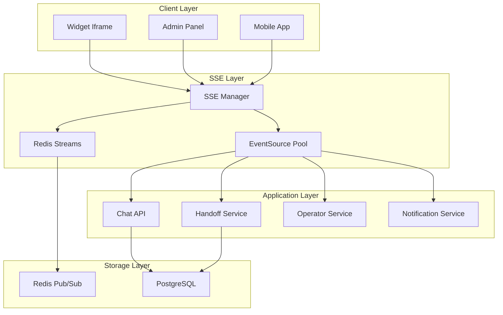

# SSE Real-time Communication 

**Last Updated:** 6 сентября 2025  
**Status:** ✅ Active (Migrated from WebSocket)  
**Язык:** Русский (обновлено)  

Guide to Server-Sent Events (SSE) based real-time communication system in ReplyX for live chat, operator handoffs, and system notifications.

## Overview

ReplyX implements SSE-based real-time communication to provide:
- Live chat messaging through HTTP/2 streams
- Operator presence and handoff management  
- System notifications and alerts
- Automatic reconnection and replay mechanisms

## Architecture



## SSE Manager Implementation

### Connection Management

```python
class SSEManager:
    """Manages SSE connections and message routing via Redis Streams"""
    
    def __init__(self):
        self.redis = None
        self.client_queues: Dict[str, asyncio.Queue] = {}
        
    async def create_sse_stream(self, dialog_id: int, client_id: str,
                               last_event_id: str = None) -> AsyncGenerator[str, None]:
        """Create SSE stream for client with replay capability"""
        
        # Register client
        self.client_queues[client_id] = asyncio.Queue()
        
        try:
            # 1. Send historical events if last_event_id provided
            if last_event_id:
                historical = await self.get_events_since(dialog_id, last_event_id)
                for event in historical:
                    yield self._format_sse_event(event['data'], event['id'])
            
            # 2. Send recent events for new connections
            elif not last_event_id:
                recent = await self.get_events_since(dialog_id, None, limit=10)
                for event in recent:
                    yield self._format_sse_event(event['data'], event['id'])
            
            # 3. Main loop: send new events + heartbeat
            queue = self.client_queues[client_id]
            while client_id in self.client_queues:
                try:
                    # Wait for next event with heartbeat timeout
                    item = await asyncio.wait_for(queue.get(), timeout=25.0)
                    yield item
                except asyncio.TimeoutError:
                    # Heartbeat comment (doesn't affect lastEventId)
                    yield ": heartbeat\n\n"
                    
        finally:
            # Cleanup client
            self.client_queues.pop(client_id, None)
```

### Redis Integration

```python
# Redis Pub/Sub Listener
async def _pubsub_worker(self):
    """Background task for Redis Pub/Sub → SSE client forwarding"""
    pubsub = self.redis.pubsub()
    await pubsub.psubscribe("ws:dialog:*")  # Listen to all dialog events
    
    async for message in pubsub.listen():
        if message['type'] == 'pmessage':
            channel = message['channel']
            dialog_id = int(channel.split(':')[-1])
            event_data = json.loads(message['data'])
            
            # Add to Redis Stream for replay
            event_id = await self.add_event_to_stream(dialog_id, event_data)
            
            # Forward to active SSE clients
            if dialog_id in sse_connections:
                sse_formatted = self._format_sse_event(event_data, event_id)
                for client_id in sse_connections[dialog_id]:
                    await self.client_queues[client_id].put(sse_formatted)
```

## API Endpoints

### SSE Connection

```python
@router.get("/api/dialogs/{dialog_id}/events")
async def dialog_events_stream(
    dialog_id: int,
    request: Request,
    last_event_id: Optional[str] = Header(None, alias="Last-Event-ID"),
    token: Optional[str] = Query(None),
    site_token: Optional[str] = Query(None),
    assistant_id: Optional[int] = Query(None),
    db: Session = Depends(get_db)
):
    """SSE stream for dialog events with three auth modes:
    - token: JWT token for admin panel
    - site_token: Site token for authorized widgets
    - assistant_id + guest_id: Guest mode for widgets
    """
    
    # Validate authorization
    is_valid, auth_type = await validate_sse_auth(
        dialog_id=dialog_id,
        token=token,
        site_token=site_token,
        assistant_id=assistant_id,
        origin=request.headers.get("origin")
    )
    
    if not is_valid:
        raise HTTPException(status_code=403, detail=f"Auth failed: {auth_type}")
    
    # Generate client ID
    client_id = f"{auth_type}_{dialog_id}_{uuid.uuid4().hex[:8]}"
    
    async def event_stream():
        yield f"retry: 5000\n\n"  # Retry after 5 seconds on disconnect
        
        async for sse_event in sse_manager.create_sse_stream(
            dialog_id=dialog_id,
            client_id=client_id,
            last_event_id=last_event_id
        ):
            yield sse_event
    
    return StreamingResponse(
        event_stream(),
        media_type="text/event-stream",
        headers={
            "Cache-Control": "no-cache",
            "Connection": "keep-alive", 
            "X-Accel-Buffering": "no"  # For Nginx
        }
    )
```

### Specialized Endpoints

```python
# Site widgets (with site_token)
@router.get("/api/site/dialogs/{dialog_id}/events") 
async def site_dialog_events_stream(
    dialog_id: int,
    site_token: str = Query(...),
    last_event_id: Optional[str] = Header(None, alias="Last-Event-ID")
):
    """SSE stream for site widgets"""
    return await dialog_events_stream(dialog_id, site_token=site_token, ...)

# Widget mode (assistant_id + guest_id)
@router.get("/api/widget/dialogs/{dialog_id}/events")
async def widget_dialog_events_stream(
    dialog_id: int,
    assistant_id: int = Query(...),
    guest_id: str = Query(...),
    last_event_id: Optional[str] = Header(None, alias="Last-Event-ID")
):
    """SSE stream for widget mode"""
    return await dialog_events_stream(dialog_id, assistant_id=assistant_id, ...)
```

## Message Types & Formats

### Chat Messages

```javascript
// Incoming SSE event format
data: {
  "id": "msg_123",
  "sender": "assistant",
  "text": "Hello! How can I help you today?",
  "timestamp": "2025-01-14T10:30:00Z",
  "dialog_id": 123
}

// User message (optimistically added in UI)
data: {
  "id": "msg_124", 
  "sender": "user",
  "text": "I need help with...",
  "timestamp": "2025-01-14T10:30:15Z"
}
```

### Handoff Events

```javascript
// Handoff request
data: {
  "type": "handoff_requested",
  "dialog_id": 123,
  "message": "Переключаем ваш диалог на сотрудника",
  "timestamp": "2025-01-14T10:30:00Z"
}

// Operator connected
data: {
  "type": "handoff_started", 
  "dialog_id": 123,
  "operator_name": "John Smith",
  "message": "Оператор подключился"
}

// Back to AI
data: {
  "type": "handoff_released",
  "dialog_id": 123,
  "message": "Диалог возвращен к AI-ассистенту"
}
```

### Typing Indicators

```javascript
// Typing start
data: {
  "type": "typing_start",
  "dialog_id": 123,
  "sender": "assistant"
}

// Typing stop  
data: {
  "type": "typing_stop",
  "dialog_id": 123,
  "sender": "assistant"
}
```

## Client Implementation

### JavaScript EventSource

```javascript
// Create SSE connection
const sseUrl = `/api/dialogs/${dialogId}/events?site_token=${token}`;
const eventSource = new EventSource(sseUrl);

// Handle connection
eventSource.onopen = () => {
  console.log('SSE connected');
  setIsOnline(true);
};

// Handle messages
eventSource.onmessage = (event) => {
  const data = JSON.parse(event.data);
  
  // Handle handoff events
  if (data.type === 'handoff_started') {
    setHandoffStatus('active');
    showSystemMessage('Оператор подключился');
    return;
  }
  
  // Handle regular messages
  if (data.message && data.message.sender !== 'user') {
    addMessage(data.message);
  }
};

// Handle errors (automatic reconnection)
eventSource.onerror = (error) => {
  console.log('SSE error, will reconnect automatically');
  setIsOnline(false);
};
```

### Last-Event-ID Replay

```javascript
// Browser automatically sends Last-Event-ID header on reconnect
// Server uses this to replay missed events:

const events = await redis.xrange(
  `sse:dialog:${dialogId}`,
  `(${lastEventId}`,  // Exclude last seen event
  '+',               // Until latest
  'COUNT', 50        // Max 50 events
);
```

## Performance & Scalability

### Redis Streams

```python
# Events stored in Redis Streams for replay
stream_key = f"sse:dialog:{dialog_id}"

# Add event to stream
event_id = await redis.xadd(
    stream_key,
    {"data": json.dumps(event_data)},
    maxlen=1000  # Keep last 1000 events
)

# Replay events since last_event_id
events = await redis.xread(
    {stream_key: f"({last_event_id}"},
    count=50,
    block=0
)
```

### Connection Limits

- **Per dialog**: Up to 50 SSE connections
- **Global**: Up to 1000 total connections  
- **Heartbeat**: Every 30 seconds
- **Replay buffer**: 1000 recent events per dialog

## Testing & Debugging

### Manual Testing

```bash
# Connect to SSE stream
curl -N "http://localhost:8000/api/dialogs/123/events?site_token=TOKEN"

# Test with Last-Event-ID replay
curl -N -H "Last-Event-ID: 1704067200000-0" \
     "http://localhost:8000/api/dialogs/123/events?assistant_id=1&guest_id=test"

# Send test event
curl -X POST "http://localhost:8000/api/sse/test-event?dialog_id=123&message=Hello"
```

### Health Monitoring

```bash
# Check SSE service health
curl "http://localhost:8000/api/sse/health"

# Check detailed stats (development only)
curl "http://localhost:8000/api/sse/stats"

# Prometheus metrics
curl "http://localhost:8000/metrics" | grep websocket_connections
```

## Migration Notes

### Differences from WebSocket

| Aspect | WebSocket | SSE | Notes |
|--------|-----------|-----|-------|
| **Connection** | Bidirectional | Unidirectional | SSE only server→client |
| **Sending Messages** | WebSocket.send() | HTTP POST to API | Messages sent via REST API |
| **Receiving** | onmessage | EventSource.onmessage | Similar event handling |
| **Reconnection** | Manual implementation | Automatic browser feature | SSE handles reconnection |
| **Replay** | Custom implementation | Last-Event-ID standard | Browser standard |
| **Buffering** | Custom queuing | Redis Streams | Durable message storage |

### Compatibility Layer

```python
# Legacy WebSocket functions now use SSE
async def push_dialog_message(dialog_id: int, message: dict):
    """Compatibility wrapper for SSE"""
    await push_sse_event(dialog_id, message)

async def push_site_dialog_message(dialog_id: int, message: dict):  
    """Compatibility wrapper for SSE"""
    await push_sse_event(dialog_id, message)
```

## Troubleshooting

### Common Issues

**Connection fails with 403:**
```bash
# Check token validity
curl -X POST "http://localhost:8000/api/validate-widget-token" \
     -d '{"token":"YOUR_TOKEN", "domain":"your-domain.com"}'
```

**Events not delivered:**
```bash
# Check Redis Pub/Sub
redis-cli PSUBSCRIBE "ws:dialog:*"

# Check SSE service health
curl "http://localhost:8000/api/sse/health"
```

**Reconnection issues:**
```javascript
// Browser automatically reconnects SSE
// Check Network tab in DevTools for reconnection attempts

// Manual reconnection if needed:
eventSource.close();
eventSource = new EventSource(sseUrl);
```

### Performance Tuning

**Nginx Configuration:**
```nginx
location ~ ^/api/.*/(events|sse) {
    proxy_buffering off;        # Critical for SSE
    proxy_cache off;           # No caching
    proxy_read_timeout 3600s;  # Long timeout
    proxy_set_header X-Accel-Buffering no;
}
```

**Redis Optimization:**
```python
# Stream cleanup (automatic)
await redis.xtrim(stream_key, maxlen=1000, approximate=True)

# Pub/Sub pattern matching
await pubsub.psubscribe("ws:dialog:*")
```

## Security

### Authentication

```python
# Three auth modes supported:
async def validate_sse_auth(dialog_id, token=None, site_token=None, assistant_id=None):
    # Admin token (JWT)
    if token:
        return validate_jwt_token(token)
    
    # Site token (domain validation) 
    if site_token:
        return validate_site_token(site_token, origin)
    
    # Widget mode (assistant validation)
    if assistant_id:
        return validate_assistant_active(assistant_id)
```

### CORS Configuration

```python
# Dynamic CORS for widgets
headers = {
    "Access-Control-Allow-Origin": origin if origin else "*",
    "Access-Control-Allow-Headers": "Last-Event-ID, Cache-Control",
    "Access-Control-Expose-Headers": "Content-Type"
}
```

This SSE system provides robust real-time communication with improved stability and simplified architecture compared to WebSocket implementation.
