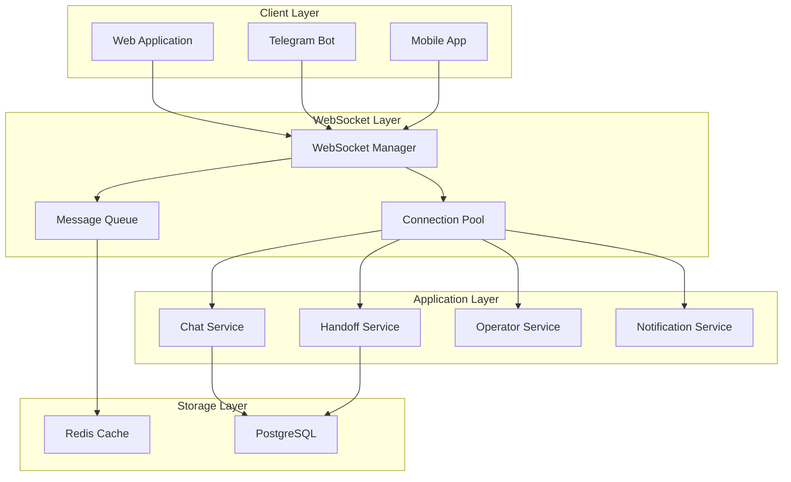

# ⚠️ DEPRECATED: WebSocket Real-time Communication

**Last Updated:** 2025-08-23  
**Status:** ❌ DEPRECATED - Migrated to SSE on 2025-01-14  
**New Documentation:** [`sse-architecture.md`](./sse-architecture.md)

## Migration Notice

This WebSocket system has been **completely replaced with Server-Sent Events (SSE)** for improved stability and simplified architecture.

**📖 See:** [`sse-architecture.md`](./sse-architecture.md) for current implementation.

---

**HISTORICAL DOCUMENTATION (for reference only):**

Guide to real-time WebSocket communication system in ChatAI for live chat, operator handoffs, and system notifications.

## Overview

ChatAI implements WebSocket-based real-time communication to provide:
- Live chat messaging
- Operator presence and handoff management
- System notifications and alerts
- Real-time analytics updates

## Architecture



## WebSocket Manager Implementation

### Connection Management

```python
class WebSocketManager:
    """Manages WebSocket connections and message routing"""
    
    def __init__(self):
        self.active_connections: Dict[str, WebSocket] = {}
        self.user_connections: Dict[int, Set[str]] = {}
        self.operator_connections: Dict[int, Set[str]] = {}
        self.room_connections: Dict[str, Set[str]] = {}
    
    async def connect(self, websocket: WebSocket, user_id: int, 
                     connection_type: str = "user"):
        """Register new WebSocket connection"""
        await websocket.accept()
        
        connection_id = f"{user_id}_{uuid.uuid4().hex[:8]}"
        self.active_connections[connection_id] = websocket
        
        if connection_type == "operator":
            if user_id not in self.operator_connections:
                self.operator_connections[user_id] = set()
            self.operator_connections[user_id].add(connection_id)
        else:
            if user_id not in self.user_connections:
                self.user_connections[user_id] = set()
            self.user_connections[user_id].add(connection_id)
        
        logger.info(f"WebSocket connected: {connection_id}, user: {user_id}, type: {connection_type}")
        return connection_id
    
    async def disconnect(self, connection_id: str):
        """Remove WebSocket connection"""
        if connection_id in self.active_connections:
            # Clean up connection references
            websocket = self.active_connections[connection_id]
            del self.active_connections[connection_id]
            
            # Remove from user/operator mappings
            for user_id, connections in self.user_connections.items():
                connections.discard(connection_id)
            
            for user_id, connections in self.operator_connections.items():
                connections.discard(connection_id)
            
            # Remove from rooms
            for room_id, connections in self.room_connections.items():
                connections.discard(connection_id)
            
            logger.info(f"WebSocket disconnected: {connection_id}")
    
    async def send_to_user(self, user_id: int, message: dict):
        """Send message to all user connections"""
        connections = self.user_connections.get(user_id, set())
        
        for connection_id in connections.copy():
            websocket = self.active_connections.get(connection_id)
            if websocket:
                try:
                    await websocket.send_json(message)
                except WebSocketDisconnect:
                    await self.disconnect(connection_id)
    
    async def send_to_operators(self, message: dict):
        """Send message to all operator connections"""
        for user_id, connections in self.operator_connections.items():
            for connection_id in connections.copy():
                websocket = self.active_connections.get(connection_id)
                if websocket:
                    try:
                        await websocket.send_json(message)
                    except WebSocketDisconnect:
                        await self.disconnect(connection_id)
    
    async def broadcast_to_room(self, room_id: str, message: dict, 
                               exclude_connection: str = None):
        """Broadcast message to all connections in a room"""
        connections = self.room_connections.get(room_id, set())
        
        for connection_id in connections.copy():
            if connection_id == exclude_connection:
                continue
                
            websocket = self.active_connections.get(connection_id)
            if websocket:
                try:
                    await websocket.send_json(message)
                except WebSocketDisconnect:
                    await self.disconnect(connection_id)
```

### Message Types & Formats

#### Chat Messages

```python
# Incoming chat message from user
{
    "type": "chat_message",
    "dialog_id": 123,
    "message": "Hello, I need help with...",
    "timestamp": "2025-08-23T10:30:00Z"
}

# Outgoing AI response
{
    "type": "ai_response",
    "dialog_id": 123,
    "message": "I'd be happy to help you with that...",
    "assistant_name": "Support Assistant",
    "timestamp": "2025-08-23T10:30:05Z",
    "tokens_used": 245
}

# Typing indicator
{
    "type": "typing",
    "dialog_id": 123,
    "user_id": 456,
    "is_typing": true
}
```

#### Operator Handoff

```python
# Handoff request
{
    "type": "handoff_request",
    "dialog_id": 123,
    "user_id": 456,
    "reason": "Complex technical issue",
    "priority": "high",
    "timestamp": "2025-08-23T10:30:00Z"
}

# Operator assignment
{
    "type": "operator_assigned",
    "dialog_id": 123,
    "operator_id": 789,
    "operator_name": "John Smith",
    "estimated_wait_time": 180  # seconds
}

# Handoff completion
{
    "type": "handoff_completed",
    "dialog_id": 123,
    "operator_id": 789,
    "resolution": "Issue resolved",
    "duration": 840  # seconds
}
```

#### System Notifications

```python
# Balance notification
{
    "type": "balance_alert",
    "user_id": 456,
    "current_balance": 2.50,
    "threshold": 5.00,
    "message": "Your balance is running low"
}

# System maintenance
{
    "type": "system_alert",
    "severity": "warning",
    "message": "Scheduled maintenance in 30 minutes",
    "affected_services": ["ai_chat", "document_upload"]
}

# Analytics update (for admin users)
{
    "type": "analytics_update",
    "metric": "active_users",
    "value": 245,
    "change": "+12",
    "timestamp": "2025-08-23T10:30:00Z"
}
```

## API Endpoints

### WebSocket Connection

```python
@app.websocket("/ws/{user_id}")
async def websocket_endpoint(websocket: WebSocket, user_id: int, 
                           token: str = Query(...)):
    """Main WebSocket endpoint for user connections"""
    
    # Authenticate user
    try:
        current_user = await auth.get_current_user_from_token(token)
        if current_user.id != user_id:
            await websocket.close(code=1008, reason="Unauthorized")
            return
    except AuthError:
        await websocket.close(code=1008, reason="Invalid token")
        return
    
    # Connect to WebSocket manager
    connection_id = await websocket_manager.connect(websocket, user_id, "user")
    
    try:
        while True:
            # Receive message from client
            data = await websocket.receive_json()
            
            # Process message based on type
            await handle_websocket_message(connection_id, user_id, data)
            
    except WebSocketDisconnect:
        await websocket_manager.disconnect(connection_id)
    except Exception as e:
        logger.error(f"WebSocket error for user {user_id}: {e}")
        await websocket_manager.disconnect(connection_id)

@app.websocket("/ws/operator/{operator_id}")
async def operator_websocket_endpoint(websocket: WebSocket, operator_id: int,
                                    token: str = Query(...)):
    """WebSocket endpoint for operator connections"""
    
    # Authenticate operator
    try:
        current_user = await auth.get_current_operator_from_token(token)
        if current_user.id != operator_id:
            await websocket.close(code=1008, reason="Unauthorized")
            return
    except AuthError:
        await websocket.close(code=1008, reason="Invalid token")
        return
    
    # Connect as operator
    connection_id = await websocket_manager.connect(websocket, operator_id, "operator")
    
    try:
        while True:
            data = await websocket.receive_json()
            await handle_operator_message(connection_id, operator_id, data)
            
    except WebSocketDisconnect:
        await websocket_manager.disconnect(connection_id)
```

### Message Handlers

```python
async def handle_websocket_message(connection_id: str, user_id: int, data: dict):
    """Route WebSocket messages to appropriate handlers"""
    
    message_type = data.get("type")
    
    handlers = {
        "chat_message": handle_chat_message,
        "join_room": handle_join_room,
        "leave_room": handle_leave_room,
        "typing": handle_typing_indicator,
        "heartbeat": handle_heartbeat
    }
    
    handler = handlers.get(message_type)
    if handler:
        await handler(connection_id, user_id, data)
    else:
        logger.warning(f"Unknown message type: {message_type}")

async def handle_chat_message(connection_id: str, user_id: int, data: dict):
    """Handle incoming chat message"""
    dialog_id = data.get("dialog_id")
    message_content = data.get("message")
    
    if not dialog_id or not message_content:
        return
    
    # Save message to database
    dialog_message = await create_dialog_message(
        dialog_id=dialog_id,
        user_id=user_id,
        message=message_content,
        sender="user"
    )
    
    # Get AI response (async)
    asyncio.create_task(process_ai_response(dialog_id, message_content))
    
    # Notify operators if handoff is active
    handoff = await get_active_handoff(dialog_id)
    if handoff:
        await notify_operator_of_message(handoff.operator_id, dialog_message)

async def handle_typing_indicator(connection_id: str, user_id: int, data: dict):
    """Handle typing indicator"""
    dialog_id = data.get("dialog_id")
    is_typing = data.get("is_typing", False)
    
    # Broadcast to other participants in the dialog
    typing_message = {
        "type": "typing",
        "dialog_id": dialog_id,
        "user_id": user_id,
        "is_typing": is_typing
    }
    
    # Send to operators if handoff is active
    handoff = await get_active_handoff(dialog_id)
    if handoff and handoff.operator_id:
        await websocket_manager.send_to_user(handoff.operator_id, typing_message)
```

## Operator Presence System

### Presence Management

```python
class OperatorPresenceManager:
    """Manages operator online status and availability"""
    
    def __init__(self):
        self.online_operators: Dict[int, Dict] = {}
    
    async def set_operator_online(self, operator_id: int, status: str = "available"):
        """Mark operator as online"""
        self.online_operators[operator_id] = {
            "status": status,  # available, busy, away
            "last_seen": datetime.utcnow(),
            "active_handoffs": await get_operator_active_handoffs(operator_id)
        }
        
        # Notify all operators of status change
        await websocket_manager.send_to_operators({
            "type": "operator_status_change",
            "operator_id": operator_id,
            "status": status,
            "timestamp": datetime.utcnow().isoformat()
        })
    
    async def set_operator_offline(self, operator_id: int):
        """Mark operator as offline"""
        if operator_id in self.online_operators:
            del self.online_operators[operator_id]
        
        # Notify other operators
        await websocket_manager.send_to_operators({
            "type": "operator_status_change",
            "operator_id": operator_id,
            "status": "offline",
            "timestamp": datetime.utcnow().isoformat()
        })
    
    def get_available_operators(self) -> List[int]:
        """Get list of available operators"""
        return [
            operator_id for operator_id, info in self.online_operators.items()
            if info["status"] == "available"
        ]
    
    async def update_operator_workload(self, operator_id: int):
        """Update operator workload information"""
        if operator_id in self.online_operators:
            active_handoffs = await get_operator_active_handoffs(operator_id)
            self.online_operators[operator_id]["active_handoffs"] = active_handoffs
            
            # Auto-set to busy if too many handoffs
            if len(active_handoffs) >= 5:  # Max concurrent handoffs
                await self.set_operator_status(operator_id, "busy")
```

## Performance Optimizations

### Connection Pooling

```python
class ConnectionPool:
    """Optimized connection pool for WebSockets"""
    
    def __init__(self, max_connections_per_user: int = 5):
        self.max_connections_per_user = max_connections_per_user
        self.connection_metrics: Dict[str, Dict] = {}
    
    async def add_connection(self, connection_id: str, user_id: int):
        """Add connection with limits"""
        user_connections = websocket_manager.user_connections.get(user_id, set())
        
        # Enforce connection limit per user
        if len(user_connections) >= self.max_connections_per_user:
            # Close oldest connection
            oldest_connection = min(user_connections, 
                                  key=lambda c: self.connection_metrics.get(c, {}).get("created_at", 0))
            await websocket_manager.disconnect(oldest_connection)
        
        # Track connection metrics
        self.connection_metrics[connection_id] = {
            "created_at": datetime.utcnow().timestamp(),
            "user_id": user_id,
            "messages_sent": 0,
            "last_activity": datetime.utcnow().timestamp()
        }
    
    async def cleanup_stale_connections(self):
        """Clean up connections that haven't been active"""
        stale_threshold = datetime.utcnow().timestamp() - 3600  # 1 hour
        
        stale_connections = [
            conn_id for conn_id, metrics in self.connection_metrics.items()
            if metrics["last_activity"] < stale_threshold
        ]
        
        for conn_id in stale_connections:
            await websocket_manager.disconnect(conn_id)
```

### Message Queuing

```python
class MessageQueue:
    """Redis-backed message queue for WebSocket messages"""
    
    def __init__(self, redis_client):
        self.redis = redis_client
    
    async def enqueue_message(self, user_id: int, message: dict):
        """Queue message for offline users"""
        queue_key = f"ws_queue:{user_id}"
        message_data = json.dumps({
            "message": message,
            "timestamp": datetime.utcnow().isoformat(),
            "id": str(uuid.uuid4())
        })
        
        await self.redis.lpush(queue_key, message_data)
        await self.redis.expire(queue_key, 86400)  # 24 hours TTL
    
    async def dequeue_messages(self, user_id: int) -> List[dict]:
        """Get queued messages for user"""
        queue_key = f"ws_queue:{user_id}"
        messages = []
        
        while True:
            message_data = await self.redis.rpop(queue_key)
            if not message_data:
                break
            
            try:
                message = json.loads(message_data)
                messages.append(message)
            except json.JSONDecodeError:
                logger.error(f"Invalid message in queue for user {user_id}")
        
        return messages
    
    async def send_queued_messages(self, user_id: int):
        """Send all queued messages to user"""
        messages = await self.dequeue_messages(user_id)
        
        for message_data in messages:
            await websocket_manager.send_to_user(user_id, message_data["message"])
```

## Monitoring & Analytics

### WebSocket Metrics

```python
class WebSocketAnalytics:
    """Collect and analyze WebSocket metrics"""
    
    def __init__(self):
        self.metrics = {
            "total_connections": 0,
            "active_connections": 0,
            "messages_per_minute": 0,
            "average_connection_duration": 0,
            "error_rate": 0
        }
    
    async def track_connection_event(self, event_type: str, connection_id: str, 
                                   user_id: int, data: dict = None):
        """Track WebSocket events"""
        event_data = {
            "event_type": event_type,
            "connection_id": connection_id,
            "user_id": user_id,
            "timestamp": datetime.utcnow().isoformat(),
            "data": data or {}
        }
        
        # Store in analytics database
        await store_websocket_event(event_data)
        
        # Update real-time metrics
        if event_type == "connect":
            self.metrics["total_connections"] += 1
            self.metrics["active_connections"] += 1
        elif event_type == "disconnect":
            self.metrics["active_connections"] -= 1
    
    async def get_real_time_stats(self) -> dict:
        """Get current WebSocket statistics"""
        return {
            "active_connections": len(websocket_manager.active_connections),
            "active_users": len(websocket_manager.user_connections),
            "active_operators": len(websocket_manager.operator_connections),
            "total_rooms": len(websocket_manager.room_connections),
            "messages_last_minute": await self.get_recent_message_count(60),
            "uptime": await self.get_websocket_uptime()
        }
```

### Health Checks

```python
@app.get("/api/websocket/health")
async def websocket_health_check():
    """WebSocket system health check"""
    try:
        # Check Redis connectivity
        await redis_client.ping()
        
        # Check active connections
        active_connections = len(websocket_manager.active_connections)
        
        # Check message queue
        queue_size = await get_total_queue_size()
        
        return {
            "status": "healthy",
            "active_connections": active_connections,
            "queue_size": queue_size,
            "timestamp": datetime.utcnow().isoformat()
        }
    except Exception as e:
        return {
            "status": "unhealthy",
            "error": str(e),
            "timestamp": datetime.utcnow().isoformat()
        }
```

This WebSocket system provides robust real-time communication capabilities for the ChatAI platform with comprehensive error handling, monitoring, and scalability features.

