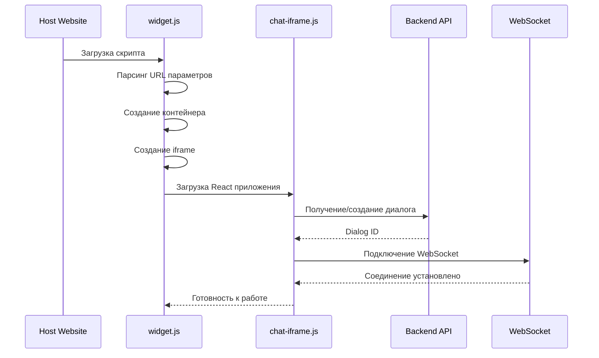
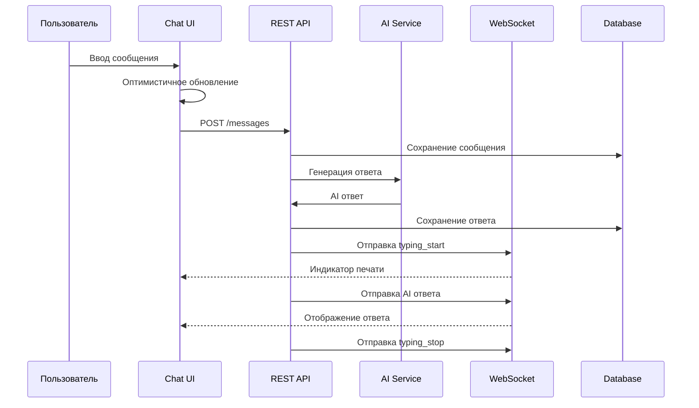
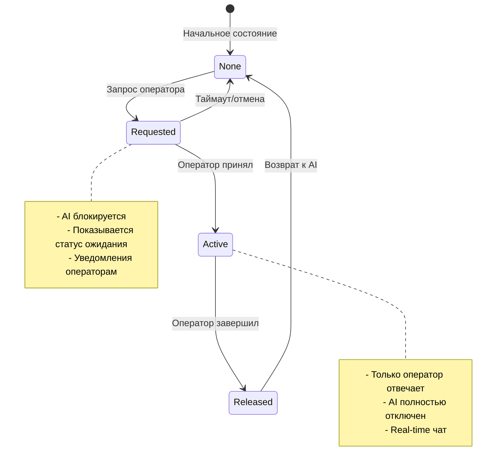

# 🏗️ Widget Architecture - Архитектура виджета ReplyX

**Детальная техническая документация архитектуры iframe виджета**

Этот документ описывает внутреннее устройство виджета ReplyX, его компоненты, потоки данных и принципы работы.

---

## 📋 Обзор архитектуры

### Многоуровневая структура

ReplyX Widget построен по принципу многоуровневой архитектуры с четким разделением ответственности:

```
┌─────────────────────────────────────────────────────────┐
│                  HOST WEBSITE                           │
│  ┌───────────────────────────────────────────────────┐  │
│  │              WIDGET.JS LAYER                      │  │ ← Загрузчик и контроллер
│  │  ┌─────────────────────────────────────────────┐  │  │
│  │  │           IFRAME SANDBOX                    │  │  │ ← Безопасная изоляция
│  │  │  ┌───────────────────────────────────────┐  │  │  │
│  │  │  │       REACT APPLICATION             │  │  │  │ ← Next.js чат интерфейс
│  │  │  │  ┌─────────────┬─────────────────┐  │  │  │  │
│  │  │  │  │ WebSocket   │  REST API       │  │  │  │  │ ← Коммуникационные слои
│  │  │  │  │ Real-time   │  CRUD           │  │  │  │  │
│  │  │  │  └─────────────┴─────────────────┘  │  │  │  │
│  │  │  └───────────────────────────────────────┘  │  │  │
│  │  └─────────────────────────────────────────────┘  │  │
│  └───────────────────────────────────────────────────┘  │
└─────────────────────────────────────────────────────────┘
                           │
                           ▼
┌─────────────────────────────────────────────────────────┐
│                 BACKEND SERVICES                        │
│  ┌──────────────┬──────────────┬─────────────────────┐  │
│  │  FastAPI     │  PostgreSQL  │     Redis           │  │
│  │  REST + WS   │  Database    │     Cache           │  │
│  └──────────────┴──────────────┴─────────────────────┘  │
└─────────────────────────────────────────────────────────┘
```

---

## 🧩 Компоненты системы

### 1. Widget Loader (`widget.js`)

**Ответственность:** Загрузка, конфигурация и управление жизненным циклом виджета

**Ключевые функции:**
```javascript
// Основной объект виджета
window.ReplyXWidget = {
    isMinimized: boolean,
    isLoaded: boolean,
    container: HTMLElement,
    config: WidgetConfig,
    theme: ThemeConfig,
    
    // Методы жизненного цикла
    init(): void,
    createContainer(): void,
    loadStyles(): void,
    createFloatingWidget(): void,
    expand(): void,
    minimize(): void
}
```

**Конфигурация:**
```typescript
interface WidgetConfig {
    apiUrl: string;           // Backend API URL
    siteToken?: string;       // JWT токен авторизации
    assistantId?: number;     // ID ассистента для прямого доступа
    theme: 'blue'|'green'|'purple'|'orange';
    type: 'floating'|'embedded'|'fullscreen';
    host: string;             // Frontend URL
    position: 'bottom-left'|'bottom-center'|'bottom-right';
    buttonSize: number;       // Размер кнопки в пикселях
    borderRadius: number;     // Скругление углов
    welcomeMessage: string;   // Приветственное сообщение
    buttonText: string;       // Текст на кнопке
    showAvatar: boolean;      // Показывать аватар
    showOnlineStatus: boolean;// Показывать статус онлайн
    devOnly: boolean;         // Режим только для разработки
    devKey?: string;          // Ключ разработчика
}
```

### 2. Iframe Chat Component (`chat-iframe.js`)

**Ответственность:** UI интерфейс чата и взаимодействие с пользователем

**React State Management:**
```typescript
interface ChatState {
    messages: Message[];
    input: string;
    loading: boolean;
    siteToken: string | null;
    assistantId: number | null;
    handoffStatus: 'none'|'requested'|'active'|'released';
    dialogId: number | null;
    ws: WebSocket | null;
    typing: boolean;
    guestId: string;
    isMinimized: boolean;
    newMessageCount: number;
    chatTheme: string;
    isMobile: boolean;
    isOnline: boolean;
    messageCache: Record<string, Message[]>;
}
```

**Компонентная архитектура:**
```tsx
function ChatIframe() {
    // State management
    const [messages, setMessages] = useState<Message[]>([]);
    const [ws, setWs] = useState<WebSocket | null>(null);
    // ... другие состояния
    
    // Lifecycle hooks
    useEffect(() => {
        // Инициализация и конфигурация
        initializeChat();
        establishWebSocketConnection();
    }, []);
    
    // API integration
    const handleSend = async (messageText: string) => {
        // Оптимистичное обновление UI
        addMessageOptimistically(messageText);
        
        // API запрос
        const response = await sendMessage(messageText);
        
        // Обработка ответа
        handleApiResponse(response);
    };
    
    return (
        <ChatContainer>
            <ChatHeader />
            <MessagesList />
            <InputArea />
            <HandoffControls />
        </ChatContainer>
    );
}
```

### 3. Communication Layer

**WebSocket Real-time Communication:**
```typescript
interface WebSocketMessage {
    type: 'typing_start' | 'typing_stop' | 'message' | 'handoff_requested' | 
          'handoff_started' | 'handoff_released' | 'operator_handling';
    message?: {
        id: number;
        sender: 'user' | 'assistant' | 'manager' | 'system';
        text: string;
        timestamp: string;
    };
    data?: any;
}

// WebSocket соединение
const wsUrl = `${wsApiUrl}/ws/widget/dialogs/${dialogId}?assistant_id=${assistantId}`;
const socket = new WebSocket(wsUrl);

socket.onmessage = (event) => {
    const data: WebSocketMessage = JSON.parse(event.data);
    handleRealtimeMessage(data);
};
```

**REST API Communication:**
```typescript
// Базовые CRUD операции
interface ApiClient {
    // Диалоги
    getDialogs(params: GetDialogsParams): Promise<Dialog[]>;
    createDialog(params: CreateDialogParams): Promise<Dialog>;
    
    // Сообщения
    getMessages(dialogId: number, params: GetMessagesParams): Promise<Message[]>;
    sendMessage(dialogId: number, params: SendMessageParams): Promise<MessageResponse>;
    
    // Handoff
    requestHandoff(dialogId: number, params: HandoffParams): Promise<HandoffResponse>;
}
```

---

## 🔄 Потоки данных

### 1. Инициализация виджета



### 2. Отправка сообщения



### 3. Handoff процесс



---

## 🎨 UI Architecture

### Component Hierarchy

```tsx
<ChatIframe>                          // Основной контейнер
  <StyleProvider>                     // CSS стили и темы
    {isMinimized ? (
      <MinimizedWidget>               // Свернутый виджет
        <FloatingButton>              // Анимированная кнопка
          <AIIcon />                  // SVG иконка с анимацией
          <NotificationBadge />       // Счетчик сообщений
        </FloatingButton>
      </MinimizedWidget>
    ) : (
      <ExpandedChat>                  // Развернутый чат
        <ChatHeader>                  // Заголовок
          <OnlineStatus />            // Статус подключения
          <MinimizeButton />          // Кнопка сворачивания
        </ChatHeader>
        <MessagesArea>                // Область сообщений
          <MessagesList>              // Список сообщений
            <SystemMessage />         // Системные уведомления
            <UserMessage />           // Сообщения пользователя
            <AssistantMessage />      // Ответы ассистента
            <TypingIndicator />       // Индикатор печати
          </MessagesList>
        </MessagesArea>
        <InputArea>                   // Область ввода
          <MessageInput />            // Поле ввода
          <HandoffButton />           // Кнопка вызова оператора
          <SendButton />              // Кнопка отправки
        </InputArea>
      </ExpandedChat>
    )}
  </StyleProvider>
</ChatIframe>
```

### Responsive Design Strategy

```typescript
interface ResponsiveBreakpoints {
    mobile: number;    // ≤ 768px - полноэкранный режим
    tablet: number;    // 769-1024px - адаптированный размер
    desktop: number;   // ≥ 1025px - стандартный режим
}

const useResponsive = () => {
    const [isMobile, setIsMobile] = useState(false);
    
    useEffect(() => {
        const checkMobile = () => {
            setIsMobile(window.innerWidth <= 768);
        };
        
        checkMobile();
        window.addEventListener('resize', checkMobile);
        
        return () => window.removeEventListener('resize', checkMobile);
    }, []);
    
    return { isMobile };
};
```

---

## 🔐 Security Architecture

### Authentication Flow

```typescript
// Site Token режим (рекомендуется)
interface SiteTokenPayload {
    user_id: number;
    assistant_id?: number;
    type: 'site';
    // exp не указываем - токен бессрочный
}

// Assistant ID режим (упрощенный)
interface GuestSession {
    guest_id: string;      // UUID в localStorage
    assistant_id: number;  // Публичный ID ассистента
    created_at: string;
}
```

### Security Layers

1. **iframe Sandbox**
   ```html
   <iframe 
     src="https://app.replyx.com/chat-iframe"
     sandbox="allow-scripts allow-same-origin allow-forms"
     allow="camera; microphone; geolocation">
   </iframe>
   ```

2. **CORS Protection**
   ```python
   CORS_ORIGINS = [
       "https://app.replyx.com",
       "https://api.replyx.com",
       # Домены клиентов добавляются динамически
   ]
   ```

3. **JWT Validation**
   ```python
   def validate_site_token(token: str) -> User:
       try:
           payload = jwt.decode(token, SITE_SECRET, algorithms=['HS256'])
           return get_user(payload['user_id'])
       except jwt.InvalidTokenError:
           raise HTTPException(401, "Invalid token")
   ```

4. **Rate Limiting**
   ```python
   @limiter.limit("60/minute")
   async def send_message(request: Request, ...):
       # API endpoint защищен rate limiting
   ```

---

## 📊 Performance Architecture

### Caching Strategy

```typescript
// Message Caching
interface MessageCache {
    [dialogId: string]: {
        messages: Message[];
        timestamp: number;
        ttl: number;
    }
}

const messageCache = new Map<string, CacheEntry>();

// WebSocket Connection Pooling
interface ConnectionPool {
    [dialogId: string]: {
        connections: WebSocket[];
        lastActivity: number;
    }
}
```

### Optimistic Updates

```typescript
const sendMessage = async (text: string) => {
    // 1. Немедленное обновление UI
    const optimisticMessage: Message = {
        id: Date.now(), // временный ID
        sender: 'user',
        text,
        timestamp: new Date().toISOString(),
        pending: true // флаг оптимистичного обновления
    };
    
    setMessages(prev => [...prev, optimisticMessage]);
    
    try {
        // 2. Отправка на сервер
        const response = await api.sendMessage(dialogId, { text });
        
        // 3. Замена временного сообщения реальным
        setMessages(prev => prev.map(msg => 
            msg.id === optimisticMessage.id 
                ? { ...response.user_message, delivered: true }
                : msg
        ));
        
    } catch (error) {
        // 4. Удаление при ошибке
        setMessages(prev => prev.filter(msg => msg.id !== optimisticMessage.id));
        showError('Не удалось отправить сообщение');
    }
};
```

### Memory Management

```typescript
// Автоочистка старых сообщений
const MAX_MESSAGES_IN_MEMORY = 100;
const MEMORY_CLEANUP_INTERVAL = 5 * 60 * 1000; // 5 минут

useEffect(() => {
    const cleanup = setInterval(() => {
        if (messages.length > MAX_MESSAGES_IN_MEMORY) {
            const keepCount = Math.floor(MAX_MESSAGES_IN_MEMORY * 0.8);
            setMessages(prev => prev.slice(-keepCount));
        }
    }, MEMORY_CLEANUP_INTERVAL);
    
    return () => clearInterval(cleanup);
}, [messages.length]);
```

---

## 🌐 Cross-Origin Communication

### PostMessage API

```typescript
// Родительское окно → iframe
interface ParentToIframeMessage {
    type: 'config_update' | 'theme_change' | 'minimize' | 'maximize';
    data?: any;
}

// iframe → Родительское окно  
interface IframeToParentMessage {
    type: 'replyX_minimize' | 'replyX_message_sent' | 'replyX_message_received' | 
          'replyX_operator_message_received' | 'replyX_websocket_connected' | 'replyX_error';
    text?: string;
    timestamp?: string;
    message?: string;
}

// В iframe
window.parent.postMessage({
    type: 'replyX_message_sent',
    text: messageText,
    timestamp: new Date().toISOString()
}, '*');

// В родительском окне
window.addEventListener('message', (event) => {
    if (event.origin !== 'https://app.replyx.com') return;
    
    switch (event.data.type) {
        case 'replyX_message_sent':
            // Обработка отправки сообщения
            analytics.track('Widget Message Sent', event.data);
            break;
    }
});
```

---

## 🔧 Configuration Management

### Environment Detection

```typescript
const getEnvironmentConfig = (): EnvironmentConfig => {
    const isDevelopment = process.env.NODE_ENV === 'development';
    const isProduction = process.env.NODE_ENV === 'production';
    
    return {
        apiUrl: isDevelopment 
            ? 'http://localhost:8000' 
            : 'https://api.replyx.com',
        websocketUrl: isDevelopment
            ? 'ws://localhost:8000'
            : 'wss://api.replyx.com',
        frontendUrl: isDevelopment
            ? 'http://localhost:3000'
            : 'https://app.replyx.com',
        logLevel: isDevelopment ? 'debug' : 'error'
    };
};
```

### Theme System

```typescript
interface ThemeConfig {
    primary: string;
    secondary: string;  
    accent: string;
    gradient: string;
    light: string;
}

const themes: Record<string, ThemeConfig> = {
    blue: {
        primary: '#2563eb',
        secondary: '#dbeafe',
        accent: '#1d4ed8',
        gradient: 'linear-gradient(135deg, #667eea 0%, #764ba2 100%)',
        light: '#eff6ff'
    },
    green: {
        primary: '#059669',
        secondary: '#d1fae5',
        accent: '#047857',
        gradient: 'linear-gradient(135deg, #11998e 0%, #38ef7d 100%)',
        light: '#f0fdf4'
    },
    // ... другие темы
};
```

---

## 🚨 Error Handling Architecture

### Error Boundary

```tsx
class WidgetErrorBoundary extends React.Component {
    constructor(props: Props) {
        super(props);
        this.state = { hasError: false };
    }
    
    static getDerivedStateFromError(error: Error) {
        return { hasError: true };
    }
    
    componentDidCatch(error: Error, errorInfo: ErrorInfo) {
        // Логирование в систему мониторинга
        this.logErrorToService(error, errorInfo);
    }
    
    render() {
        if (this.state.hasError) {
            return <ErrorFallback onRetry={() => window.location.reload()} />;
        }
        
        return this.props.children;
    }
}
```

### API Error Handling

```typescript
const handleApiError = (error: ApiError) => {
    switch (error.status) {
        case 401:
            // Неавторизован - обновить токен
            refreshToken();
            break;
        case 403:
            // Заблокирован - показать upgrade modal
            showUpgradeModal();
            break;
        case 429:
            // Rate limit - показать предупреждение
            showRateLimitWarning();
            break;
        case 500:
            // Серверная ошибка - fallback режим
            enableOfflineMode();
            break;
        default:
            showGenericError(error.message);
    }
};
```

---

## 📈 Monitoring & Analytics

### Performance Metrics

```typescript
interface PerformanceMetrics {
    // Загрузка виджета
    widgetLoadTime: number;
    iframeLoadTime: number;
    firstRenderTime: number;
    
    // Взаимодействие
    messagesSent: number;
    messagesReceived: number;
    averageResponseTime: number;
    
    // WebSocket
    connectionEstablishTime: number;
    disconnectionCount: number;
    reconnectionCount: number;
    
    // Handoff
    handoffRequestCount: number;
    handoffSuccessRate: number;
    averageHandoffTime: number;
}

// Сбор метрик
const trackPerformance = () => {
    performance.mark('widget-init-start');
    
    // После инициализации
    performance.mark('widget-init-end');
    performance.measure('widget-init-time', 'widget-init-start', 'widget-init-end');
    
    const measure = performance.getEntriesByName('widget-init-time')[0];
    analytics.track('Widget Load Time', {
        duration: measure.duration,
        timestamp: new Date().toISOString()
    });
};
```

### Debug Information

```typescript
interface DebugInfo {
    version: string;
    environment: string;
    userAgent: string;
    config: WidgetConfig;
    state: ChatState;
    lastError?: Error;
    performanceMetrics: PerformanceMetrics;
}

// Глобальный debug объект
(window as any).ReplyXDebug = {
    getInfo: (): DebugInfo => ({
        version: '1.2.0',
        environment: process.env.NODE_ENV,
        userAgent: navigator.userAgent,
        config: window.ReplyXWidget?.config,
        state: getCurrentChatState(),
        performanceMetrics: getPerformanceMetrics()
    }),
    
    exportLogs: () => {
        const logs = getStoredLogs();
        downloadAsFile('replyx-debug.json', JSON.stringify(logs, null, 2));
    }
};
```

---

## 🎯 Future Architecture Considerations

### 1. Multi-tenancy Support
```typescript
interface TenantConfig {
    tenantId: string;
    customDomain?: string;
    brandingConfig: BrandingConfig;
    featureFlags: FeatureFlags;
    apiLimits: ApiLimits;
}
```

### 2. Plugin System
```typescript
interface WidgetPlugin {
    name: string;
    version: string;
    init(api: WidgetAPI): void;
    destroy(): void;
    onMessage?(message: Message): void;
    onStateChange?(state: ChatState): void;
}
```

### 3. Advanced Caching
```typescript
// Service Worker для оффлайн поддержки
interface OfflineStrategy {
    cacheMessages(messages: Message[]): Promise<void>;
    getCachedMessages(dialogId: string): Promise<Message[]>;
    queueOfflineActions(actions: OfflineAction[]): Promise<void>;
    syncOnReconnect(): Promise<void>;
}
```

---

## 📚 Заключение

Архитектура ReplyX Widget спроектирована с учетом:

- **Безопасности** — iframe изоляция, JWT авторизация
- **Производительности** — оптимистичные обновления, кэширование
- **Масштабируемости** — модульная структура, WebSocket пул
- **Надежности** — error boundaries, graceful degradation
- **Совместимости** — Safari workarounds, responsive design
- **Мониторинга** — подробная аналитика и debug информация

Система готова к промышленному использованию и может быть легко адаптирована под специфические требования клиентов.

---

**📅 Последнее обновление:** 2025-01-23  
**🏗️ Версия архитектуры:** 1.2.0  
**👥 Архитекторы:** ReplyX Engineering Team